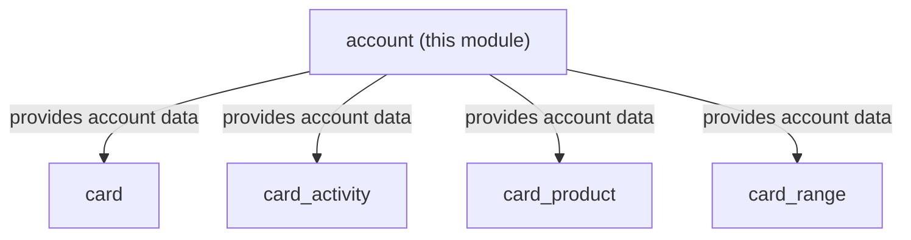
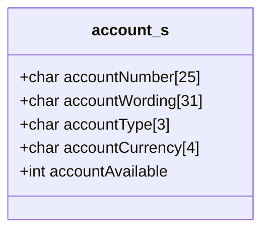
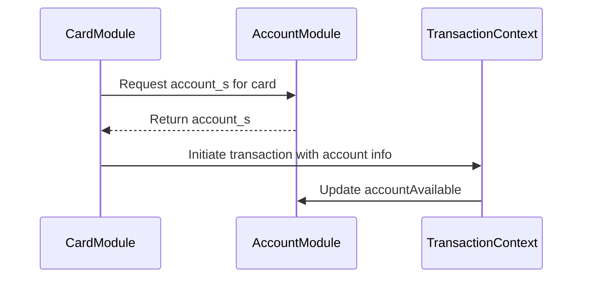

# Account Module Documentation

## Introduction

The **account** module is a core component of the `card_account_management` subsystem. It provides the fundamental data structures and definitions for representing and managing bank account information within the system. This module is essential for any operation that requires access to account details, such as transaction processing, card management, and settlement operations.

## Core Functionality

At its core, the account module defines the `account_s` structure (typedef for `account_t`), which encapsulates all necessary information about a bank account, including:

- **Account Number**: Unique identifier for the account
- **Account Wording**: Human-readable description or label for the account
- **Account Type**: Encoded type of the account (e.g., savings, checking)
- **Account Currency**: Currency code (e.g., USD, EUR)
- **Account Available**: Integer representing the available balance or status

Additionally, the module defines several constants for account management, such as `MAX_ACCOUNT`, `SOURCE_ACCOUNT`, and `TARGET_ACCOUNT`.

## Architecture and Component Relationships

The account module is part of the `card_account_management` subsystem, which also includes modules for card, card activity, card product, and card range management. The account structure is typically referenced by these sibling modules to associate cards and transactions with specific accounts.

### Module Placement

### Data Structure Overview

### Component Interactions

- **Card Module** ([card.md]): Associates cards with accounts using `account_s` references.
- **Card Activity Module** ([card_activity.md]): Tracks activities and transactions on accounts.
- **Card Product Module** ([card_product.md]): Links account types and products.
- **Card Range Module** ([card_range.md]): May use account information for range validation.

## Data Flow and Process Flows

The account module acts as a data provider. Typical flows include:

1. **Account Lookup**: When a card transaction is initiated, the system retrieves the associated `account_s` structure to validate and process the transaction.
2. **Balance Update**: After transaction approval, the `accountAvailable` field is updated to reflect the new balance.
3. **Account Type/Currency Validation**: During transaction processing, the account type and currency are checked for compatibility with the requested operation.

## Integration with the Overall System

The account module is foundational for all modules that require account information. It is tightly integrated with:

- **Transaction Context** ([transaction_context.md]): Uses account data for transaction state and processing.
- **Settlement Batch** ([settlement_batch.md]): Aggregates account data for settlement and reconciliation.
- **Network Communication** ([network_communication.md]): May transmit account data as part of transaction messages.

## References

- [card.md]: Card module documentation
- [card_activity.md]: Card Activity module documentation
- [card_product.md]: Card Product module documentation
- [card_range.md]: Card Range module documentation
- [transaction_context.md]: Transaction Context module documentation
- [settlement_batch.md]: Settlement Batch module documentation
- [network_communication.md]: Network Communication module documentation
