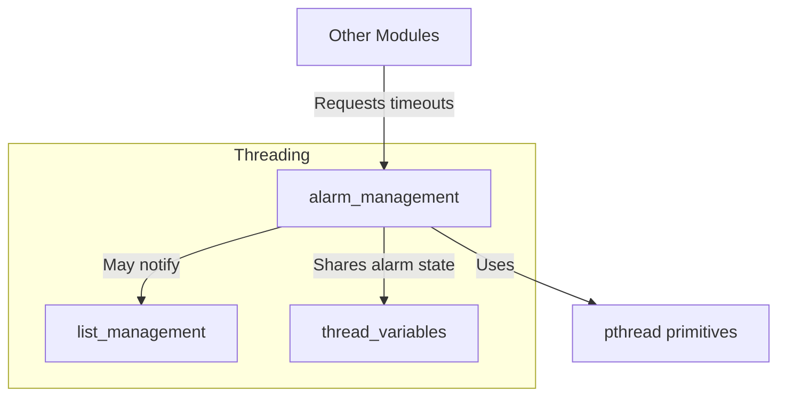
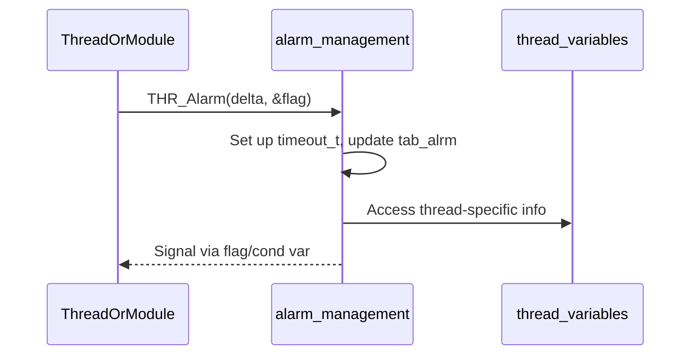
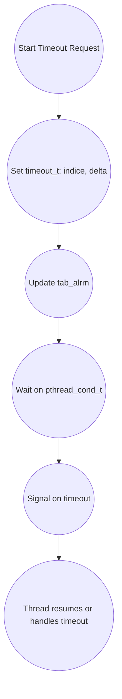

# Alarm Management Module Documentation

## Introduction

The **alarm_management** module is responsible for managing alarm and timeout mechanisms within the system's threading infrastructure. It provides the foundational structures and functions to handle timeouts, signaling, and synchronization between threads, ensuring timely execution and coordination of concurrent operations. This module is essential for implementing features such as operation timeouts, periodic checks, and inter-thread signaling, which are critical for robust and responsive multi-threaded applications.

## Core Functionality

The alarm_management module provides:
- **Timeout Management:** Structures and mechanisms to define and track timeouts for various operations.
- **Alarm Signaling:** Facilities for signaling between threads when a timeout or alarm condition occurs.
- **Thread Synchronization:** Use of mutexes and condition variables to coordinate thread activities in response to alarms.

### Core Components

#### `timeout_t` / `timeou_s`
```c
typedef struct timeou_s {
   int indice; // Index or identifier for the timeout
   int delta;  // Timeout duration or delta in time units
} timeout_t;
```
Represents a timeout entry, including an identifier and the time delta for the timeout.

#### `alrm_inf_t` / `sig_inf`
```c
typedef struct sig_inf {
   int             flag;  // Status flag for the alarm
   pthread_t       tid;   // Thread ID associated with the alarm
   int             done;  // Completion flag
   pthread_cond_t  cond;  // Condition variable for signaling
   pthread_mutex_t lock;  // Mutex for synchronizing access
} alrm_inf_t;
```
Represents the state and synchronization primitives for an alarm, including thread association, signaling, and locking mechanisms.

#### Global Variables and Functions
- `extern alrm_inf_t tab_alrm[];` — Global table of alarm information structures.
- `void InitTabAlarm();` — Initializes the alarm table and related resources.
- `void THR_Alarm(int delta, int *flag);` — Triggers an alarm with a specified timeout and flag pointer.

## Architecture and Component Relationships

The alarm_management module is a submodule of the broader [threading](threading.md) infrastructure. It interacts closely with thread management and variable modules to provide alarm and timeout services to other system components.

### High-Level Architecture


// Note: Node labels are simplified for Mermaid compatibility.

### Component Interaction


// Note: Participant names simplified for Mermaid compatibility.

### Data Flow


// Note: Node shapes changed to round for Mermaid compatibility.

## Integration with the Overall System

- **Upstream:** Modules that require timeout or alarm services (e.g., network communication, transaction context) interact with alarm_management to set or wait for timeouts.
- **Downstream:** alarm_management relies on [thread_variables](thread_variables.md) for thread-specific data and uses POSIX threading primitives for synchronization.
- **Sibling Modules:** Works alongside [list_management](list_management.md) for managing lists of alarms or timeouts.

## References
- [threading.md](threading.md): Overview of threading infrastructure
- [thread_variables.md](thread_variables.md): Thread-specific data management
- [list_management.md](list_management.md): List operations for thread/alarm management

---
*For further details on threading and synchronization primitives, refer to the POSIX pthreads documentation.*
