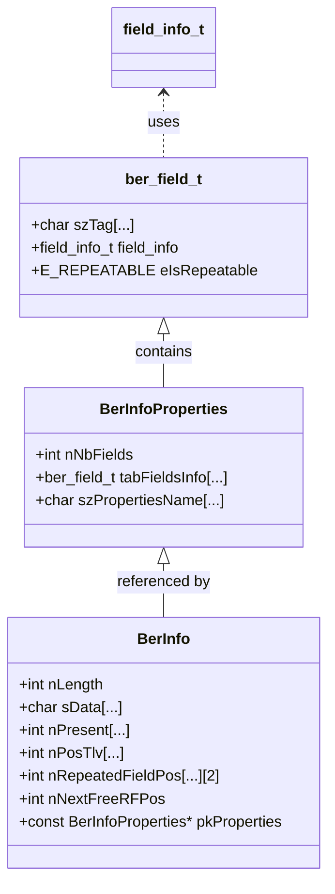
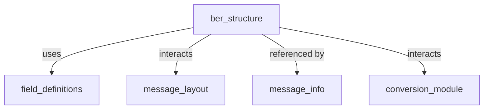
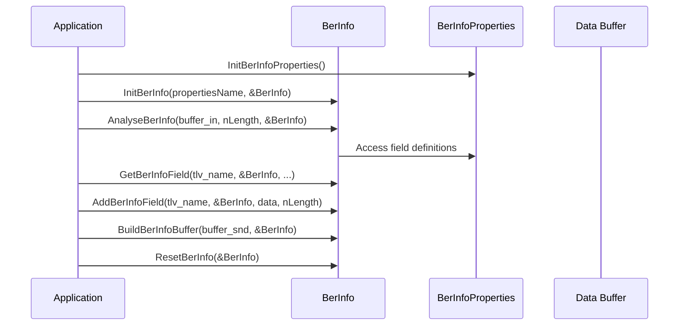

# ber_structure Module Documentation

## Introduction

The `ber_structure` module provides the data structures and core logic for handling BER (Basic Encoding Rules) formatted fields within ISO 8583 message processing. BER is a widely used encoding scheme for representing complex data structures, especially in financial messaging systems. This module defines the representation, manipulation, and parsing of BER fields, enabling the system to interpret and construct BER-encoded data as part of ISO 8583 messages.

## Core Functionality

The module centers around three main components:

- **ber_field_t**: Represents a single BER field, including its tag, field information, and repeatability.
- **BerInfoProperties**: Describes the properties of a BER structure, including the list of fields and their metadata.
- **BerInfo**: Holds the actual data and state for a BER structure instance, including field values, presence, and positions.

The module provides functions for initializing, resetting, analyzing, and manipulating BER structures, as well as for extracting and inserting field data.

## Architecture and Component Relationships

The `ber_structure` module is a specialized field structure handler within the broader ISO 8583 processing subsystem. It interacts closely with the following modules:

- [field_definitions.md](field_definitions.md): Provides the `field_info_t` type used in BER field definitions.
- [message_layout.md](message_layout.md): Determines how BER fields are present within message layouts.
- [message_info.md](message_info.md): Supplies message-level metadata that may reference BER structures.
- [conversion_module.md](conversion_module.md): Handles field mapping and conversion, which may involve BER fields.

### Component Diagram

### Module Dependency Diagram

## Data Flow and Process Overview

### BER Structure Lifecycle

### Component Interactions

- **Initialization**: `InitBerInfoProperties` sets up the field definitions. `InitBerInfo` initializes a BER structure instance with these properties.
- **Parsing**: `AnalyseBerInfo` parses a buffer into the BER structure, populating field values and presence.
- **Field Access**: `GetBerInfoField` and `GetBerInfoNextField` retrieve field data. `AddBerInfoField` and `PutBerInfoField` insert or update field data.
- **Serialization**: `BuildBerInfoBuffer` constructs a buffer from the BER structure for transmission or storage.
- **Reset**: `ResetBerInfo` clears the structure for reuse.

## Integration in the Overall System

The `ber_structure` module is one of several field structure handlers in the ISO 8583 processing subsystem, alongside [bitmap_structure.md](bitmap_structure.md), [tlv_structure.md](tlv_structure.md), and [static_structure.md](static_structure.md). It is used by higher-level modules such as [message_layout.md](message_layout.md) and [message_info.md](message_info.md) to interpret and construct messages containing BER-encoded data.

For more details on related structures and their roles, see:
- [field_definitions.md](field_definitions.md)
- [bitmap_structure.md](bitmap_structure.md)
- [tlv_structure.md](tlv_structure.md)
- [static_structure.md](static_structure.md)
- [message_layout.md](message_layout.md)
- [message_info.md](message_info.md)
- [conversion_module.md](conversion_module.md)

## Summary

The `ber_structure` module encapsulates the logic and data structures for handling BER-encoded fields in ISO 8583 messages. It provides a flexible and extensible foundation for parsing, constructing, and manipulating complex message fields, and integrates seamlessly with the broader ISO 8583 processing architecture.
