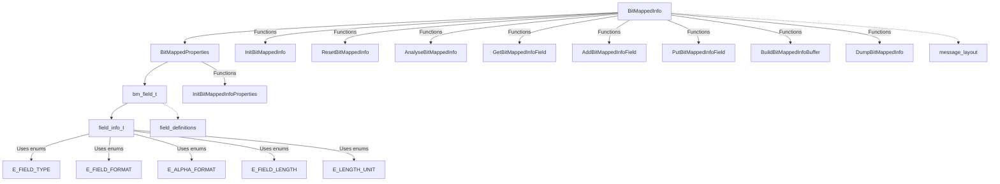
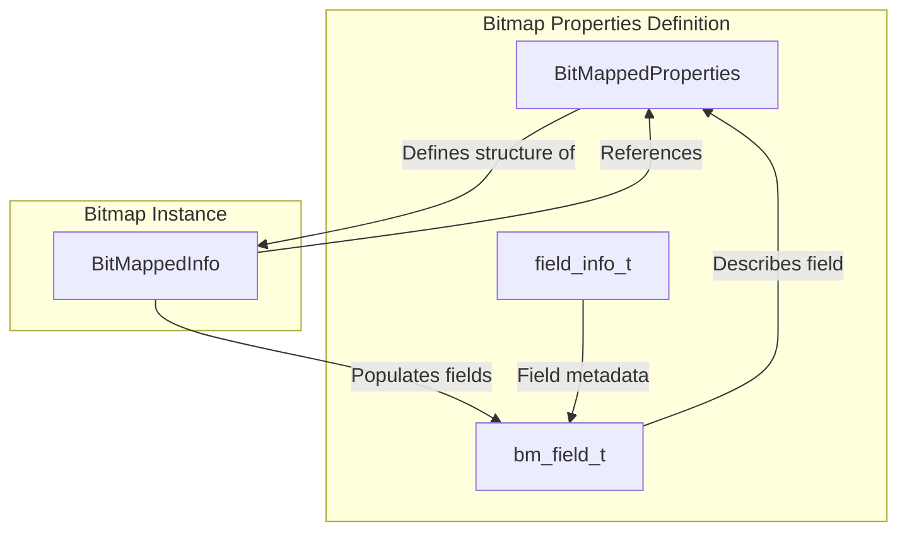
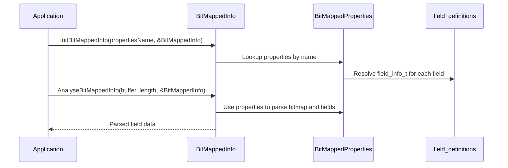

# bitmap_structure Module Documentation

## Introduction

The `bitmap_structure` module provides the core data structures and functions for handling ISO 8583 message bitmaps. Bitmaps are a fundamental part of ISO 8583 messaging, indicating the presence or absence of specific data fields in a message. This module defines how bitmaps and their associated fields are represented, manipulated, and integrated into the broader ISO 8583 message processing system.

## Core Functionality

The module centers around three main structures:

- **bm_field_t**: Represents a single field within a bitmap, including its field number and detailed field information.
- **BitMappedProperties**: Describes the properties of a bitmap, including the number of fields, bitmaps, bitmap format, and an array of field definitions.
- **BitMappedInfo**: Represents an instance of a bitmap in a message, including the bitmap data, associated fields, and a reference to its properties.

The module also provides functions for initializing, resetting, analyzing, and building bitmap data, as well as for adding, retrieving, and dumping fields.

## Architecture and Component Relationships

The `bitmap_structure` module is tightly integrated with the overall ISO 8583 message processing architecture. It relies on field definitions from the [field_definitions](field_definitions.md) module and interacts with message layouts from the [message_layout](message_layout.md) module.

### Component Diagram

### Data Flow Diagram

### Process Flow: Parsing a Bitmap

## Integration with the ISO 8583 System

The `bitmap_structure` module is a foundational component for ISO 8583 message parsing and construction. It is used by higher-level modules such as [message_layout](message_layout.md) and [message_info](message_info.md) to interpret and build messages based on bitmap presence. Field definitions are sourced from [field_definitions](field_definitions.md), ensuring consistency across the system.

For TLV, BER, and static field structures, see the respective modules: [tlv_structure](tlv_structure.md), [ber_structure](ber_structure.md), and [static_structure](static_structure.md).

## References
- [field_definitions](field_definitions.md)
- [message_layout](message_layout.md)
- [message_info](message_info.md)
- [tlv_structure](tlv_structure.md)
- [ber_structure](ber_structure.md)
- [static_structure](static_structure.md)
