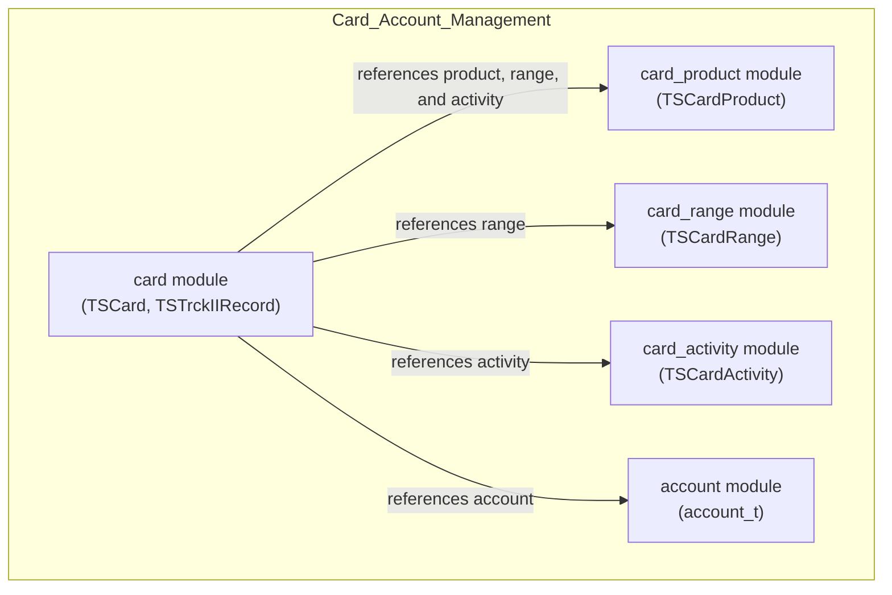
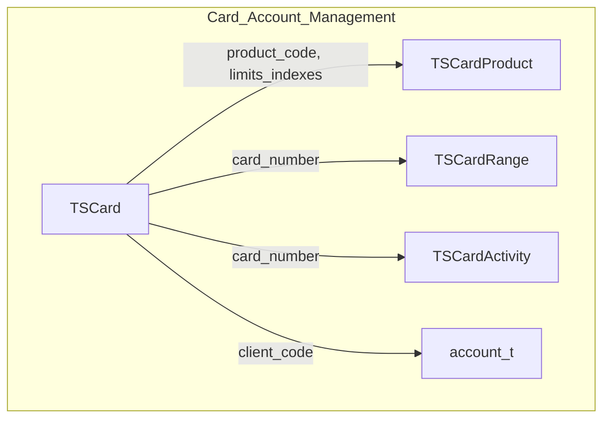

# Card Module Documentation

## Introduction
The **card** module is a core component of the card_account_management subsystem. It is responsible for representing and managing card-related data structures, including cardholder information, card product details, and card range definitions. This module provides the foundational data types and structures that enable card lifecycle management, transaction processing, and integration with other modules such as account, card activity, card product, and card range.

## Core Functionality
The card module defines the following primary data structures:

- **TSCard / SCard**: Represents a payment card, including card number, sequence, client and bank codes, product and fee codes, validity dates, delivery information, and channel association.
- **TSTrckIIRecord / STrackIIRecord**: Encapsulates Track II data for magnetic stripe cards, including card range, field offsets for parsing, and security-related offsets (e.g., CVV, PVV).

These structures are used throughout the system for card issuance, validation, transaction authorization, and reporting.

## Architecture and Component Relationships

The card module is part of the broader **card_account_management** subsystem, which also includes:
- [account](account.md): Account data structures and management
- [card_activity](card_activity.md): Card usage and activity tracking
- [card_product](card_product.md): Card product definitions and rules
- [card_range](card_range.md): Card range and BIN management

The card module interacts with these modules to provide a complete view of a cardholder's profile, product entitlements, and transaction capabilities.

### Component Diagram


### Data Structure Overview

#### TSCard / SCard
```c
typedef struct SCard {
 char     card_number[22];
 int      card_seq;
 char     client_code[24];
 char     bank_code[6];
 char     branch_code[6];
 char     card_product_code[3];
 char     card_fees_code[3];
 char     basic_card_flag[1];
 char     basic_card_number[22];
 char     vip_level[1];
 char     start_val_date[8];
 char     expiry_date[8];
 char     former_expiry_date[8];
 char     delivery_mode[1];
 char     delivery_flag[1];
 char     delivery_date[8];
 char     limits_indexes[4];
 char     periodicity_code[3];
 char     channel_number[15];
} TSCard;
```

#### TSTrckIIRecord / STrackIIRecord
```c
typedef struct STrackIIRecord {
 char min_card_range[23];
 char max_card_range[23];
 int field_separator_offset;
 int country_code_offset;
 int expiry_date_offset;
 int service_code_offset;
 int pvki_offset;
 int pvv_offset;
 int cvv_offset;
 int language_code_offset;
} TSTrckIIRecord;
```

## Data Flow and Process Overview

The card module's data structures are used in the following typical flows:

1. **Card Issuance**: When a new card is issued, a TSCard structure is created and populated with cardholder and product information. The card_product and card_range modules are referenced to validate product codes and BIN ranges.
2. **Transaction Authorization**: During a transaction, the card module provides card details (via TSCard) and track data (via TSTrckIIRecord) for validation and authorization. Card activity is updated via the card_activity module.
3. **Reporting and Auditing**: Card data is aggregated with account and activity data for reporting purposes.

### Data Flow Diagram


## Integration in the Overall System

The card module is foundational for all card-based operations in the system. It is tightly integrated with:
- **Transaction context**: For linking card data to transaction sessions ([transaction_context](transaction_context.md))
- **ISO 8583 processing**: For mapping card data to message fields ([iso8583_processing](iso8583_processing.md))
- **Network communication**: For transmitting card-related data ([network_communication](network_communication.md))
- **Security HSM**: For cryptographic operations on card data ([security_hsm](security_hsm.md))

## References
- [account](account.md)
- [card_activity](card_activity.md)
- [card_product](card_product.md)
- [card_range](card_range.md)
- [transaction_context](transaction_context.md)
- [iso8583_processing](iso8583_processing.md)
- [network_communication](network_communication.md)
- [security_hsm](security_hsm.md)
