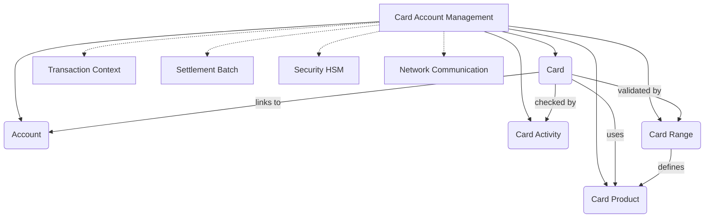
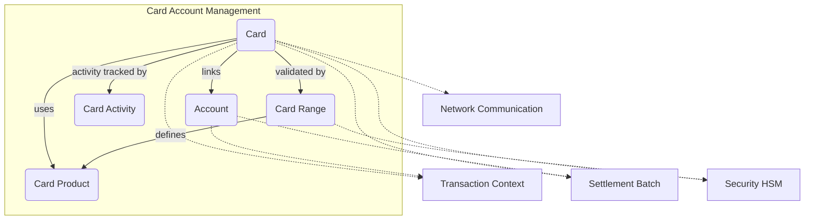

# Card Account Management Module Documentation

## Introduction and Purpose

The **card_account_management** module is responsible for the definition, management, and operational tracking of cards, card products, card ranges, card activities, and associated accounts within the payment processing system. It provides the foundational data structures and logic for handling cardholder data, card product configurations, card range definitions, card activity monitoring, and account linkage, which are essential for transaction authorization, settlement, and compliance.

This module is a core part of the payment system, interfacing with transaction processing, settlement, security, and network communication modules.

---

## Architecture Overview

### Component Relationships
- **Card**: Central entity, links to Account, Product, Activity, and Range.
- **Account**: Holds account details linked to cards.
- **Card Activity**: Tracks card usage, limits, and security events.
- **Card Product**: Defines product-level rules and features.
- **Card Range**: Defines BIN ranges and associated product/rule defaults.

---

## Sub-Modules and High-Level Functionality

The module is organized into the following sub-modules:

### 1. Card
- Defines cardholder and card instance data structures.
- [See detailed documentation](card.md)

### 2. Account
- Defines account structures and linkage to cards.
- [See detailed documentation](account.md)

### 3. Card Activity
- Tracks card usage, limits, and security-related events.
- [See detailed documentation](card_activity.md)

### 4. Card Product
- Defines card product types, features, and rules.
- [See detailed documentation](card_product.md)

### 5. Card Range
- Manages BIN ranges, product defaults, and key management.
- [See detailed documentation](card_range.md)

---

## Integration with the Overall System

The **card_account_management** module is tightly integrated with other modules:
- **Transaction Context** ([transaction_context.md]): For transaction state and context referencing card/account data.
- **Settlement Batch** ([settlement_batch.md]): For batch settlement and reconciliation using card/account/product data.
- **Security HSM** ([security_hsm.md]): For PIN/CVV key management and cryptographic operations.
- **Network Communication** ([network_communication.md]): For card data exchange with external networks.

---

## Data Flow and Process Overview

---

## References to Sub-Module Documentation
- [Card](card.md)
- [Account](account.md)
- [Card Activity](card_activity.md)
- [Card Product](card_product.md)
- [Card Range](card_range.md)

---

## References to Related Modules
- [Transaction Context](transaction_context.md)
- [Settlement Batch](settlement_batch.md)
- [Security HSM](security_hsm.md)
- [Network Communication](network_communication.md)
