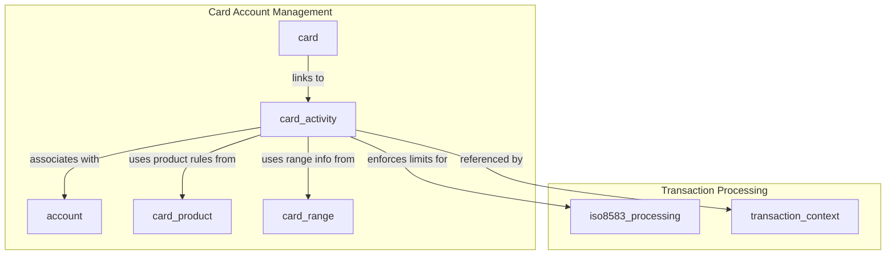
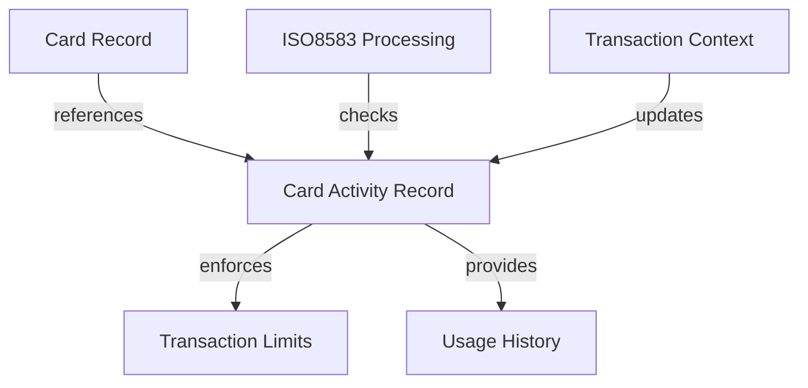
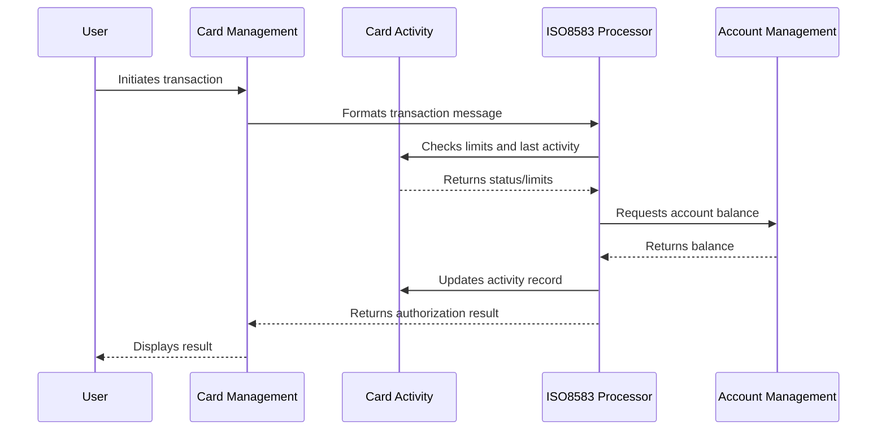

# Card Activity Module Documentation

## Introduction

The **card_activity** module is a core component of the card_account_management subsystem. It is responsible for tracking, storing, and managing the activity and usage limits of individual payment cards within the system. This module provides the data structures necessary to record card usage events, enforce transaction limits, and maintain a historical record of card-related actions, which are essential for risk management, compliance, and operational reporting.

## Core Functionality

The module defines the following primary data structures:

- **SCardActivity / TSCardActivity**: These structures (identical in definition) encapsulate all relevant information about a card's recent activity, including:
  - Card identification (number, bank code, service code)
  - PIN verification and error tracking
  - Last usage details (outlet, terminal, country, merchant category code)
  - Validity and activity dates
  - Amounts and dates for various types of authorizations (approved, declined, cancelled)
  - Codes for last actions/events/services
  - Daily and per-period transaction limits (amount and count), both for online and offline, and for on-us, national, and international transactions

These structures are typically used by transaction processing logic to:
- Enforce card usage limits
- Detect and respond to suspicious activity
- Support compliance with regulatory requirements
- Provide data for reporting and analytics

## Architecture and Component Relationships

The **card_activity** module is part of the broader **card_account_management** subsystem, which also includes modules for card details, account information, card products, and card ranges. It interacts with other modules as follows:

- **card** ([card.md]): Provides core card data and links to card activity records
- **account** ([account.md]): Associates card activity with account-level controls
- **card_product** ([card_product.md]): Determines product-level rules that may affect activity limits
- **card_range** ([card_range.md]): Used for card number validation and routing
- **transaction_context** ([transaction_context.md]): Supplies context for transaction processing, including references to card activity
- **iso8583_processing** ([iso8583_processing.md]): Utilizes card activity data for message validation and limit enforcement during transaction processing

### High-Level Architecture Diagram



## Data Structure Overview

### SCardActivity / TSCardActivity

```c
typedef struct SCardActivity {
  char     card_number[22];
  int      card_activity_set_index;
  char     bank_code[6];
  char     service_code[3];
  int      pin_verification_number;
  int      pin_error_cum;
  char     last_outlet_number[15];
  char     last_card_acceptor_mcc[4];
  char     last_card_acceptor_term_id[15];
  char     last_country_code[3];
  double   cycle_amount;
  int      cycle_start;
  int      last_usage_date;
  char     start_validity_date[4];
  char     end_validity_date[4];
  char     last_activity_date[8];
  char     last_app_auth_date[8];
  double   last_app_auth_amount;
  char     last_dec_auth_date[8];
  double   last_dec_auth_amount;
  char     last_can_auth_date[8];
  double   last_can_auth_amount;
  char     last_code_action[3];
  char     last_code_event[3];
  char     last_service[13];
  char     last_date_pin_error[8];
  // Transaction limits (offline/online, daily/per, onus/nat/internat)
  double   off_daily_onus_amnt_limit;
  int      off_daily_onus_nbr_limit;
  double   off_daily_nat_amnt_limit;
  int      off_daily_nat_nbr_limit;
  double   off_daily_internat_amnt_limit;
  int      off_daily_internat_nbr_limit;
  double   off_per_onus_amnt_limit;
  int      off_per_onus_nbr_limit;
  double   off_per_nat_amnt_limit;
  int      off_per_nat_nbr_limit;
  double   off_per_internat_amnt_limit;
  int      off_per_internat_nbr_limit;
  double   on_daily_onus_amnt_limit;
  int      on_daily_onus_nbr_limit;
  double   on_daily_nat_amnt_limit;
  int      on_daily_nat_nbr_limit;
  double   on_daily_internat_amnt_limit;
  int      on_daily_internat_nbr_limit;
  double   on_per_onus_amnt_limit;
  int      on_per_onus_nbr_limit;
  double   on_per_nat_amnt_limit;
  int      on_per_nat_nbr_limit;
  double   on_per_internat_amnt_limit;
  int      on_per_internat_nbr_limit;
} TSCardActivity;
```

### Data Flow and Usage



- **Card creation/update**: When a card is issued or updated, a corresponding card activity record is created or modified.
- **Transaction processing**: Each transaction references the card activity record to check limits and update usage statistics.
- **Limit enforcement**: The system uses the limit fields to approve or decline transactions based on card usage.

## Component Interactions

- **With card module**: Card records reference card activity for real-time status and limit checks ([card.md]).
- **With transaction_context**: Transaction context modules update and query card activity during transaction lifecycles ([transaction_context.md]).
- **With iso8583_processing**: Transaction messages are validated against card activity data ([iso8583_processing.md]).
- **With card_product/card_range**: Product and range rules may affect how activity is interpreted ([card_product.md], [card_range.md]).

## Process Flow Example: Transaction Authorization



## How the Module Fits into the Overall System

The **card_activity** module is a foundational part of the card_account_management subsystem. It enables:
- Real-time enforcement of card usage policies
- Accurate tracking of cardholder behavior
- Integration with transaction processing and compliance systems
- Support for advanced features such as fraud detection and dynamic limit management

For more details on related modules, see:
- [card.md]
- [account.md]
- [card_product.md]
- [card_range.md]
- [transaction_context.md]
- [iso8583_processing.md]
