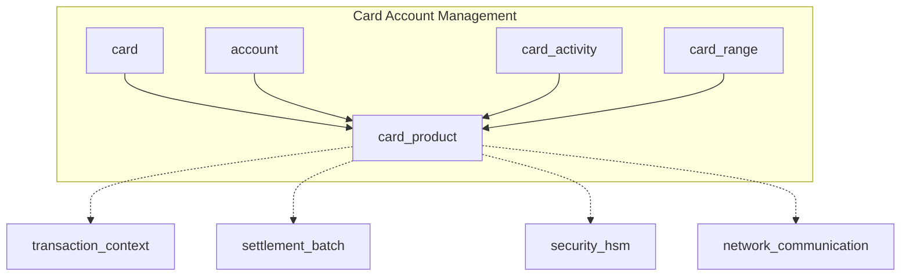
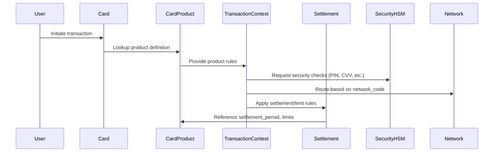

# card_product Module Documentation

## Introduction

The `card_product` module is a core component of the card account management subsystem. It defines the structure and properties of card products, encapsulating all the configuration, behavioral flags, and operational parameters that distinguish different card offerings within the system. This module is essential for supporting a wide range of card types (e.g., debit, credit, business, cobranded, purchase cards) and their associated business logic, limits, and network-specific behaviors.

## Core Functionality

At its core, the `card_product` module provides the data structure (`TSCardProduct`/`SCardProduct`) that represents a card product. This structure is used throughout the system to:
- Identify and classify card products by bank, product code, and type
- Configure network and service codes for routing and processing
- Set business flags (e.g., business, cobranded, purchase)
- Define limits, periodicity, and exception handling
- Specify security and validation options (PIN, CVV, telecode, etc.)
- Control settlement, charging, and authorization levels
- Support advanced features (e.g., smart card processing, language preferences)

The module does **not** implement business logic directly, but provides the foundational data required by other modules (such as card, account, transaction context, and settlement) to enforce product-specific rules and behaviors.

## Data Structure: `TSCardProduct` / `SCardProduct`

```c
// See Source/src/inc/card_product.h

typedef struct SCardProduct {
    char     bank_code[6];
    char     product_code[3];
    char     on_us_product_flag[1];
    char     product_type[2];
    char     network_code[2];
    char     network_card_type[2];
    char     service_code[3];
    char     business_card_flag[1];
    char     cobranded_card_flag[1];
    char     purchase_card_flag[1];
    char     services_setup_index[4];
    char     vip_response_translation[4];
    char     currency_code[3];
    char     limits_indexes[4];
    char     periodicity_code[3];
    char     enable_card_limits_exception[1];
    char     prod_pin_offset_pvv[3];
    char     prod_cvv1[1];
    char     prod_cvv2[1];
    char     prod_ccd[1];
    char     prod_telecode[1];
    char     off_line_atm_period[3];
    double   off_line_atm_limit_onus;
    double   off_line_atm_limit_offus;
    char     rot_mem_option[1];
    char     rot_mem_ctrl_limit[1];
    char     rot_mem_ctrl_available[1];
    char     rot_mem_scanf_iso2iso3[1];
    char     rot_mem_last_usage_date[1];
    char     iso3_smart_proc_mode[7];
    char     chk_exp_date_opt[1];
    char     chk_start_exp_date_opt[1];
    char     chk_pin_opt[3];
    char     chk_cvv1_opt[1];
    char     chk_cvv2_opt[1];
    char     delivery_flag[1];
    char     card_carrier_option[1];
    char     advice_option[1];
    int      validity_code_first;
    int      validity_code_renewal;
    char     charging_condition[3];
    char     settlement_period[1];
    char     settlement_period_cash[1];
    char     markup_code[2];
    char     scenario_code[1];
    char     aut_lvl_card[1];
    char     aut_lvl_banking_account[1];
    char     aut_lvl_client[1];
    char     aut_lvl_shadow_account[1];
    char     iso3_smart_option[1];
    char     default_language_code[3];
} TSCardProduct;
```

## Architecture and Component Relationships

The `card_product` module is tightly integrated with other modules in the `card_account_management` subsystem. It acts as a reference point for card and account records, and its fields are used by transaction processing, settlement, and security modules to determine product-specific rules.

### High-Level Architecture



- **card**: Links each card to its product definition ([card.md])
- **account**: Associates accounts with card products ([account.md])
- **card_activity**: Uses product rules for activity validation ([card_activity.md])
- **card_range**: Maps BIN/IIN ranges to products ([card_range.md])
- **transaction_context**: Uses product data for transaction validation ([transaction_context.md])
- **settlement_batch**: Applies settlement rules per product ([settlement_batch.md])
- **security_hsm**: Enforces security options per product ([security_hsm.md])
- **network_communication**: Determines routing and network-specific logic ([network_communication.md])

## Data Flow and Process Overview

### Card Product Usage in Transaction Processing



### Component Interaction

- **Card**: Each card record references a `TSCardProduct` for its operational parameters.
- **Transaction Context**: During transaction processing, the context module queries the card product for rules on limits, periodicity, security, and network routing.
- **Settlement**: Settlement logic uses product fields to determine batching, periodicity, and charging.
- **Security HSM**: Security checks (PIN, CVV, telecode) are enforced based on product configuration.
- **Network Communication**: Routing and network-specific logic are determined by product fields like `network_code` and `network_card_type`.

## How the Module Fits into the Overall System

The `card_product` module is foundational for:
- Defining the characteristics and rules of each card product
- Enabling flexible support for multiple card types and business models
- Centralizing product configuration for use by downstream modules
- Ensuring consistent enforcement of product-specific rules across the system

It is not used in isolation, but as a reference by other modules that require knowledge of card product properties. For more details on how these modules interact, see:
- [card.md]
- [account.md]
- [card_activity.md]
- [card_range.md]
- [transaction_context.md]
- [settlement_batch.md]
- [security_hsm.md]
- [network_communication.md]

## References
- [card.md]: Card record structure and linkage to product
- [account.md]: Account management and product association
- [card_activity.md]: Activity validation using product rules
- [card_range.md]: BIN/IIN mapping to products
- [transaction_context.md]: Transaction processing and product rule enforcement
- [settlement_batch.md]: Settlement logic per product
- [security_hsm.md]: Security enforcement per product
- [network_communication.md]: Network routing and product-specific logic
