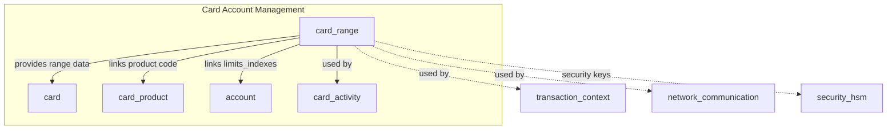
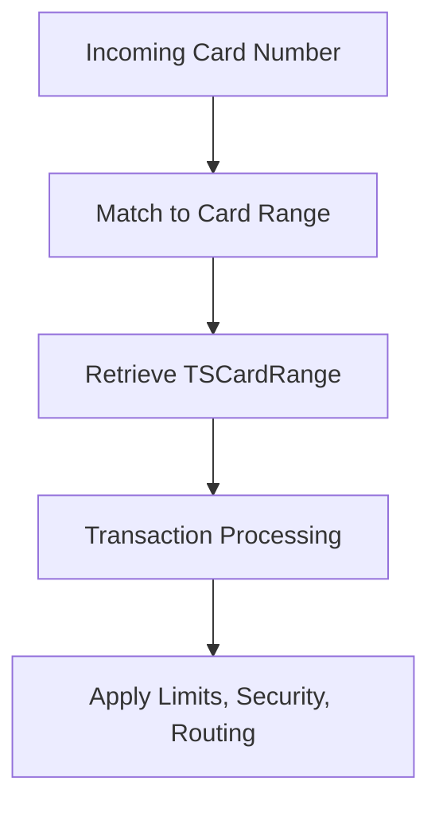

# card_range Module Documentation

## Introduction

The `card_range` module is a core component of the `card_account_management` subsystem. It defines the data structures used to represent card range information, which is essential for identifying, categorizing, and processing payment cards within the system. The module provides a comprehensive structure for storing card range attributes, including issuer details, product codes, security keys, limits, and various operational flags. This information is critical for routing transactions, applying business rules, and enforcing security policies.

## Core Functionality

The primary functionality of the `card_range` module is to encapsulate all relevant data for a given card range. This includes:
- Card number range and length constraints
- Issuer and network identification
- Product and service configuration
- Security key references (PIN, CVV, etc.)
- Limit and periodicity settings
- Default operational flags and options

These data structures are typically used by other modules to:
- Match incoming card numbers to the correct issuer and product
- Retrieve configuration for transaction processing
- Enforce security and business rules

## Core Data Structures

### TSCardRange (typedef struct SCardRange)

```c
typedef struct SCardRange {
    char     card_nbr[22];
    char     issuing_bank_code[6];
    char     issuer_bin[11];
    char     issuer_ica[4];
    char     network_code[2];
    int      card_number_length_min;
    int      card_number_length_max;
    char     get_product_data_level[1];
    char     get_card_data_level[1];
    char     single_product_flag[1];
    char     product_code[3];
    char     services_setup_index[4];
    char     vip_response_translation[4];
    char     currency_code[3];
    char     limits_indexes[4];
    char     periodicity_code[3];
    int      primary_pin_key_number;
    char     network_card_type[2];
    int      alternate_pin_key_number;
    char     start_pin_alternate_key[8];
    char     primary_cvv_key_number[3];
    char     alternate_cvv_key_number[3];
    char     start_cvv_alternate_key[8];
    char     exception_cvv_key_number[3];
    char     exception_cvv_key_valdate[8];
    int      pvki;
    int      key_set_number_1;
    int      key_set_number_2;
    int      key_set_number_3;
    int      key_set_number_4;
    int      key_set_number_5;
    int      key_set_number_6;
    int      key_set_number_7;
    int      key_set_number_8;
    int      key_set_number_9;
    int      pin_retry_max;
    char     def_prod_pin_offset_pvv[3];
    char     def_prod_cvv1[1];
    char     def_prod_cvv2[1];
    char     def_prod_ccd[1];
    char     def_prod_telecode[1];
    char     def_prod_encod_iso_1[1];
    char     def_prod_encod_iso_2[1];
    char     def_prod_encod_iso_3[1];
    char     def_prod_encod_ship[1];
    char     def_off_line_atm_period[3];
    double   def_off_line_atm_limit_onus;
    double   def_off_line_atm_limit_offus;
    char     def_iso3_smart_option[1];
    char     def_rot_mem_option[1];
    char     def_rot_mem_ctrl_limit[1];
    char     def_rot_mem_ctrl_available[1];
    char     def_rot_mem_scanf_iso2iso3[1];
    char     def_rot_mem_last_usage_date[1];
    char     def_iso3_smart_proc_mode[7];
    char     def_chk_exp_date_opt[1];
    char     def_chk_start_exp_date_opt[1];
    char     def_chk_pin_opt[1];
    char     def_chk_cvv1_opt[1];
    char     def_chk_cvv2_opt[1];
    char     def_language_code[3];
} TSCardRange;
```

## Architecture and Component Relationships

The `card_range` module is tightly integrated with other modules in the `card_account_management` subsystem, such as:
- [card.md](card.md): Card entity and track data
- [account.md](account.md): Account information
- [card_product.md](card_product.md): Card product definitions
- [card_activity.md](card_activity.md): Card activity tracking

It also interacts with modules responsible for transaction context, security, and network communication, as card range data is essential for transaction routing and validation.

### High-Level Architecture Diagram



### Data Flow Diagram



### Component Interaction

- When a transaction is initiated, the system uses the card number to search the card range table (TSCardRange).
- Once matched, the system retrieves all relevant configuration, security, and limit data for processing.
- The module provides references (such as product_code, limits_indexes, and key numbers) that are resolved by other modules ([card_product.md], [account.md], [security_hsm.md]).

## How card_range Fits into the Overall System

The `card_range` module acts as a central reference for card identification and configuration. It is queried during transaction processing to:
- Identify the issuer and product for a card
- Retrieve security and limit settings
- Route transactions to the appropriate network or issuer
- Enforce business and security rules

It is foundational for the correct operation of the card processing pipeline and is referenced by multiple subsystems.

## References
- [card.md](card.md)
- [account.md](account.md)
- [card_product.md](card_product.md)
- [card_activity.md](card_activity.md)
- [security_hsm.md](security_hsm.md)
- [transaction_context.md](transaction_context.md)
- [network_communication.md](network_communication.md)
