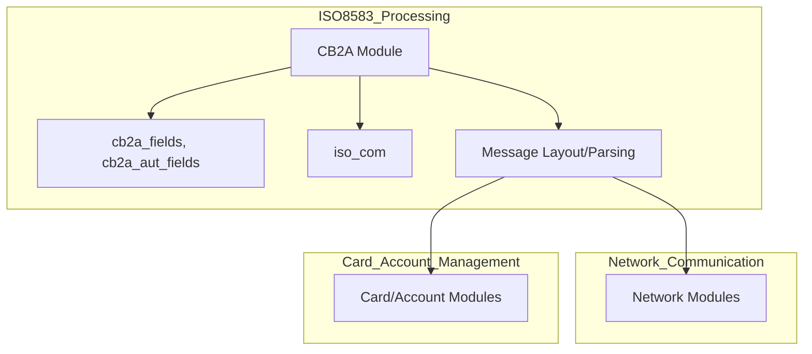
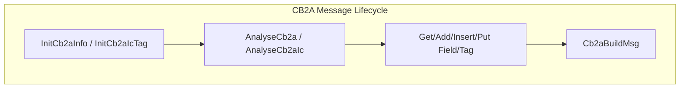
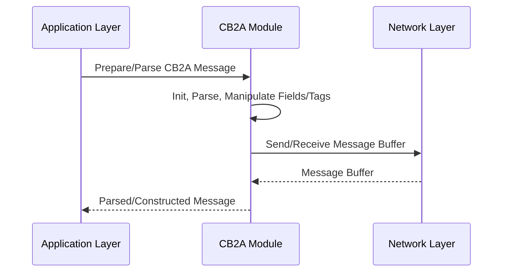

# CB2A Module Documentation

## Introduction

The **CB2A module** is responsible for the parsing, construction, and manipulation of CB2A-format ISO 8583 messages, which are used in financial transaction processing, particularly for card-based transactions in certain regional or network-specific implementations. This module provides data structures and functions to handle both standard message fields and chip (IC card) data (commonly found in field 55 of ISO 8583 messages).

## Core Functionality

The CB2A module provides:
- Data structures for representing CB2A message layouts and chip data
- Functions for initializing, parsing, building, and manipulating CB2A messages and their fields
- Support for both fixed and variable-length fields, as well as chip/EMV tag handling

### Key Data Structures

#### `TSCb2aInfo` / `SCb2aInfo`
Represents the state and content of a CB2A message, including:
- Field positions (`nFieldPos`)
- Message type (`nMsgType`)
- Message length (`nLength`)
- Bitmap (`sBitMap`)
- Raw data buffer (`sData`)
- Protocol indicator (`nProtocol`)

#### `TSTagCb2a` / `STagCb2a`
Represents the chip (IC card) data section (typically field 55):
- Tag presence and positions (`nPresent`, `nPosTag`)
- Length of chip data (`nLength`)
- Raw chip data buffer (`sChipData`)

### Main Functions

- **Initialization:**
  - `InitCb2aInfo(TSCb2aInfo *msgInfo)`
  - `InitCb2aIcTag(TSTagCb2a *msgInfo)`
- **Parsing:**
  - `AnalyseCb2a(char *buffer_rec, TSCb2aInfo *msgInfo)`
  - `AnalyseCb2aIc(char *buffer, int nLength, TSTagCb2a *msgInfo)`
- **Field Manipulation:**
  - `GetCb2aField`, `AddCb2aField`, `InsertCb2aField`, `PutCb2aField`
  - `GetCb2aIcTag`, `AddCb2aIcTag`, `PutCb2aIcTag`
- **Message Construction:**
  - `Cb2aBuildMsg(char *buffer_snd, TSCb2aInfo *msgInfo)`

## Architecture and Component Relationships

The CB2A module is part of the broader ISO 8583 message processing subsystem. It interacts with other modules for field definitions, protocol-specific logic, and network communication.

### High-Level Architecture

### Component Interaction

### Data Flow

## Integration with the Overall System

- **Upstream:** Receives raw buffers from the network or application layer for parsing.
- **Downstream:** Provides constructed message buffers for transmission.
- **Lateral:** Relies on field definitions and protocol constants from `cb2a_fields`, `cb2a_aut_fields`, and `iso_com`.
- **Related Modules:**
  - [iso8583_processing.md](iso8583_processing.md) for core ISO 8583 logic and message layouts
  - [network_communication.md](network_communication.md) for message transport
  - [card_account_management.md](card_account_management.md) for card/account data used in field population

## References
- [iso8583_processing.md](iso8583_processing.md)
- [network_communication.md](network_communication.md)
- [card_account_management.md](card_account_management.md)
- [cbae_module.md](cbae_module.md) (for CBAE message handling)
- [jcb_module.md](jcb_module.md) (for JCB message handling)
- [sid_module.md](sid_module.md) (for SID message handling)
