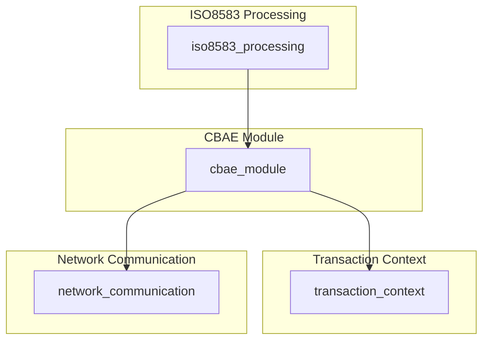
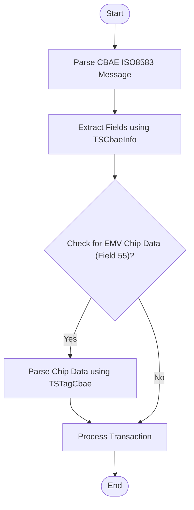

# CBAE Module Documentation

## Introduction

The **CBAE module** provides data structures and utilities for handling CBAE-specific ISO8583-1987 messages, including support for EMV chip data (field 55). It defines the message layout, field types, and chip tag handling required for CBAE-compliant transaction processing. This module is a specialized extension within the broader ISO8583 message processing framework, focusing on the CBAE protocol variant.

## Core Functionality

- Defines CBAE-specific field types and tag types for ISO8583 messages
- Structures for representing CBAE message data (`TSCbaeInfo`)
- Structures for handling EMV chip data within CBAE messages (`TSTagCbae`)
- Provides initialization routines for CBAE message structures

## Architecture and Component Relationships

The CBAE module is part of the ISO8583 message processing subsystem. It interacts with the core ISO8583 processing logic (see [iso8583_processing.md](iso8583_processing.md)) and may be used by higher-level transaction context modules (see [transaction_context.md](transaction_context.md)) and network communication modules (see [network_communication.md](network_communication.md)).

### Key Data Structures

#### TSCbaeInfo (CBAE Message Structure)
```c
typedef struct SCbaeInfo {
   int  nFieldPos[MAX_CBAE_FIELDS + 1]; // Field positions in the message
   int  nMsgType;                       // Message type indicator
   int  nLength;                        // Total message length
   char sHeader[CBAE_HEADER_LEN + 1];   // Message header
   char sPi24[64 + 1];                  // Processing code (field 24)
   int  LPi24;                          // Length of field 24
   char sBitMap[CBAE_BITMAP_LEN];       // Bitmap for field presence
   char sData[MAX_CBAE_DATA_LEN];       // Raw message data
} TSCbaeInfo;
```

#### TSTagCbae (CBAE Chip Data Structure)
```c
typedef struct STagCbae {
   int  nPresent[MAX_CBAE_CHIP_TAG];    // Tag presence flags
   int  nPosTag[MAX_CBAE_CHIP_TAG];     // Tag positions
   int  nLength;                        // Total chip data length
   char sChipData[MAX_CBAE_CHIP_LEN];   // Raw chip data
} TSTagCbae;
```

### Component Relationships

- `TSCbaeInfo` is used to represent the entire CBAE message, including header, bitmap, and data fields.
- `TSTagCbae` is used for handling EMV chip data (typically field 55 in ISO8583 messages).
- The module relies on definitions from the core ISO8583 processing module (e.g., field mapping, bitmap handling).

### Module Dependency Diagram



### Data Flow Diagram



## Integration in the Overall System

The CBAE module is typically invoked by the ISO8583 message processing engine when a CBAE message type is detected. It provides the necessary structures and routines to parse, construct, and manipulate CBAE-specific messages, including EMV chip data. Other modules, such as transaction context and network communication, interact with the CBAE module to access or modify message content as part of the transaction lifecycle.

For details on the core ISO8583 processing logic, refer to [iso8583_processing.md](iso8583_processing.md). For information on how transaction context and network communication modules interact with message structures, see [transaction_context.md](transaction_context.md) and [network_communication.md](network_communication.md).

## References
- [iso8583_processing.md](iso8583_processing.md)
- [transaction_context.md](transaction_context.md)
- [network_communication.md](network_communication.md)
