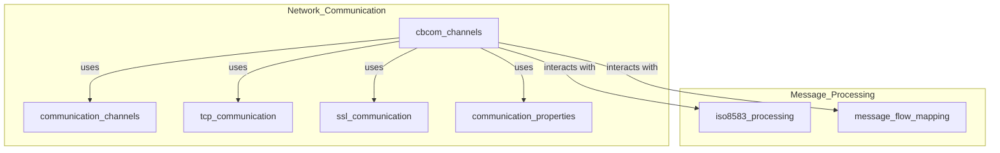
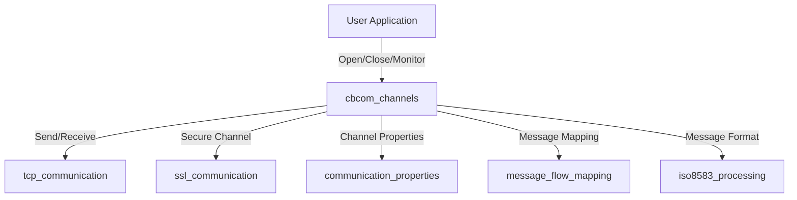
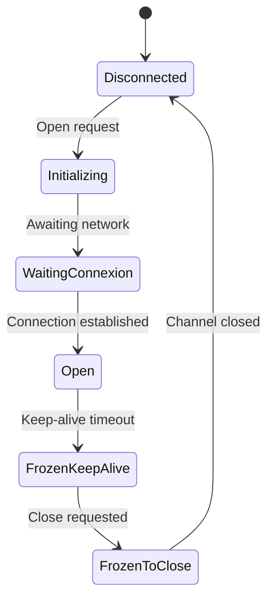

# cbcom_channels Module Documentation

## Introduction

The `cbcom_channels` module is a core component of the `network_communication` subsystem. It is responsible for managing communication channels specific to CBCom (presumably "Carte Bancaire Communication" or similar banking protocol), handling their state, error tracking, and operational parameters. This module provides the data structures and global variables necessary for the lifecycle and monitoring of CBCom channels, which are essential for reliable message exchange in banking and payment systems.

## Core Functionality

- **Channel State Management:** Maintains the state of each CBCom channel (e.g., disconnected, initializing, open, frozen, etc.).
- **Incident Tracking:** Tracks consecutive and non-consecutive incidents (errors or faults) per channel, with timestamped logs for diagnostics and resilience.
- **Window and Resource Management:** Manages window sizes, resource allocation, and operational timers for each channel.
- **Integration with Communication Stack:** Works in conjunction with lower-level communication modules (TCP, SSL, etc.) and higher-level message mapping and processing modules.

## Key Data Structures

### `TSCBComChannel` / `SCBComChannel`

```c
typedef struct SCBComChannel {
    char            Id[PI23_LEN];
    int             state;
    unsigned int    nConsecutiveIncidents;
    time_t          CBComIncidents[CBCOM_MAX_INCIDENTS];
    unsigned int    nIncidentNextEntry;
    int             nWindowSize;
    int             nNbWaitingRD;
    int             bTNRequester;
    int             nChannelFd;
} TSCBComChannel;
```

- **Id:** Unique identifier for the channel.
- **state:** Current state of the channel (see Channel States below).
- **nConsecutiveIncidents:** Number of consecutive incidents/errors.
- **CBComIncidents:** Circular buffer of timestamps for incidents.
- **nIncidentNextEntry:** Index for the next incident entry.
- **nWindowSize:** Size of the anticipation window for message flow.
- **nNbWaitingRD:** Number of pending read operations.
- **bTNRequester:** Flag indicating if the channel is a TN (Test Node) requester.
- **nChannelFd:** File descriptor for the channel's network connection.

### Channel States

- `CR_ST_DISCONNECTED`: 0
- `CR_ST_INIT`: 1
- `CR_ST_WAITING_CONNEXION`: 2
- `CR_ST_OPEN`: 3
- `CR_ST_FROZEN_KEEP_ALIVE`: 4
- `CR_ST_FROZEN_TO_CLOSE`: 5

### Channel Manager States

- `CRM_INIT`: 0
- `CRM_OPEN`: 1

### Error Codes

- `ERR_CBCOM_DISCONNECT`: 700

## Global Variables and Parameters

- `CBComChannels[]`: Array of all CBCom channel structures.
- `CBComCRMState`: State of the channel manager.
- `nNbChannels`: Number of active CBCom channels.
- Various timers and operational parameters (e.g., `nTRC`, `nTC`, `nTNR`, `nTTN`, `nTDG`, `nTDC`, `nMaxNbLostTD`, `nMaxWindowSize`, etc.)

## Architecture and Component Relationships

The `cbcom_channels` module is part of the broader `network_communication` subsystem. It interacts with several other modules:

- **communication_channels:** Provides generic channel structures and logic ([communication_channels.md]).
- **tcp_communication:** Handles TCP-level communication ([tcp_communication.md]).
- **ssl_communication:** Handles SSL/TLS communication ([ssl_communication.md]).
- **message_flow_mapping:** For mapping and routing messages ([message_flow_mapping.md]).
- **iso8583_processing:** For ISO 8583 message parsing and formatting ([iso8583_processing.md]).

### High-Level Architecture Diagram




### Data Flow Diagram



### Component Interaction

- **Channel Lifecycle:** Channels are created, initialized, monitored, and closed by the cbcom_channels logic.
- **Incident Handling:** Each channel tracks its own incidents, which can trigger state changes or alerts.
- **Resource Management:** Window sizes and timers are dynamically managed for optimal throughput and reliability.

## Process Flow Example: Channel State Transition



## How cbcom_channels Fits Into the System

The `cbcom_channels` module is the specialized handler for CBCom protocol channels within the network communication stack. It builds upon the generic channel management provided by [communication_channels.md], and leverages lower-level TCP/SSL modules for transport. It is tightly integrated with message mapping and ISO 8583 processing modules to ensure that financial messages are reliably transmitted and received.

For more details on related modules, see:
- [communication_channels.md]
- [tcp_communication.md]
- [ssl_communication.md]
- [message_flow_mapping.md]
- [iso8583_processing.md]

## References
- [communication_channels.md]
- [tcp_communication.md]
- [ssl_communication.md]
- [message_flow_mapping.md]
- [iso8583_processing.md]
