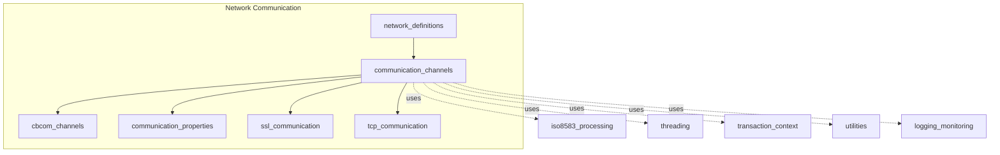
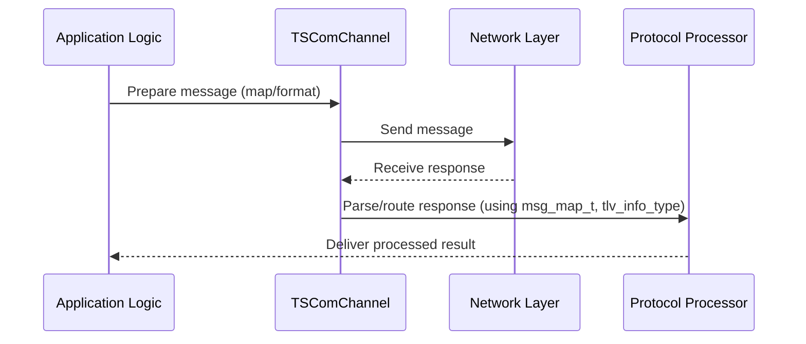
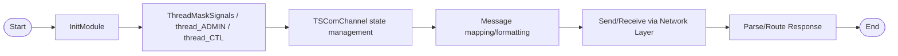

# Communication Channels Module Documentation

## Introduction

The **communication_channels** module is a core part of the `network_communication` subsystem. It provides the foundational abstractions and data structures for managing communication channels between the system and external networks, such as banking hosts, switches, and other financial networks. This module is essential for supporting message exchange, channel state management, and protocol-specific formatting in high-throughput, multi-channel financial transaction environments.

## Core Functionality

The module defines the following key components:

- **TSComChannel**: Represents a communication channel, encapsulating connection state, host address, port, and service flags.
- **msg_map_t / msg_map_st**: Structures for mapping message fields and conditions for message routing or transformation.
- **msg_field_format_t / msg_field_format_st**: Define the format of individual message fields.
- **msg_subfield_format_t / msg_subfield_format_st**: Define the format of subfields within a message.
- **tlv_info_type / tlv_info_st**: Describe TLV (Tag-Length-Value) field metadata for flexible message parsing.

These structures enable the system to:
- Manage multiple concurrent communication channels
- Track and control channel state and properties
- Map and format messages for various protocols (e.g., ISO 8583, BASE24)
- Support TLV-based message extensions

## Architecture and Component Relationships

The `communication_channels` module interacts closely with other modules in the `network_communication` subsystem, as well as with protocol and transaction processing modules. The following diagram illustrates its position and relationships:

### Component Interaction

- **TSComChannel** is the primary structure for each open channel. An array of these (`Channels[]`) is maintained for all active connections.
- **msg_map_t** and **msg_field_format_t** are used to define how messages are mapped and formatted for each channel.
- **tlv_info_type** supports extensible message parsing for protocols requiring TLV fields.
- The module exposes functions for channel/thread management, message processing, and resource control (see [threading.md], [logging_monitoring.md]).

## Data Flow and Process Overview

The following diagram shows a typical data flow for message processing through a communication channel:

## Integration with Other Modules

- **network_definitions**: Provides network, switch, and bank network definitions ([network_definitions.md]).
- **cbcom_channels**: Specialized communication channels for CBCom ([cbcom_channels.md]).
- **communication_properties**: Channel property definitions ([communication_properties.md]).
- **ssl_communication**: SSL/TLS channel support ([ssl_communication.md]).
- **tcp_communication**: TCP/IP channel support ([tcp_communication.md]).
- **threading**: Thread and concurrency management ([threading.md]).
- **logging_monitoring**: Event logging and monitoring ([logging_monitoring.md]).

## Component Reference

| Structure                  | Purpose                                                      |
|---------------------------|--------------------------------------------------------------|
| TSComChannel              | Represents a communication channel and its state             |
| msg_map_t                 | Message field mapping for routing/processing                 |
| msg_field_format_t        | Format specification for message fields                      |
| msg_subfield_format_t     | Format specification for message subfields                   |
| tlv_info_type             | TLV field metadata for extensible message parsing            |

For detailed protocol mapping and message layout, see [iso8583_processing.md].

## Process Flow Example

## See Also
- [network_definitions.md]
- [cbcom_channels.md]
- [communication_properties.md]
- [ssl_communication.md]
- [tcp_communication.md]
- [iso8583_processing.md]
- [threading.md]
- [logging_monitoring.md]
