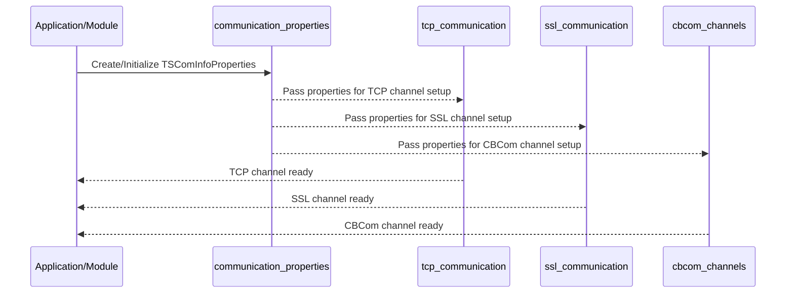

# Communication Properties Module Documentation

## Introduction

The **communication_properties** module defines the configuration and property structure for communication channels within the system. It provides a unified way to describe, initialize, and manage the properties of network communication endpoints, supporting various connection types (TCP, UDP, SSL), modes (client/server), and packet length encoding schemes. This module is foundational for establishing and maintaining robust, flexible communication channels across the system, and is referenced by other modules that implement or manage network communication.

## Core Functionality

At the heart of this module is the `TSComInfoProperties` structure, which encapsulates all relevant properties for a communication channel, including:
- **Connection Mode**: Specifies whether the channel operates as a client or server.
- **Connection Type**: Indicates the protocol (TCP, UDP, SSL).
- **Packet Length Type**: Defines how packet lengths are encoded (binary, ASCII, included/excluded, etc.).
- **Length Parameters**: Controls the length field size, offset, and inclusion.
- **Client Management**: Sets limits and behaviors for client connections.
- **Naming**: Provides a unique name for the property set.

This structure is used throughout the system to standardize communication channel configuration, ensuring consistency and simplifying integration with other modules such as TCP, SSL, and CBCom channel implementations.

## Architecture and Component Relationships

The `communication_properties` module is a core part of the `network_communication` subsystem. It is referenced by modules that implement specific communication protocols (e.g., TCP, SSL) and by higher-level network management modules. The relationships are illustrated below:

```mermaid
graph TD
    subgraph network_communication
        A[communication_properties\n(TSComInfoProperties)]
        B[tcp_communication\n(TSTCPComInfo, TSTCPCltComInfo)]
        C[ssl_communication\n(TSSSLComInfo, TSCtlSSLComInfo)]
        D[cbcom_channels\n(TSCBComChannel, SCBComChannel)]
        E[communication_channels\n(TSComChannel, ...)]
        F[network_definitions\n(TSNetwork, ...)]
    end
    A --> B
    A --> C
    A --> D
    A --> E
    E --> F
```

- **TSComInfoProperties** is referenced by protocol-specific modules ([tcp_communication.md], [ssl_communication.md], [cbcom_channels.md]) to configure and manage their respective channels.
- **communication_channels** aggregates and manages multiple channel types, all of which rely on the properties defined here.
- **network_definitions** uses these channels to build higher-level network abstractions.

## Data Structure: TSComInfoProperties

```c
typedef struct {
    E_CONN_MODE         eConnMode;           // Client or Server mode
    E_CONN_TYPE         eConnType;           // TCP, UDP, SSL, etc.
    E_CONN_LENGTH_TP    ePacketLengthType;   // Packet length encoding type
    int                 nLengthLen;          // Length field size
    int                 nTotalLengthLen;     // Total length field size
    int                 nLengthOffset;       // Offset of length field
    E_LENGH_DT          bExcludeLength;      // Whether length is included/excluded
    int                 nMaxClients;         // Max number of clients (for server)
    int                 nDivFactor;          // Division factor for load balancing
    int                 bMultiConnPerClient; // Allow multiple connections per client
    char                szPropertiesName[MAX_PROP_NAME_LEN + 1]; // Name
} TSComInfoProperties;
```

### Enumerations Used
- `E_CONN_MODE`: { NONE, SERVER, CLIENT }
- `E_CONN_TYPE`: { TCP, UDP, SSL }
- `E_CONN_LENGTH_TP`: { HIGH_BINARY, LOW_BINARY, NO_LENGTH, HIGH_ASCII, LOW_ASCII, ... }
- `E_LENGH_DT`: { LENGTH_EXCLUDED, LENGTH_INCLUDED }

## Data Flow and Process Overview

The following diagram illustrates how communication properties are initialized and used in the system:



## Integration with the System

The `communication_properties` module is essential for any module that needs to establish or manage a communication channel. It provides a single source of truth for channel configuration, enabling:
- Consistent setup of TCP, SSL, and custom channels
- Centralized management of connection parameters
- Simplified extension for new protocols or connection types

For details on how these properties are used in specific channel implementations, refer to:
- [tcp_communication.md]
- [ssl_communication.md]
- [cbcom_channels.md]

## References
- [network_communication.md]: Overview of the network communication subsystem
- [communication_channels.md]: Channel management and aggregation
- [tcp_communication.md]: TCP channel implementation
- [ssl_communication.md]: SSL channel implementation
- [cbcom_channels.md]: CBCom channel implementation
