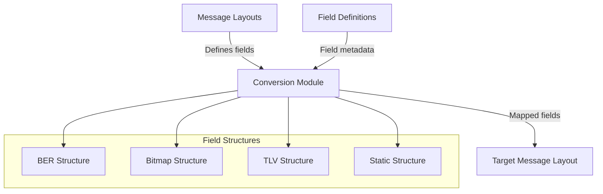
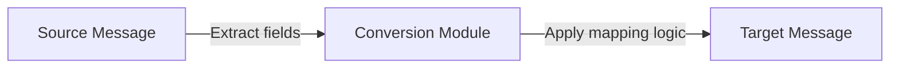
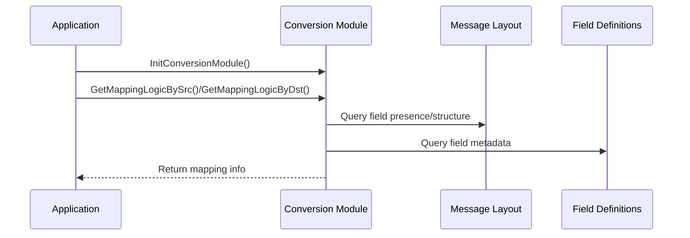

# Conversion Module Documentation

## Introduction

The **conversion_module** is a core component of the ISO 8583 message processing subsystem. Its primary responsibility is to define and manage the mapping logic between fields of different message protocols or layouts, enabling seamless translation and transformation of message data between heterogeneous systems. This is essential in financial transaction processing, where interoperability between different message formats and standards is required.

## Core Functionality

The conversion_module provides:
- **Field Mapping Logic**: Defines how fields from a source protocol are mapped to fields in a destination protocol, supporting various mapping strategies (direct, table-based, custom, etc.).
- **Conversion Module Structure**: Encapsulates the mapping logic for a specific protocol conversion scenario.
- **APIs for Initialization and Lookup**: Functions to initialize conversion modules and retrieve mapping logic by source or destination field number.

### Key Data Structures

#### `TSFieldMapping`
Represents a single mapping rule between a source and destination field, including the mapping logic type.
```c
typedef struct {
    int                 nSrcFieldNo;      // Source field number
    int                 nDstFieldNo;      // Destination field number
    E_MAPPING_LOGIC     eMappingLogic;    // Mapping logic type (direct, table, custom, etc.)
} TSFieldMapping;
```

#### `TSConversionModule`
Represents a complete set of field mappings for a protocol conversion.
```c
typedef struct {
    int                 nProtocolId;                  // Protocol identifier
    TSFieldMapping      tab_MappingLogic[MAX_STRUCT_FIELDS]; // Array of field mappings
    int                 nSize;                        // Number of mappings
} TSConversionModule;
```

#### Mapping Logic Enumeration
```c
typedef enum {
    ML_NO_MAPPING = 0,
    ML_F_TO_F,         // Field-to-field direct mapping
    ML_MAP_TABLE,      // Mapping via lookup table
    ML_CUSTOM,         // Custom mapping logic
    ML_QTY
} E_MAPPING_LOGIC;
```

### API Functions
- `void InitConversionModule(TSConversionModule* pkConversionModule);`
- `const TSFieldMapping* GetMappingLogicBySrc(const TSConversionModule* pkConversionModule, int nFieldNo);`
- `const TSFieldMapping* GetMappingLogicByDst(const TSConversionModule* pkConversionModule, int nFieldNo);`

## Architecture and Component Relationships

The conversion_module operates as a bridge between message layouts and field definitions, enabling flexible translation between different message formats. It interacts closely with the following modules:

- [field_definitions.md](field_definitions.md): Provides field metadata and types.
- [message_layout.md](message_layout.md): Defines the structure and presence of fields in messages.
- [ber_structure.md](ber_structure.md), [bitmap_structure.md](bitmap_structure.md), [tlv_structure.md](tlv_structure.md), [static_structure.md](static_structure.md): Define various field encoding and storage formats.

### High-Level Architecture



### Data Flow Diagram



### Component Interaction



## Process Flow

1. **Initialization**: The application initializes a `TSConversionModule` with the required protocol mappings.
2. **Field Mapping Lookup**: During message processing, the application queries the conversion module for mapping logic for each field.
3. **Field Transformation**: The conversion module applies the specified mapping logic (direct, table, custom) to transform source fields to target fields.
4. **Message Construction**: The mapped fields are assembled into the target message layout.

## Integration in the Overall System

The conversion_module is a central part of the ISO 8583 processing pipeline, enabling interoperability between different message formats and protocols. It is typically used in conjunction with:
- [message_layout.md](message_layout.md) for message structure
- [field_definitions.md](field_definitions.md) for field properties
- [ber_structure.md](ber_structure.md), [bitmap_structure.md](bitmap_structure.md), [tlv_structure.md](tlv_structure.md), [static_structure.md](static_structure.md) for field encoding/decoding

For more details on related modules, refer to their respective documentation files.

---
*This documentation was generated automatically to assist developers and maintainers in understanding the structure and role of the conversion_module within the ISO 8583 processing system.*
