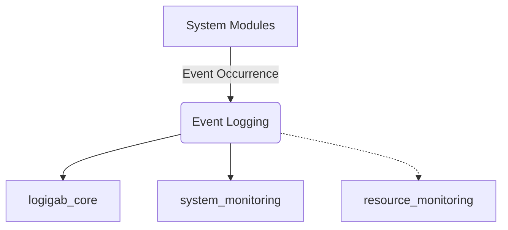
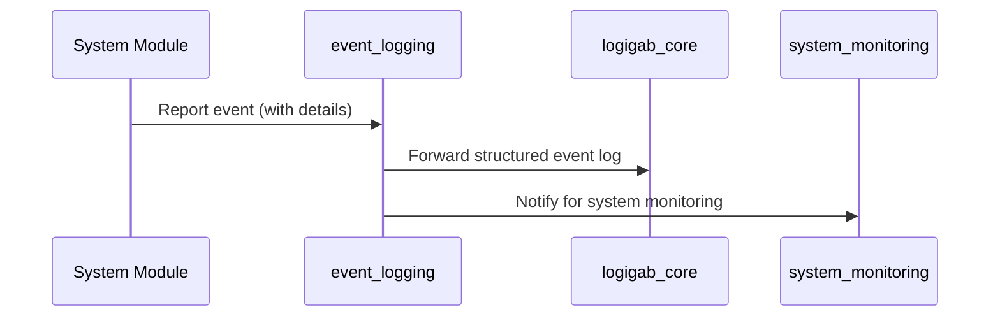

# Event Logging Module Documentation

## Introduction

The **event_logging** module is responsible for capturing, structuring, and recording significant system and interface events within the broader transaction processing system. It provides a standardized way to log operational events, errors, and interface state changes, which are critical for monitoring, troubleshooting, and auditing system behavior.

This module is a core part of the [logging_monitoring](logging_monitoring.md) subsystem and interacts closely with other monitoring and logging modules, such as [logigab_core](logigab_core.md) and [system_monitoring](system_monitoring.md).

---

## Core Functionality

The event_logging module defines the structure and identifiers for event logs. It standardizes the format for logging events related to system resources, interfaces, and error conditions. The main data structure is `TSEventLog`, which encapsulates all relevant information for a single event log entry.

### Key Event Identifiers

The module provides a set of predefined event and error codes, such as:
- **Interface Events:**
  - `INTERFACE_ABNORMAL_STOP` ("INAB")
  - `INTERFACE_DOWN` ("INDW")
  - `INTERFACE_SIGN_ON` ("INSN")
  - `INTERFACE_SIGN_OFF` ("INSO")
  - `INTERFACE_START` ("INSR")
  - `INTERFACE_TIME_OUT` ("INTO")
  - `INTERFACE_STOP` ("INST")
  - `INTERFACE_UP` ("INUP")
- **Error Events:**
  - `ERROR_RETREIVE_RESOURCE` ("ENRR")
  - `ERROR_WRITING_IN_QUEUE` ("ERWQ")
  - `ERROR_TIME_OUT` ("ERTO")
  - `ERROR_READ_FROM_QUEUE` ("ERRQ")
  - `ERROR_UFS_NO_EXIST` ("FSNE")
  - `ERROR_UFS_FULL` / `ERROR_IPC_FULL` ("SYSE")
  - `ERROR_IPC_NO_EXIST` ("IPNE")
  - `ERROR_DBTS_FULL` ("DBWR")
  - `ERROR_DBTS_NO_EXIST` ("DBNE")
  - `ERROR_INVALID_MAC` ("INMA")
  - `RECONCILIATION_FAILURE` ("RCNL")
  - `DOWNLOAD_FAILURE` ("PARA")

These codes are used to categorize and identify the nature of each logged event.

### Data Structure: TSEventLog

```c
typedef struct SEventLog {
   char   ResourceId [6];   // Unique identifier for the resource (e.g., interface, subsystem)
   char   EventId    [4];   // Event type code (see above)
   char   TeminalId  [15];  // Terminal or device identifier
   char   ApiErrno1  [8];   // First API or system error code
   char   ApiErrno2  [8];   // Second API or system error code
} TSEventLog;
```

- **ResourceId:** Identifies the resource or subsystem where the event occurred.
- **EventId:** Specifies the event type using the predefined codes.
- **TeminalId:** Identifies the terminal or device involved in the event.
- **ApiErrno1/ApiErrno2:** Provide additional error context, such as system or API error codes.

---

## Architecture and Component Relationships

The event_logging module is designed to be lightweight and focused on event data definition. It is typically used by higher-level logging and monitoring components to record events in persistent storage or forward them to monitoring dashboards.

### Module Relationships

- **Upstream:**
  - Receives event data from various system modules (e.g., network, transaction context, card/account management) when significant events occur.
- **Downstream:**
  - Supplies structured event log entries to the [logigab_core](logigab_core.md) for cryptographic logging, and to [system_monitoring](system_monitoring.md) for system health tracking.

### Dependency Diagram



---

## Data Flow and Process Overview

### Event Logging Process



### Component Interaction

- **System modules** (e.g., network, transaction, card) detect events and invoke event_logging.
- **event_logging** structures the event data using `TSEventLog` and assigns appropriate event codes.
- **logigab_core** and **system_monitoring** consume these logs for further processing, alerting, or storage.

---

## Integration in the Overall System

The event_logging module is a foundational component for system observability. It ensures that all critical events are captured in a consistent format, enabling:
- Real-time monitoring
- Historical auditing
- Automated alerting
- Root cause analysis

For more details on how event logs are processed, encrypted, or visualized, refer to:
- [logigab_core](logigab_core.md)
- [system_monitoring](system_monitoring.md)
- [resource_monitoring](resource_monitoring.md)

---

## References
- [logging_monitoring](logging_monitoring.md)
- [logigab_core](logigab_core.md)
- [system_monitoring](system_monitoring.md)
- [resource_monitoring](resource_monitoring.md)
