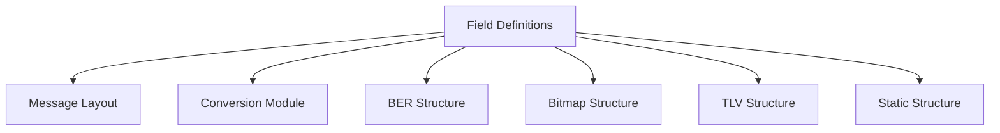

# Field Definitions Module Documentation

## Introduction

The **field_definitions** module provides the foundational data structures and initialization logic for describing ISO 8583 message fields. It defines the metadata and properties required to interpret, validate, and process individual fields within ISO 8583 messages, which are widely used in financial transaction processing systems. This module is essential for ensuring that each field in a message is handled according to its type, format, length, and other constraints.

## Core Components

### `field_info_s` / `field_info_t`

These structures encapsulate all necessary metadata for a single ISO 8583 field. The typedef `field_info_t` is an alias for `struct field_info_s`.

**Structure Definition:**
```c
typedef struct field_info_s {
    E_FIELD_TYPE    eFieldType;
    E_FIELD_FORMAT  eFormatType;
    E_ALPHA_FORMAT  eAlphaFormat;
    E_FIELD_LENGTH  eLengthType;
    E_LENGTH_UNIT   eLengthUnit;
    int             nLength;
    int             nPrintPolicy;
    char            szPattern[MAX_PATTERN_LEN + 1];
    char            szLabel[MAX_FIELD_LABEL_LEN + 1];
    char            szPropertiesName[MAX_PROP_NAME_LEN + 1];
} field_info_t;
```

**Field Descriptions:**
- `eFieldType`: The type of the field (numeric, alphanumeric, binary, etc.).
- `eFormatType`: The format in which the field is encoded.
- `eAlphaFormat`: Specifies alphabetic formatting rules.
- `eLengthType`: Indicates whether the field has fixed or variable length.
- `eLengthUnit`: The unit for the field length (e.g., bytes, characters).
- `nLength`: The maximum or fixed length of the field.
- `nPrintPolicy`: Policy for printing/logging the field (e.g., mask sensitive data).
- `szPattern`: Validation pattern (e.g., regex or format string).
- `szLabel`: Human-readable label for the field.
- `szPropertiesName`: Name for referencing additional field properties.

### Initialization Function
- `void InitFieldInfo(field_info_t* stFieldInfo);`
  - Initializes a `field_info_t` structure with default values.

## Architecture and Component Relationships

The **field_definitions** module is a core building block for ISO 8583 message processing. It is referenced by higher-level modules that require detailed knowledge of field structure and validation, such as message layout, conversion, and mapping modules.

### Module Relationships
- **Upstream dependencies:** None (defines base structures)
- **Downstream consumers:**
  - [message_layout.md](message_layout.md): Uses field definitions to construct message layouts.
  - [conversion_module.md](conversion_module.md): Uses field metadata for field mapping and conversion.
  - [ber_structure.md](ber_structure.md), [bitmap_structure.md](bitmap_structure.md), [tlv_structure.md](tlv_structure.md), [static_structure.md](static_structure.md): Specialized field structures that may extend or reference field definitions.

### Mermaid Diagram: Module Dependency


## Data Flow and Process Overview

The following diagram illustrates how field definitions are used during ISO 8583 message processing:

```mermaid
graph TD
    A[Define Field Metadata (field_info_t)] --> B[Build Message Layout]
    B --> C[Parse/Format ISO 8583 Messages]
    C --> D[Field Validation & Conversion]
```

## Component Interaction

- **Field Definitions** are instantiated and initialized for each field in an ISO 8583 message.
- **Message Layout** modules aggregate these definitions to describe the structure of entire messages.
- **Conversion and Mapping** modules use field metadata to transform and validate data during message processing.

## How This Module Fits Into the Overall System

The **field_definitions** module is foundational for all ISO 8583 message processing. It ensures that every field is described in a consistent, extensible manner, enabling robust validation, parsing, and formatting throughout the system. Other modules (such as [message_layout.md](message_layout.md), [conversion_module.md](conversion_module.md), and the various field structure modules) build upon these definitions to implement complex message handling logic.

## References
- [message_layout.md](message_layout.md)
- [conversion_module.md](conversion_module.md)
- [ber_structure.md](ber_structure.md)
- [bitmap_structure.md](bitmap_structure.md)
- [tlv_structure.md](tlv_structure.md)
- [static_structure.md](static_structure.md)
