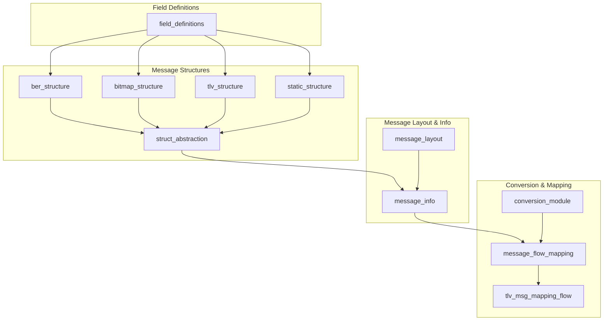
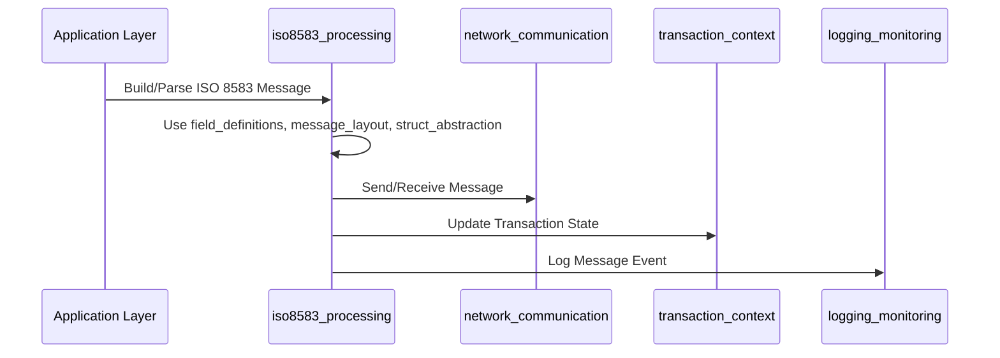
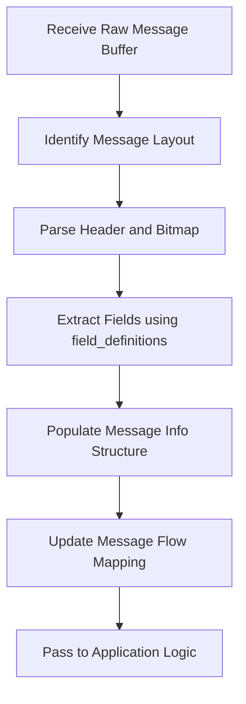

# iso8583_processing Module Documentation

## Introduction and Purpose

The `iso8583_processing` module provides a comprehensive framework for defining, parsing, constructing, and mapping ISO 8583 messages and related message structures. ISO 8583 is a standard for systems that exchange electronic transactions made by cardholders using payment cards. This module abstracts the complexities of message layouts, field definitions, TLV/BER/bitmap/static structures, and message flow mapping, enabling robust and flexible transaction processing in financial systems.

## Architecture Overview

The architecture of the `iso8583_processing` module is highly modular, with each sub-module responsible for a specific aspect of ISO 8583 message handling. The following diagram illustrates the relationships and data flow between the core components:

## High-Level Functionality of Each Sub-Module

Below is a summary of each sub-module, with references to their detailed documentation:

### 1. [Field Definitions](field_definitions.md)
Defines the properties and metadata for individual ISO 8583 fields, including type, format, length, and labeling. This is foundational for all message structure modules.

### 2. [BER Structure](ber_structure.md)
Handles BER (Basic Encoding Rules) formatted fields, including parsing, construction, and management of repeatable fields.

### 3. [Bitmap Structure](bitmap_structure.md)
Manages bitmap-based field presence and data extraction, supporting the core ISO 8583 bitmap paradigm.

### 4. [TLV Structure](tlv_structure.md)
Supports TLV (Tag-Length-Value) formatted fields, including parsing, construction, and repeatable field handling.

### 5. [Static Structure](static_structure.md)
Manages statically defined field layouts for messages that do not use dynamic field presence.

### 6. [Struct Abstraction](struct_abstraction.md)
Provides a unified abstraction over BER, TLV, bitmap, and static structures, enabling generic field access and manipulation.

### 7. [Message Layout](message_layout.md)
Defines the presence, conditions, and layout of fields within a message type, supporting flexible message definitions.

### 8. [Message Info](message_info.md)
Encapsulates the full message instance, including header, type, and data, and provides APIs for message parsing and construction.

### 9. [Conversion Module](conversion_module.md)
Implements field mapping and conversion logic between different message protocols or layouts.

### 10. [Message Flow Mapping](message_flow_mapping.md)
Tracks and manages the flow of messages through the system, supporting monitoring, status tracking, and resource management.

### 11. [TLV Message Mapping Flow](tlv_msg_mapping_flow.md)
Handles TLV-based mapping flows for message tracking and transformation.

## Integration with the Overall System

The `iso8583_processing` module is a core part of the transaction processing pipeline. It interacts with modules such as `network_communication` (for message transport), `transaction_context` (for transaction state), and `logging_monitoring` (for audit and monitoring). For details on these integrations, refer to their respective documentation files, e.g., [network_communication.md], [transaction_context.md], [logging_monitoring.md].

## Component Interaction Diagram

## Process Flow Example: Message Parsing

---

For detailed information on each sub-module, please refer to the linked documentation files above.
