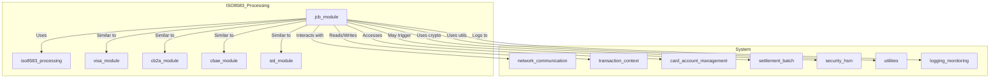
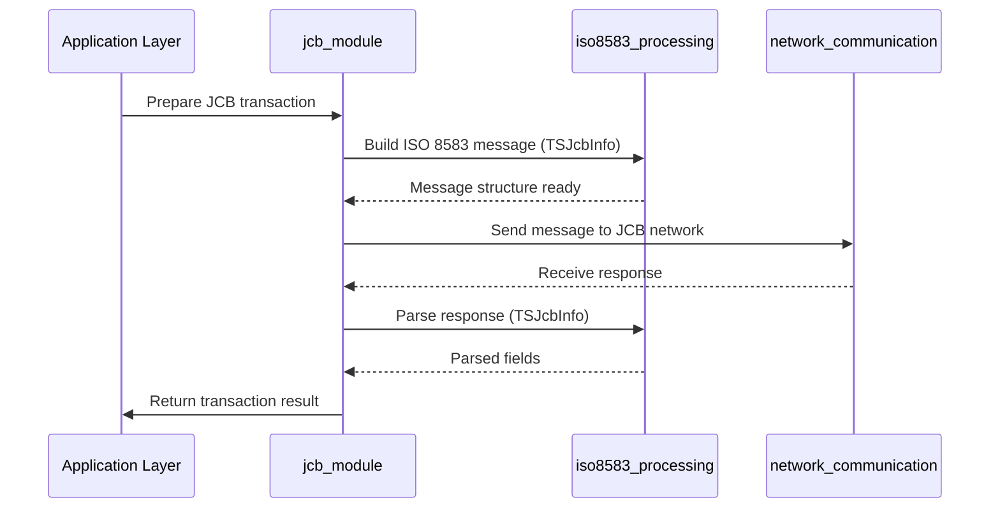
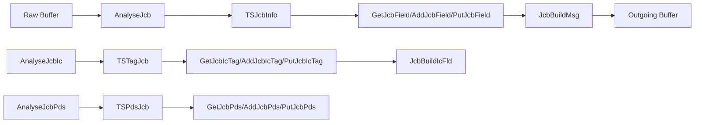

# JCB Module Documentation

## Introduction

The **JCB Module** provides the core data structures and processing functions for handling JCB (Japan Credit Bureau) ISO 8583 messages within the payment switching system. It is responsible for parsing, constructing, and manipulating JCB-specific message fields, chip (ICC) tags, and Private Data Subfields (PDS), ensuring compliance with JCB network requirements. This module is essential for supporting JCB card transactions, including message field management, chip data handling, and PDS processing.

## Core Functionality

The JCB module defines the following key data structures and functions:

- **TSJcbInfo**: Represents the parsed state of a JCB ISO 8583 message, including field positions, message type, bitmap, and raw data.
- **TSTagJcb**: Manages the presence, position, and content of chip (ICC) tags (typically field 55) in JCB messages.
- **TSPdsJcb**: Handles the presence, position, and content of Private Data Subfields (PDS, typically field 48) in JCB messages.
- Functions for initializing, parsing, extracting, adding, and building JCB message fields, chip tags, and PDS fields.

## Architecture Overview

The JCB module is part of the broader ISO 8583 message processing subsystem. It interacts with generic ISO 8583 utilities and other card scheme modules (e.g., Visa, CB2A, CBAE, SID) to provide scheme-specific message handling. The module relies on shared ISO 8583 definitions and utilities for field mapping, bitmap management, and message layout.

### High-Level Architecture




### Component Relationships

- **iso8583_processing**: Provides the base message parsing, field mapping, and bitmap utilities. See [iso8583_processing.md].
- **network_communication**: Handles message transport to/from JCB network endpoints. See [network_communication.md].
- **transaction_context**: Maintains per-transaction state and context. See [transaction_context.md].
- **card_account_management**: Supplies card/account data for message population. See [card_account_management.md].
- **settlement_batch**: Used for settlement and batch processing of JCB transactions. See [settlement_batch.md].
- **security_hsm**: Provides cryptographic operations for secure fields. See [security_hsm.md].
- **utilities**: General-purpose helpers (e.g., encoding, parameter management). See [utilities.md].
- **logging_monitoring**: For event and error logging. See [logging_monitoring.md].

## Data Structures

### TSJcbInfo
```c
typedef struct SJcbInfo {
   int           nFieldPos    [ MAX_JCB_FIELDS  +1 ];
   int           nMsgType;
   int           nLength;
   char          sBitMap      [ JCB_BITMAP_LEN   ];
   char          sData        [ MAX_JCB_DATA_LEN ];
} TSJcbInfo;
```
- **Purpose**: Holds the parsed state of a JCB ISO 8583 message, including field positions, message type, bitmap, and raw data.

### TSTagJcb
```c
typedef struct STagJcb {
   int  nPresent  [ MAX_JCB_CHIP_TAG ];
   int  nPosTag   [ MAX_JCB_CHIP_TAG ];
   int  nLength;
   char sChipData [ MAX_JCB_CHIP_LEN ];
} TSTagJcb;
```
- **Purpose**: Manages chip (ICC) tag data (field 55) for JCB messages.

### TSPdsJcb
```c
typedef struct SPdsJcb {
   int  nPresent  [ MAX_JCB_PDS ];
   int  nPosPds   [ MAX_JCB_PDS ];
   int  nLength;
   char sPdsData  [ MAX_JCB_PDS_LEN ];
   int  nMsgType;
} TSPdsJcb;
```
- **Purpose**: Handles Private Data Subfields (PDS, field 48) for JCB messages.

## Process Flow

### JCB Message Lifecycle



### Internal Data Flow




## Component Interactions

- **TSJcbInfo** is the central structure for message parsing and construction.
- **TSTagJcb** and **TSPdsJcb** are used for specialized field handling (chip and PDS data).
- Functions such as `AnalyseJcb`, `GetJcbField`, `AddJcbField`, `PutJcbField`, and `JcbBuildMsg` manage the message lifecycle.
- Similar functions exist for chip tags and PDS fields.

## Integration Points

- **With iso8583_processing**: Uses field mapping, bitmap, and message layout utilities. See [iso8583_processing.md].
- **With network_communication**: Sends/receives messages to/from JCB endpoints. See [network_communication.md].
- **With card_account_management**: Accesses card/account data for field population. See [card_account_management.md].
- **With security_hsm**: For cryptographic field processing. See [security_hsm.md].
- **With logging_monitoring**: For transaction/event logging. See [logging_monitoring.md].

## References

- [iso8583_processing.md]
- [network_communication.md]
- [transaction_context.md]
- [card_account_management.md]
- [settlement_batch.md]
- [security_hsm.md]
- [utilities.md]
- [logging_monitoring.md]
