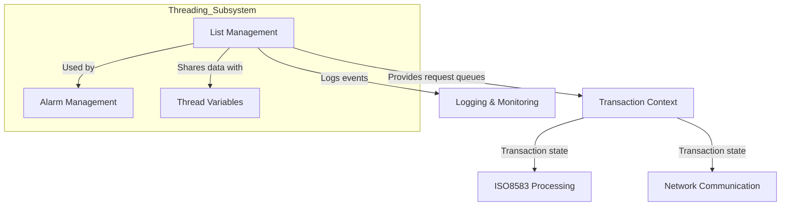
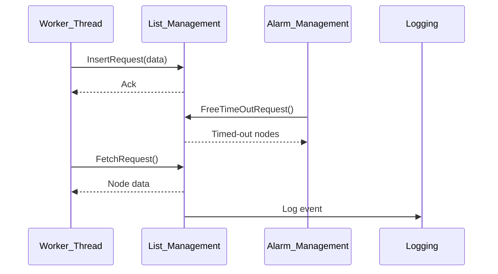
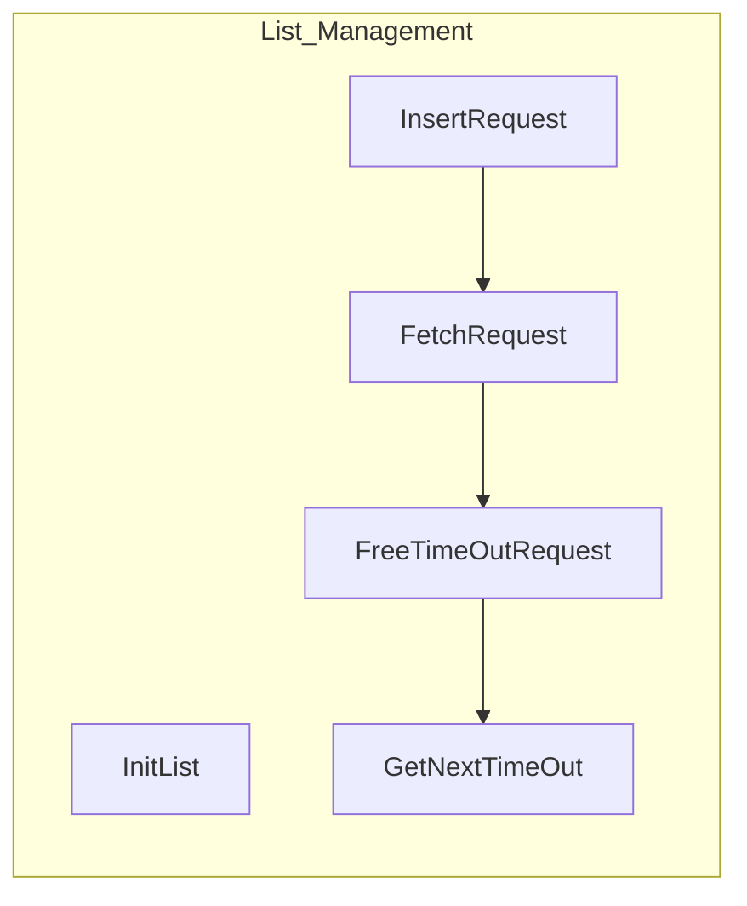

# List Management Module Documentation

## Introduction

The **list_management** module provides thread-safe, in-memory linked list structures and operations for managing transient request data within the system. It is a foundational component for handling concurrent request queuing, timeouts, and data exchange between threads, especially in high-throughput transaction processing environments such as payment switches or message routers.

This module is part of the broader `threading` subsystem, and is closely related to modules such as [alarm_management.md](alarm_management.md) and [thread_variables.md](thread_variables.md), which together provide robust thread and timeout management capabilities.

---

## Core Functionality

The module defines:
- **Node Data Structures**: For encapsulating request metadata and payloads.
- **Thread-Safe Linked Lists**: For storing and managing active requests.
- **List Operations**: For initialization, insertion, retrieval, timeout handling, and cleanup of request nodes.

### Key Data Structures

#### `TSNodeData`
Represents the payload and metadata for a single request node. Includes:
- Multiple key fields (for indexing or identification)
- Buffers for request data and private data
- Timestamps for purge/timeout management
- Message ID for tracking

#### `TSNodeStruct`
A linked list node containing:
- Creation timestamp
- Embedded `TSNodeData`
- Pointer to the next node
- Mutex for thread-safe access

#### List Heads
- `ListHeadAcq`: Head of the Acquirer request list
- `ListHeadIss`: Head of the Issuer request list

### Core Operations
- `InitList()`: Initializes the list heads and mutexes
- `InitNodeData(TSNodeData *data)`: Initializes a node's data fields
- `InsertRequest(char sens, TSNodeData *data)`: Inserts a request node into the appropriate list (Acquirer/Issuer)
- `FetchRequest(char sens, TSNodeData *data)`: Retrieves and removes a request node from the list
- `FreeTimeOutRequest(char sens)`: Frees nodes that have timed out
- `GetNextTimeOut(struct timeval* stNextTimeOut)`: Determines the next timeout event

---

## Architecture & Component Relationships

The list_management module is designed for use by multiple threads, providing safe concurrent access to request queues. It is typically used by transaction processing threads, timeout/alarm handlers, and possibly network communication handlers.

### High-Level Architecture

### Component Interaction

### Data Flow

---

## Integration with the Overall System

- **Upstream**: Receives request data from transaction processing threads or network handlers.
- **Downstream**: Supplies request data to processing threads, timeout handlers, or cleanup routines.
- **Timeout Handling**: Closely integrated with [alarm_management.md](alarm_management.md) for purging expired requests.
- **Thread Context**: Shares and manages per-thread data in conjunction with [thread_variables.md](thread_variables.md).
- **Logging**: Reports significant events to [logging_monitoring.md](logging_monitoring.md).

---

## References
- [alarm_management.md](alarm_management.md)
- [thread_variables.md](thread_variables.md)
- [logging_monitoring.md](logging_monitoring.md)
- [transaction_context.md](transaction_context.md)
- [network_communication.md](network_communication.md)
- [iso8583_processing.md](iso8583_processing.md)
