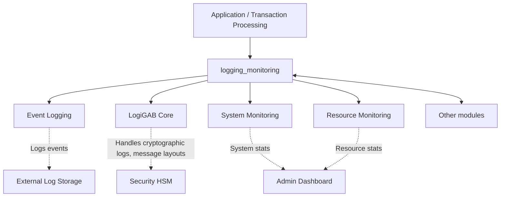
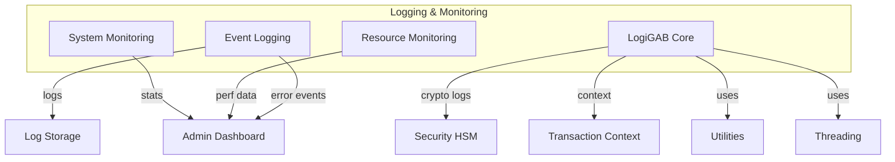

# Logging & Monitoring Module Documentation

## Introduction and Purpose

The `logging_monitoring` module provides comprehensive facilities for event logging, system and resource monitoring, and advanced message logging/cryptographic operations within the transaction processing system. It is essential for ensuring operational visibility, troubleshooting, auditing, and maintaining the health and security of the overall system.

## Architecture Overview

The module is composed of four main sub-modules:

- **Event Logging**: Handles structured event logging for system and application events.
- **LogiGAB Core**: Provides advanced message logging, cryptographic message handling, and context management.
- **System Monitoring**: Collects and exposes system-level statistics (CPU, RAM, disk, network, etc.).
- **Resource Monitoring**: Tracks resource usage and process timing for performance analysis.

### High-Level Architecture

## Sub-Modules and Core Functionality

### 1. Event Logging
- **Purpose**: Structured logging of system and application events, error codes, and operational states.
- **Core Components**: `TSEventLog`, `SEventLog`
- **Details**: See [event_logging.md](event_logging.md)

### 2. LogiGAB Core
- **Purpose**: Advanced message logging, cryptographic message construction/parsing, and context management for secure transaction processing.
- **Core Components**: `TSLGCryptoInfo`, `TSLGCrytTmplDesc`, `TSLGMsgInfo`, `TSLGCryptoMsg`, `TSLGCryptoTemplate`, `SContext`, `TSLGAccounts`, `TSLGMsgFieldProp`, `TSLGField`, `TSLGKeyElts`, `SContextT`, `TSLGMsgLayout`, `TSLGStruct`
- **Details**: See [logigab_core.md](logigab_core.md)

### 3. System Monitoring
- **Purpose**: Collects and provides system-level statistics such as uptime, CPU/memory usage, disk/network IO, and message queue status.
- **Core Components**: `TSSysInfo`
- **Details**: See [system_monitoring.md](system_monitoring.md)

### 4. Resource Monitoring
- **Purpose**: Tracks process-level resource usage and timing for performance and health monitoring.
- **Core Components**: `TSResLastTime`
- **Details**: See [resource_monitoring.md](resource_monitoring.md)

## Integration with Other Modules

- **Security HSM**: LogiGAB Core interacts with [security_hsm.md](security_hsm.md) for cryptographic operations and secure key management.
- **Utilities**: Uses [utilities.md](utilities.md) for shared resources and parameter management.
- **Threading**: Relies on [threading.md](threading.md) for concurrency and thread context.
- **Transaction Context**: Integrates with [transaction_context.md](transaction_context.md) for transaction state and context propagation.

## Component Relationships and Data Flow

## See Also
- [event_logging.md](event_logging.md)
- [logigab_core.md](logigab_core.md)
- [system_monitoring.md](system_monitoring.md)
- [resource_monitoring.md](resource_monitoring.md)
- [security_hsm.md](security_hsm.md)
- [utilities.md](utilities.md)
- [threading.md](threading.md)
- [transaction_context.md](transaction_context.md)
