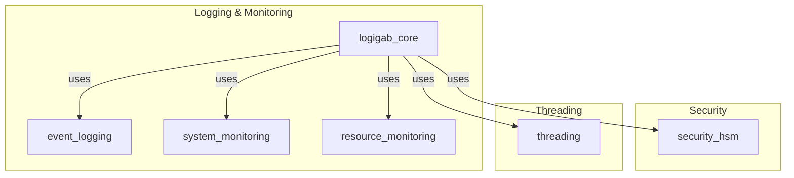
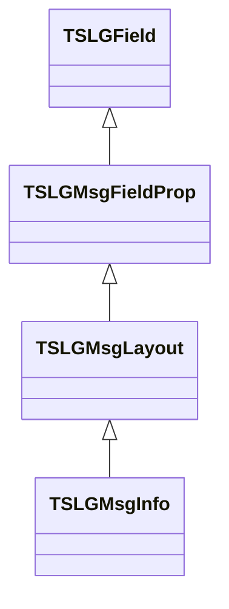
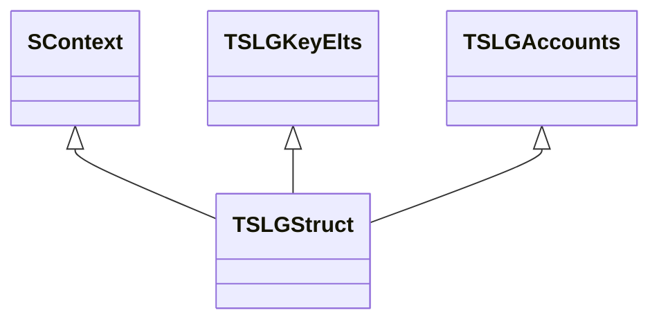
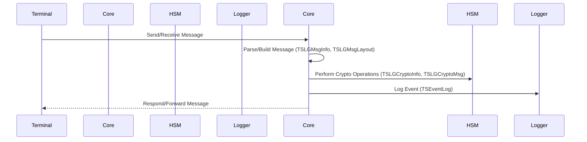
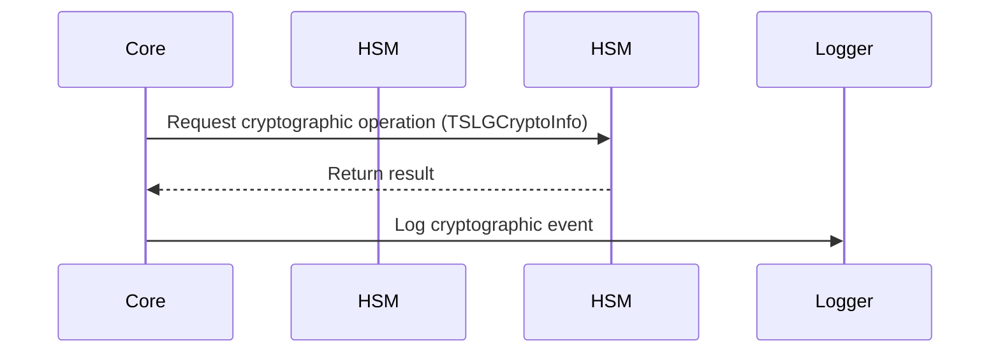

# logigab_core Module Documentation

## Introduction

The `logigab_core` module is a central component of the logging and monitoring subsystem within the broader transaction processing platform. It provides the data structures, message layouts, cryptographic templates, and context management necessary for secure, auditable, and reliable ATM and terminal transaction processing. This module is tightly integrated with other system modules, especially those handling security, event logging, and thread management.

## Core Functionality

The primary responsibilities of `logigab_core` include:

- Defining message and field layouts for ATM/terminal communication
- Managing cryptographic templates and secure key elements
- Maintaining per-terminal and per-thread context for transaction processing
- Supporting logging, monitoring, and event tracking
- Providing interfaces for message construction, parsing, and cryptographic operations

## Architecture Overview

The `logigab_core` module is composed of several key data structures and interacts with other modules as shown below.

### Main Components

- **TSLGField / TSLGMsgFieldProp / TSLGMsgLayout**: Define the structure and properties of message fields and layouts for ATM/terminal messages.
- **TSLGMsgInfo**: Represents a message instance, including its data, header, and layout.
- **TSLGCryptoTemplate / TSLGCrytTmplDesc / TSLGCryptoInfo / TSLGCryptoMsg**: Define cryptographic templates, their descriptions, and hold cryptographic data for secure operations.
- **TSLGKeyElts**: Stores cryptographic key elements for secure key management.
- **TSLGStruct**: Maintains the runtime context for a terminal or thread, including buffers, state, and cryptographic keys.
- **TSLGAccounts**: Holds account-related information for transaction processing.
- **SContext / SContextT**: Store per-transaction or per-thread context, including ISO buffers and transaction codes.

### Dependencies

- **Security**: Relies on [security_hsm.md](security_hsm.md) for cryptographic operations and secure data structures.
- **Event Logging**: Integrates with [event_logging.md](event_logging.md) for event tracking and audit trails.
- **Threading**: Uses [threading.md](threading.md) for thread and context management.


### High-Level Architecture Diagram




## Component Relationships

### Message Layout and Processing

- **TSLGField**: Describes a single message field (number, type, length, label).
- **TSLGMsgFieldProp**: Maps field numbers to offsets and sizes within a message.
- **TSLGMsgLayout**: Defines the layout for a specific message type, referencing multiple field properties.
- **TSLGMsgInfo**: Holds the actual message data, header, and a pointer to its layout.



### Cryptographic Data Flow

- **TSLGCrytTmplDesc**: Describes cryptographic templates (code, label).
- **TSLGCryptoTemplate**: Defines a cryptographic template (type, code, fields).
- **TSLGCryptoInfo**: Holds cryptographic data for a template, including field presence and TLV positions.
- **TSLGCryptoMsg**: Aggregates multiple `TSLGCryptoInfo` structures for complex cryptographic messages.
- **TSLGKeyElts**: Stores key material for cryptographic operations.

```mermaid
classDiagram
    TSLGCrytTmplDesc <|-- TSLGCryptoTemplate
    TSLGCryptoTemplate <|-- TSLGCryptoInfo
    TSLGCryptoInfo <|-- TSLGCryptoMsg
    TSLGKeyElts -- used by --> TSLGStruct
```

### Context and Runtime State

- **TSLGStruct**: Central runtime structure for a terminal/thread, holding buffers, state, keys, and context.
- **SContext / SContextT**: Store transaction-specific context, including ISO buffers and PIN blocks.
- **TSLGAccounts**: Holds account information for the current context.




## Data Flow and Process Flows

### Message Processing Flow



### Cryptographic Operation Flow




## Integration with Other Modules

- **Security HSM**: For cryptographic operations, see [security_hsm.md](security_hsm.md).
- **Event Logging**: For event structure and logging, see [event_logging.md](event_logging.md).
- **Threading**: For thread context and management, see [threading.md](threading.md).


## References

- [security_hsm.md](security_hsm.md)
- [event_logging.md](event_logging.md)
- [threading.md](threading.md)
- [system_monitoring.md](system_monitoring.md)
- [resource_monitoring.md](resource_monitoring.md)

