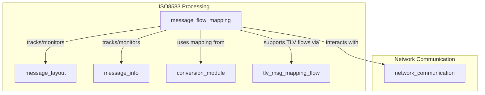
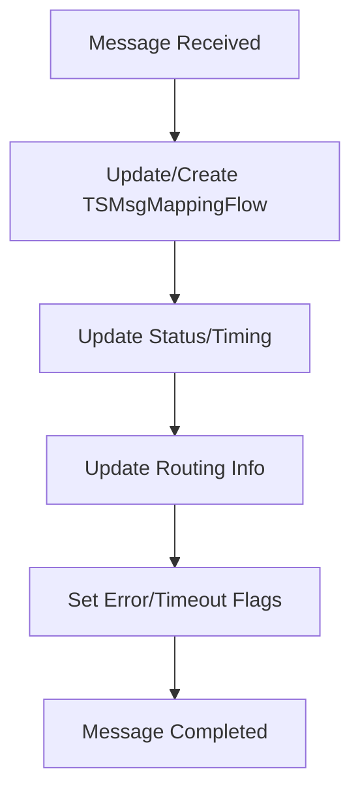
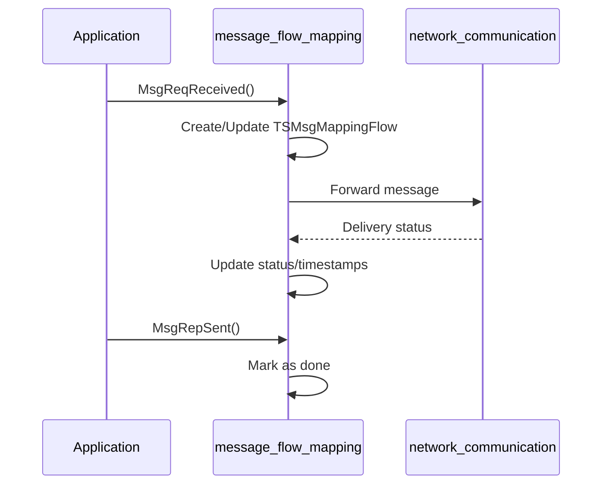

# message_flow_mapping Module Documentation

## Introduction

The `message_flow_mapping` module is a core component of the ISO 8583 processing subsystem. It is responsible for tracking, managing, and monitoring the lifecycle and flow of messages (such as financial transactions) as they traverse through the system. This module provides data structures and APIs to record message metadata, status, timing, and routing information, enabling robust monitoring, troubleshooting, and performance analysis of message flows.

## Core Functionality

- **Message Flow Tracking:** Maintains a linked list of message flow records, each capturing detailed metadata about a message's journey through the system.
- **Status and Timing:** Records timestamps for each significant event in the message lifecycle (e.g., received, forwarded, replied, sent).
- **Routing Information:** Stores source and destination node/resource identifiers and process IDs.
- **Error and Exception Handling:** Flags for orphaned messages, timeouts, malfunctions, and special processing (e.g., SAF - Store and Forward).
- **APIs for Message Flow Management:** Provides functions to initialize, update, and lock/unlock message flow records, as well as to mark various message events.

## Key Data Structures

### TSMsgMappingFlow
```c
typedef struct {
    msg_id_t            msgId;
    char                msg_type[5];
    char                processing_code[3];
    char                src_node_id[5];
    char                src_resource_id[7];
    pid_t               src_resource_pid;
    char                dst_node_id[5];
    char                dst_resource_id[7];
    pid_t               dst_resource_pid;
    struct timeval      times[QMS_QTY];
    unsigned int        status;
    char                msg_stan[7];
    char                origin_code;
    char                response_code[4];
    char                isOrphanFlag;
    char                isSrcTimeOutFlag;
    char                isDstTimeOutFlag;
    char                isMalfunctionFlag;
    char                dirty_flag;
    char                isDone;
    char                c_ver;
    char                reason_code[5];
    char                terminal_id[9];
    char                bank_code[7];
    char                saf_ind;
} TSMsgMappingFlow;
```

### TSMsgMappingList
```c
typedef struct SMsgMappingList{
    union {
        TSMsgMappingFlow    MsgMappingFlow;
        char                dummy[304];
    };
    struct SMsgMappingList* next;
} TSMsgMappingList;
```

- The `TSMsgMappingList` forms a linked list of message flow records, each containing a `TSMsgMappingFlow` structure.

## Architecture and Component Relationships

The `message_flow_mapping` module is tightly integrated with the ISO 8583 processing stack. It interacts with message layout, message info, and conversion modules to provide a comprehensive view of message processing. The module is designed to work in shared memory for high-performance, concurrent environments.

### High-Level Architecture



### Data Flow Diagram



### Component Interaction

- **message_layout:** Defines the structure and presence of fields in each message. See [message_layout.md](message_layout.md)
- **message_info:** Provides protocol-specific message metadata. See [message_info.md](message_info.md)
- **conversion_module:** Handles field mapping and transformation logic. See [conversion_module.md](conversion_module.md)
- **tlv_msg_mapping_flow:** Supports TLV-based message mapping. See [tlv_msg_mapping_flow.md](tlv_msg_mapping_flow.md)
- **network_communication:** Interfaces with network modules for message transmission. See [network_communication.md](network_communication.md)

## Process Flows

### Message Lifecycle Tracking



## Integration in the Overall System

The `message_flow_mapping` module is a central part of the ISO 8583 processing pipeline. It enables:
- End-to-end message tracking for audit and troubleshooting
- Real-time monitoring of message status and performance
- Support for advanced features like Store and Forward (SAF)
- Seamless integration with protocol-specific modules (e.g., VISA, SMS, CB2A)

## References
- [message_layout.md](message_layout.md)
- [message_info.md](message_info.md)
- [conversion_module.md](conversion_module.md)
- [tlv_msg_mapping_flow.md](tlv_msg_mapping_flow.md)
- [network_communication.md](network_communication.md)
