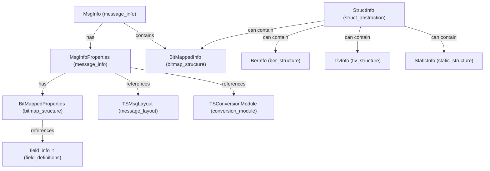
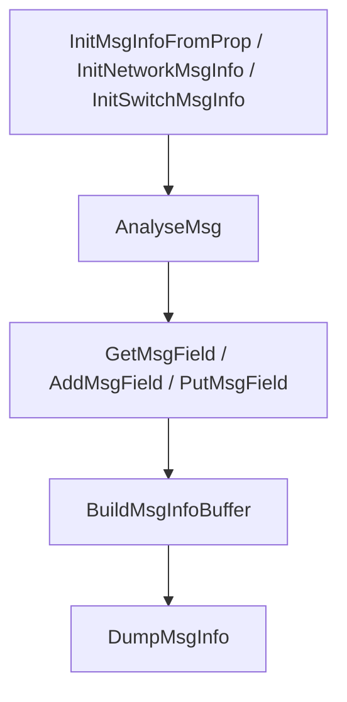

# message_info Module Documentation

## Introduction

The `message_info` module provides the core data structures and functions for representing, constructing, parsing, and manipulating ISO 8583 message instances within the system. It acts as the central abstraction for message-level operations, encapsulating both the message header and the bitmap-based data payload, and referencing protocol-specific properties. This module is essential for any component that needs to interpret or build ISO 8583 messages, such as network communication handlers, protocol converters, and transaction processors.

## Core Functionality

The module defines two primary structures:

- **MsgInfoProperties**: Describes the protocol-specific properties of a message, including header and message type formats, protocol identifiers, and bitmap properties.
- **MsgInfo**: Represents an actual message instance, containing the header, message type, bitmap data, and a reference to its properties.

It also provides a set of functions for initializing, parsing, building, and manipulating message instances.

## Architecture and Component Relationships

The `message_info` module is a key part of the `iso8583_processing` subsystem. It interacts closely with several other modules to provide a complete message processing pipeline:

- **bitmap_structure** ([bitmap_structure.md]): Provides the `BitMappedInfo` and `BitMappedProperties` types, which are embedded within `MsgInfo` and `MsgInfoProperties` to represent and manage the bitmap and field data of ISO 8583 messages.
- **field_definitions** ([field_definitions.md]): Supplies the definitions and metadata for individual message fields, referenced indirectly via bitmap properties.
- **message_layout** ([message_layout.md]): Defines the layout and presence of fields for different message types, which can be referenced by message properties.
- **conversion_module** ([conversion_module.md]): Used for mapping and converting fields between different protocol formats.
- **ber_structure**, **tlv_structure**, **static_structure**, **struct_abstraction**: These modules provide alternative data representations for message fields and are used in conjunction with or as alternatives to bitmap-based messages.

### Mermaid Diagram: High-Level Architecture

## Data Flow and Process Overview

### Message Construction and Parsing

1. **Initialization**: A `MsgInfo` instance is initialized using protocol properties (via `InitNetworkMsgInfo`, `InitSwitchMsgInfo`, or `InitMsgInfoFromProp`).
2. **Parsing**: Incoming message buffers are parsed into `MsgInfo` using `AnalyseMsg`, which fills out the header, message type, and bitmap fields.
3. **Field Access**: Fields can be retrieved, added, or updated using `GetMsgField`, `AddMsgField`, and `PutMsgField`.
4. **Building**: Outgoing messages are constructed from `MsgInfo` using `BuildMsgInfoBuffer`.
5. **Debugging**: The `DumpMsgInfo` function provides a human-readable dump of the message contents for diagnostics.

### Mermaid Diagram: Message Processing Flow

## Integration in the Overall System

The `message_info` module is the central point for ISO 8583 message representation and manipulation. It is used by:

- **network_communication** ([network_communication.md]): For receiving and sending ISO 8583 messages over various network channels.
- **transaction_context** ([transaction_context.md]): For associating parsed messages with transaction state.
- **conversion_module** ([conversion_module.md]): For protocol translation and field mapping.
- **logging_monitoring** ([logging_monitoring.md]): For logging message contents and events.

## References

- [bitmap_structure.md]
- [field_definitions.md]
- [message_layout.md]
- [conversion_module.md]
- [ber_structure.md]
- [tlv_structure.md]
- [static_structure.md]
- [struct_abstraction.md]
- [network_communication.md]
- [transaction_context.md]
- [logging_monitoring.md]
