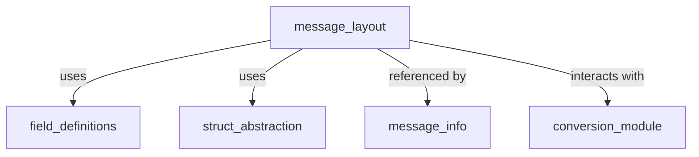
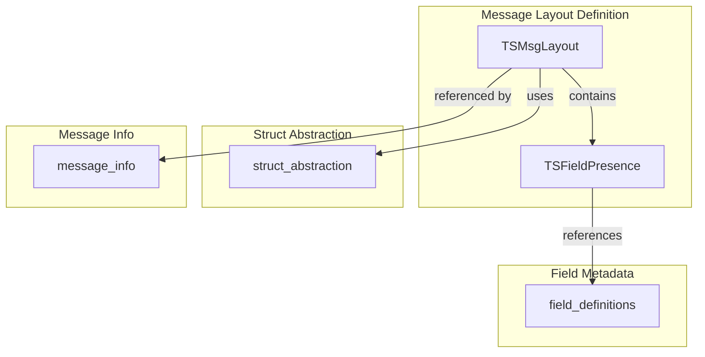
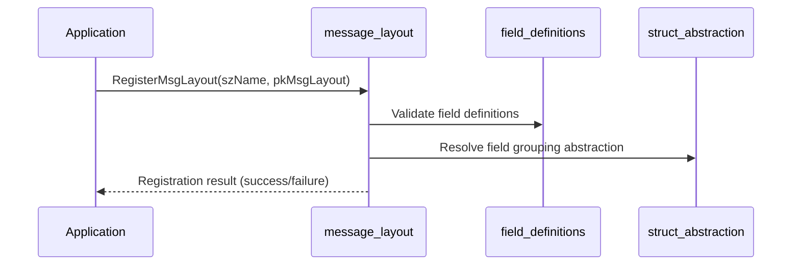

# message_layout Module Documentation

## Introduction

The `message_layout` module is a core component of the ISO 8583 message processing subsystem. It defines the structure, presence, and organization of fields within a message, enabling flexible and protocol-compliant message parsing, validation, and construction. This module is essential for supporting multiple message types and protocols in financial transaction systems.

## Core Functionality

The module provides:
- **Field presence and origin encoding**: Using compact bitwise representations to indicate whether a field is mandatory, optional, conditional, or forbidden, and its origin (e.g., required in request, generated, etc.).
- **Message layout definition**: Structures to describe the arrangement and properties of all fields in a message type.
- **APIs for layout management**: Functions to initialize, register, and retrieve message layouts and their field definitions.

## Key Data Structures

### TSFieldPresence
```c
typedef struct {
    int   nFieldNo;         // Field number (identifier)
    char  presence_info;    // Encoded presence and origin info
    int   nConditionNo;     // Condition number for conditional fields
} TSFieldPresence;
```
- Encapsulates the presence and conditionality of a single field within a message layout.

### TSMsgLayout
```c
typedef struct {
    TSFieldPresence tab_msgFields[MAX_STRUCT_FIELDS]; // Array of field presence definitions
    int             nProtocolId;                     // Protocol identifier
    char            szMsgType[MAX_MSG_TYPE_LEN + 1]; // Message type string
    char            szName;                          // Layout name
    msg_layout_id_t id;                              // Unique layout ID
} TSMsgLayout;
```
- Represents the complete layout for a message type, including all field presence definitions and protocol metadata.

## Architecture and Component Relationships

The `message_layout` module interacts with several other modules to provide a complete message definition and processing capability:

- **[field_definitions](field_definitions.md)**: Supplies detailed field metadata (type, format, length, etc.) used by layouts.
- **[struct_abstraction](struct_abstraction.md)**: Abstracts different field grouping mechanisms (bitmap, TLV, BER, static) for flexible message composition.
- **[message_info](message_info.md)**: Associates layouts with message-level metadata and protocol-specific properties.
- **[conversion_module](conversion_module.md)**: Handles mapping and transformation of fields between different layouts or protocols.

### High-Level Architecture Diagram



### Data Flow Diagram



### Component Interaction

- **TSMsgLayout** contains an array of **TSFieldPresence** entries, each describing the presence and conditionality of a field.
- Each field presence entry references field metadata from the **field_definitions** module.
- The layout may use different field grouping abstractions (bitmap, TLV, BER, static) via the **struct_abstraction** module.
- Message-level metadata and protocol-specific properties are managed in the **message_info** module, which references the layout.
- Field mapping and conversion logic is handled by the **conversion_module**.

## Process Flow Example: Message Layout Registration



## Integration in the Overall System

The `message_layout` module is foundational for ISO 8583 message processing. It enables the system to:
- Define and enforce protocol-specific message structures
- Support multiple protocols and message types
- Enable dynamic message parsing, validation, and construction

It is tightly integrated with field definitions, structural abstractions, and message metadata, forming the backbone of the message processing pipeline.

## References
- [field_definitions.md](field_definitions.md)
- [struct_abstraction.md](struct_abstraction.md)
- [message_info.md](message_info.md)
- [conversion_module.md](conversion_module.md)
