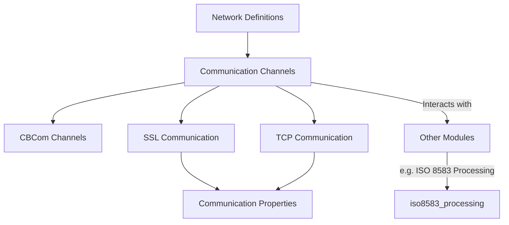
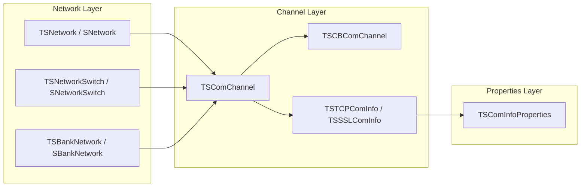

# Network Communication Module Documentation

## Introduction and Purpose

The **network_communication** module is responsible for defining, managing, and facilitating all network-related operations within the system. It provides the structures and mechanisms for configuring network entities, establishing and maintaining communication channels (including TCP and SSL), and supporting specialized banking and switch network requirements. This module is foundational for enabling secure, reliable, and flexible message exchange between internal components and external financial networks.

## Architecture Overview

The module is organized into several sub-modules, each handling a specific aspect of network communication:

- **Network Definitions**: Structures for representing networks, switches, and bank network configurations.
- **Communication Channels**: Core channel management, message mapping, and field formatting for transaction processing.
- **CBCom Channels**: Specialized channel management for CBCom protocol.
- **Communication Properties**: Abstractions for connection properties and modes.
- **SSL Communication**: Secure communication channel management using SSL/TLS.
- **TCP Communication**: Standard TCP/IP communication channel management.

### High-Level Architecture Diagram

## Sub-Modules and Their Functionality

### 1. Network Definitions
Defines the core structures for representing networks, switches, and bank network configurations. These definitions are used throughout the system to identify and route messages appropriately.

- [See detailed documentation](network_definitions.md)

### 2. Communication Channels
Manages the main communication channels, including message mapping and field formatting, essential for transaction processing and routing.

- [See detailed documentation](communication_channels.md)

### 3. CBCom Channels
Handles specialized channel management for the CBCom protocol, including state management and incident tracking.

- [See detailed documentation](cbcom_channels.md)

### 4. Communication Properties
Defines the properties and modes for communication channels, supporting various connection types (TCP, UDP, SSL) and packet formats.

- [See detailed documentation](communication_properties.md)

### 5. SSL Communication
Implements secure communication channels using SSL/TLS, including client/server modes and certificate management.

- [See detailed documentation](ssl_communication.md)

### 6. TCP Communication
Manages standard TCP/IP communication channels, including client/server initialization and message transmission.

- [See detailed documentation](tcp_communication.md)

## Component Relationships and Data Flow

## Integration with Other Modules

The **network_communication** module is tightly integrated with other system modules, especially:
- [iso8583_processing.md]: For message formatting, parsing, and transaction routing.
- [threading.md]: For managing concurrent network operations and channel threads.
- [security_hsm.md]: For secure key management and cryptographic operations over network channels.
- [logging_monitoring.md]: For event logging and monitoring of network activities.

Refer to the respective module documentation for further details on their internal structures and how they interact with network_communication.

---

*For detailed sub-module documentation, see the linked files above.*
