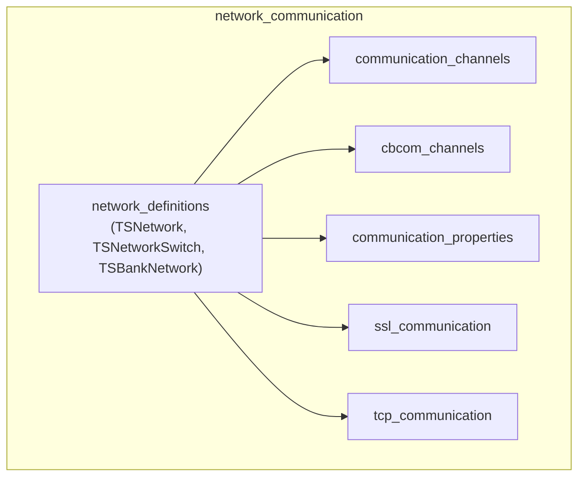
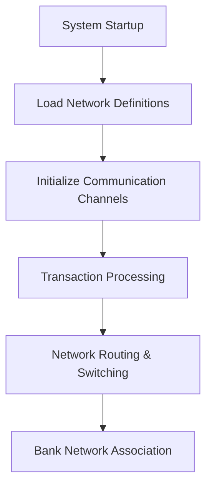
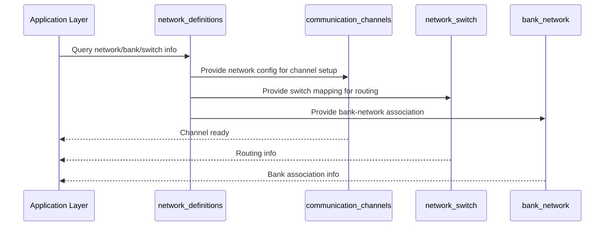

# Network Definitions Module Documentation

## Introduction

The **network_definitions** module provides the foundational data structures for representing and managing network, network switch, and bank network configurations within the payment switching and transaction processing system. These definitions are essential for routing, switching, and associating transactions with the correct network and banking entities. The module is a core part of the broader [network_communication](network_communication.md) subsystem, which handles all aspects of networked transaction flows.

## Core Functionality

This module defines the following key structures:

- **TSNetwork / SNetwork**: Represents a payment network, including network codes and port configurations for credit and debit operations.
- **TSNetworkSwitch / SNetworkSwitch**: Defines the mapping and switching logic between networks, including message type indicators (MTI) and alternate routing information.
- **TSBankNetwork / SBankNetwork**: Encapsulates the relationship between banks and networks, including codes, settlement and billing currencies, and virtual merchant/outlet information.

These structures are used throughout the system to:
- Route transactions to the correct network or bank
- Configure network-specific parameters
- Enable flexible switching and failover between network endpoints

## Architecture Overview

The **network_definitions** module is a foundational layer within the [network_communication](network_communication.md) subsystem. It is referenced by higher-level modules responsible for communication channels, protocol handling, and transaction routing.

### Module Relationships

## Component Details

### TSNetwork / SNetwork

Represents a payment network configuration.

| Field                  | Type   | Description                                 |
|------------------------|--------|---------------------------------------------|
| network_code           | char[2]| Unique code for the network                 |
| credit_primary_port    | char[6]| Primary port for credit transactions        |
| credit_alternate_port  | char[6]| Alternate port for credit transactions      |
| debit_primary_port     | char[6]| Primary port for debit transactions         |
| debit_alternate_port   | char[6]| Alternate port for debit transactions       |
| virtual_bank_code      | char[6]| Associated virtual bank code                |

### TSNetworkSwitch / SNetworkSwitch

Defines network switching and routing logic.

| Field                  | Type   | Description                                 |
|------------------------|--------|---------------------------------------------|
| network                | char[2]| Network code                                |
| resource               | char[6]| Resource identifier                         |
| mti                    | char[4]| Message Type Indicator (MTI)                |
| alternate_debit        | char[6]| Alternate debit routing info                |
| alternate_credit       | char[6]| Alternate credit routing info               |

### TSBankNetwork / SBankNetwork

Represents the mapping between banks and networks, including settlement and virtual merchant details.

| Field                       | Type    | Description                                 |
|-----------------------------|---------|---------------------------------------------|
| bank_code                   | char[6] | Bank identifier                             |
| network_code                | char[2] | Associated network code                     |
| acquirer_bin                | char[11]| Acquirer Bank Identification Number         |
| acquirer_ica                | char[4] | Acquirer ICA code                           |
| settlement_currency         | char[3] | Currency for settlement                     |
| billing_currency            | char[3] | Currency for billing                        |
| reconciliation_currency     | char[3] | Currency for reconciliation                 |
| virtual_merchant_number     | char[15]| Virtual merchant number                     |
| virtual_outlet_number       | char[15]| Virtual outlet number                       |
| virtual_abrev_location      | char[25]| Abbreviated location                        |
| virtual_activity_code       | char[4] | Activity code                               |
| virtual_city_code           | char[3] | City code                                   |
| virtual_region_code         | char[3] | Region code                                 |
| virtual_country_code        | char[3] | Country code                                |

## Data Flow and Usage

The structures defined in this module are typically loaded at system initialization from configuration sources and are referenced during transaction processing to determine routing, switching, and network-specific parameters.

## Component Interaction

## Integration with Other Modules

- For details on communication channel setup, see [communication_channels](communication_channels.md).
- For protocol and property handling, see [communication_properties](communication_properties.md), [ssl_communication](ssl_communication.md), and [tcp_communication](tcp_communication.md).
- For the overall network communication architecture, see [network_communication](network_communication.md).

## Summary

The **network_definitions** module is a critical building block for network and bank configuration management, enabling robust, flexible, and scalable transaction routing and switching in the payment processing system.
