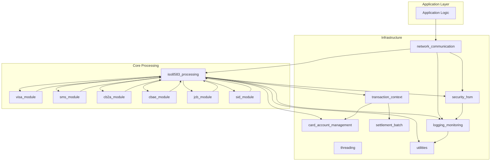

# pwc-unix_icpsconv Repository Overview

## Purpose

The `pwc-unix_icpsconv` repository provides a comprehensive, modular framework for high-performance financial transaction processing, with a focus on ISO 8583 message handling and multi-network payment switching. It is designed to support the parsing, construction, mapping, and secure transmission of electronic payment messages across various card schemes (Visa, SMS, CB2A, CBAE, JCB, SID, etc.), while integrating with network communication, transaction context management, card/account management, settlement, security (HSM), logging, and monitoring subsystems.

This repository is suitable for use in payment switches, acquirers, issuers, and other financial middleware requiring robust, extensible, and auditable transaction processing.

---

## End-to-End Architecture

The system is organized into modular components, each responsible for a specific aspect of transaction processing. The following diagrams illustrate the high-level architecture and data flows.

### High-Level System Architecture



### End-to-End Message Processing Flow

```mermaid
flowchart TD
    A[Receive Raw Message Buffer] --> B[network_communication: Transport]
    B --> C[iso8583_processing: Parse/Build Message]
    C --> D[Scheme Module (e.g., visa_module, sms_module): Specialized Handling]
    D --> E[transaction_context: Update State]
    E --> F[card_account_management: Card/Account Lookup]
    F --> G[settlement_batch: Batch/Settlement Ops]
    G --> H[security_hsm: Cryptographic Ops]
    H --> I[logging_monitoring: Log/Audit]
    I --> J[Application Logic]
```

---

## Repository Structure

Below is a summary of the main modules and their responsibilities:

| Module                    | Description                                                                                   | Core Documentation Reference                |
|---------------------------|----------------------------------------------------------------------------------------------|---------------------------------------------|
| **iso8583_processing**    | Core ISO 8583 message parsing, construction, mapping, and field definition framework         | [iso8583_processing.md](iso8583_processing.md) |
| **network_communication** | Network and channel management (TCP, SSL, CBCom, etc.) for message transport                | [network_communication.md](network_communication.md) |
| **threading**             | Thread, alarm, and timeout management for concurrent processing                             | [threading.md](threading.md)                |
| **transaction_context**   | Transaction state, context, and reference management                                        | [transaction_context.md](transaction_context.md) |
| **card_account_management** | Card, account, product, range, and activity management                                    | [card_account_management.md](card_account_management.md) |
| **settlement_batch**      | Batch and settlement processing, cutoff, and renewal management                             | [settlement_batch.md](settlement_batch.md)  |
| **security_hsm**          | Hardware Security Module (HSM) integration for cryptographic operations                     | [security_hsm.md](security_hsm.md)          |
| **visa_module**           | Visa-specific ISO 8583 message and chip data handling                                       | [visa_module.md](visa_module.md)            |
| **sms_module**            | SMS-specific ISO 8583 message and chip/tag data handling                                   | [sms_module.md](sms_module.md)              |
| **cb2a_module**           | CB2A-specific ISO 8583 message and chip data handling                                      | [cb2a_module.md](cb2a_module.md)            |
| **cbae_module**           | CBAE-specific ISO 8583 message and chip data handling                                      | [cbae_module.md](cbae_module.md)            |
| **jcb_module**            | JCB-specific ISO 8583 message, chip, and PDS data handling                                 | [jcb_module.md](jcb_module.md)              |
| **sid_module**            | SID-specific ISO 8583 message and chip data handling                                       | [sid_module.md](sid_module.md)              |
| **utilities**             | Common utilities, parameter/context/resource management                                    | [utilities.md](utilities.md)                |
| **logging_monitoring**    | Event logging, system/resource monitoring, advanced message logging                         | [logging_monitoring.md](logging_monitoring.md) |

---

## Core Modules Documentation

### ISO 8583 Processing

- **Purpose:** Defines the core framework for ISO 8583 message parsing, field mapping, and message layout abstraction.
- **Key Components:** Field definitions, BER/TLV/bitmap/static structures, message layout, conversion modules, message flow mapping.
- **Documentation:** [iso8583_processing.md](iso8583_processing.md)

### Network Communication

- **Purpose:** Manages all network and channel operations, including TCP/SSL/CBCom, network/switch/bank definitions, and message transport.
- **Documentation:** [network_communication.md](network_communication.md)

### Threading

- **Purpose:** Provides thread-safe list management, alarm/timeouts, and thread variable utilities for concurrent processing.
- **Documentation:** [threading.md](threading.md)

### Card & Account Management

- **Purpose:** Handles cardholder data, account linkage, card product/range definitions, and card activity tracking.
- **Documentation:** [card_account_management.md](card_account_management.md)

### Logging & Monitoring

- **Purpose:** Structured event logging, system/resource monitoring, and advanced cryptographic message logging.
- **Documentation:** [logging_monitoring.md](logging_monitoring.md)

### Scheme-Specific Modules

- **Visa:** [visa_module.md](visa_module.md)
- **SMS:** [sms_module.md](sms_module.md)
- **CB2A:** [cb2a_module.md](cb2a_module.md)
- **CBAE:** [cbae_module.md](cbae_module.md)
- **JCB:** [jcb_module.md](jcb_module.md)
- **SID:** [sid_module.md](sid_module.md)

### Other Core Modules

- **Transaction Context:** [transaction_context.md](transaction_context.md)
- **Settlement Batch:** [settlement_batch.md](settlement_batch.md)
- **Security HSM:** [security_hsm.md](security_hsm.md)
- **Utilities:** [utilities.md](utilities.md)

---

## How to Navigate the Repository

- Start with [iso8583_processing.md](iso8583_processing.md) for the core message processing logic.
- Refer to the relevant scheme module (e.g., [visa_module.md](visa_module.md), [sms_module.md](sms_module.md)) for card network-specific logic.
- Use [network_communication.md](network_communication.md) for understanding message transport and channel setup.
- See [card_account_management.md](card_account_management.md) for card/account data structures and logic.
- For system integration, logging, and monitoring, consult [logging_monitoring.md](logging_monitoring.md).
- For cryptographic and security operations, see [security_hsm.md](security_hsm.md).

---

## Summary

The `pwc-unix_icpsconv` repository is a robust, extensible platform for financial transaction processing, supporting multi-scheme ISO 8583 message handling, secure network communication, and comprehensive operational monitoring. Its modular architecture enables easy adaptation to new payment schemes, regulatory requirements, and integration scenarios.