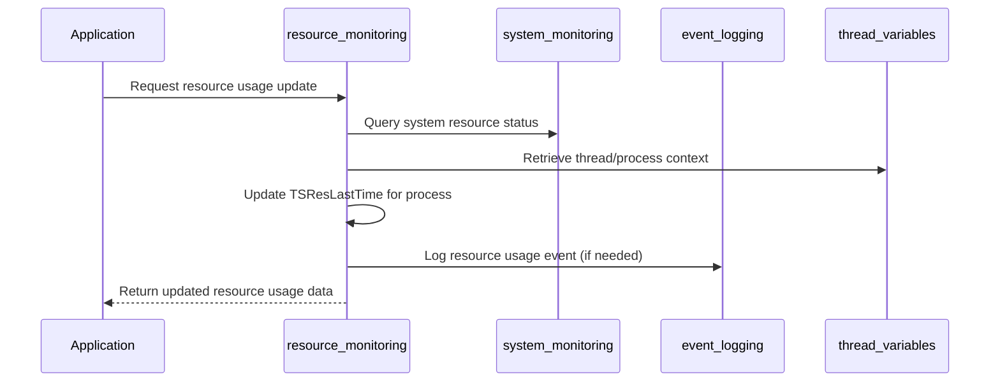

# Resource Monitoring Module Documentation

## Introduction

The **resource_monitoring** module is responsible for tracking and reporting system resource usage within the application. It provides mechanisms to monitor process-level resource consumption, such as CPU time, and is a key component for system health diagnostics and performance analysis. This module is part of the broader [logging_monitoring](logging_monitoring.md) subsystem, which also includes event logging and system monitoring functionalities.

## Core Functionality

At its core, the resource_monitoring module defines the `TSResLastTime` structure, which is used to store resource usage statistics for processes. This structure is designed to keep track of the last recorded user and system CPU times for a given process, identified by its process ID (PID). The module is intended to be used in conjunction with other monitoring and logging components to provide a comprehensive view of system performance.

### Key Data Structure

```c
// Source: Source/src/inc/sysmon.h

typedef struct {
    pid_t nPid;
    unsigned long long last_time_user;
    unsigned long long last_time_system;
} TSResLastTime;
```

- **nPid**: The process ID being monitored.
- **last_time_user**: The last recorded user CPU time for the process.
- **last_time_system**: The last recorded system CPU time for the process.

The module also defines a constant:

```c
#define NB_RESSOURCES 256
```

This indicates the maximum number of resources (processes) that can be tracked simultaneously.

## Architecture and Component Relationships

The resource_monitoring module is tightly integrated with the rest of the logging_monitoring subsystem. It relies on and interacts with several other modules for gathering, storing, and reporting resource usage data. The following diagram illustrates the high-level architecture and dependencies:

```mermaid
graph TD
    A[resource_monitoring (TSResLastTime)] -->|uses| B[system_monitoring]
    A -->|uses| C[thread_variables]
    A -->|uses| D[event_logging]
    A -->|uses| E[utilities]
    B -->|part of| F[logging_monitoring]
    C -->|part of| F
    D -->|part of| F
    E -->|shared utilities| F
    F -.->|provides monitoring data| G[other system modules]
```

### Component Interactions

- **system_monitoring**: Provides higher-level system health and status information. See [system_monitoring.md](system_monitoring.md) for details.
- **thread_variables**: Supplies thread-specific context needed for accurate resource tracking. See [thread_variables.md](thread_variables.md).
- **event_logging**: Used for logging resource usage events and anomalies. See [event_logging.md](event_logging.md).
- **utilities**: Provides common data structures and helper functions (e.g., process IDs, argument parsing). See [utilities.md](utilities.md).

## Data Flow and Process Overview

The typical flow for resource monitoring is as follows:



## Integration in the Overall System

The resource_monitoring module is invoked by various parts of the application whenever resource usage needs to be tracked or reported. It is especially important for:
- Performance monitoring and diagnostics
- Detecting resource leaks or abnormal usage patterns
- Supporting system health dashboards and alerts

It works in concert with the [system_monitoring](system_monitoring.md) and [event_logging](event_logging.md) modules to provide a holistic view of system health.

## References
- [logging_monitoring.md](logging_monitoring.md)
- [system_monitoring.md](system_monitoring.md)
- [event_logging.md](event_logging.md)
- [thread_variables.md](thread_variables.md)
- [utilities.md](utilities.md)
