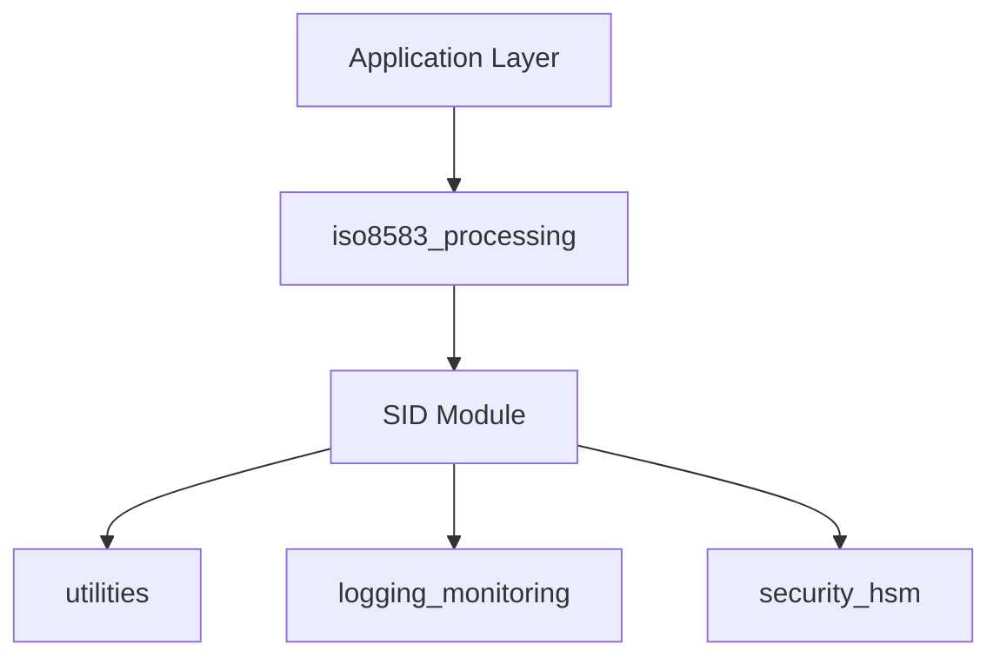
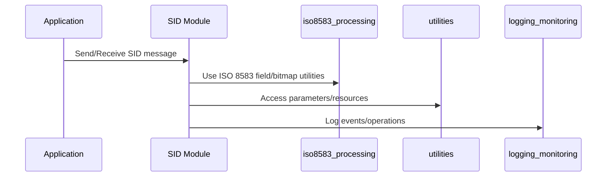

# SID Module Documentation

## Introduction

The **SID Module** is responsible for the parsing, construction, and management of SID-specific ISO 8583 messages and chip data within the payment processing system. It provides data structures and functions to handle both the message-level and chip-level (tag-based) information, supporting the encoding, decoding, and manipulation of SID message fields and chip tags. This module is essential for systems that need to process SID-compliant transactions, ensuring interoperability and correct message formatting.

## Core Functionality

The SID module provides:
- Data structures for representing SID message layouts and chip tag data.
- Functions for initializing, parsing, extracting, inserting, and building SID messages and chip tag data.
- Support for various field and tag types (fixed, variable, binary, alphanumeric, BCD, etc.).
- Management of message headers, bitmaps, and field positions for up to 128 fields and 100 chip tags.

## Key Data Structures

### TSSidInfo (Message-Level Structure)
```c
typedef struct SSidInfo {
   int   nFieldPos[MAX_SID_FIELDS + 1];
   char  sHeader[SID_HEADER_LEN + 1];
   int   nMsgType;
   int   nLength;
   char  sBitMap[SID_BITMAP_LEN];
   char  sData[MAX_SID_DATA_LEN];
} TSSidInfo;
```
- **Purpose:** Represents a complete SID message, including header, bitmap, field positions, and raw data.
- **Usage:** Used for parsing incoming messages, constructing outgoing messages, and field-level manipulation.

### TSTagSid (Chip Tag Structure)
```c
typedef struct STagSid {
   int  nPresent[MAX_SID_CHIP_TAG];
   int  nPosTag[MAX_SID_CHIP_TAG];
   int  nLength;
   char sChipData[MAX_SID_CHIP_LEN];
} TSTagSid;
```
- **Purpose:** Represents chip (ICC) data, typically found in field 55 of ISO 8583 messages.
- **Usage:** Used for parsing, extracting, and constructing chip tag data.

## Main Functions

The following functions are declared in the SID module (see source for implementation details):
- `InitSidInfo(TSSidInfo *msgInfo)` – Initialize a SID message structure.
- `AnalyseSid(char *buffer_rec, TSSidInfo *msgInfo)` – Parse a received SID message.
- `GetSidField(int field_no, TSSidInfo *msgInfo, char *data, int *length)` – Extract a field from a SID message.
- `AddSidField(int field_no, TSSidInfo *msgInfo, char *data, int length)` – Add a field to a SID message.
- `InsertSidField(int field_no, TSSidInfo *msgInfo, char *data, int length)` – Insert a field at a specific position.
- `PutSidField(int field_no, TSSidInfo *msgInfo, char *data, int length)` – Update a field in a SID message.
- `SidBuildMsg(int nIndiceCtx, char *buffer_snd, TSSidInfo *msgInfo, char *BadField)` – Build a SID message for sending.
- `InitSidIcTag(TSTagSid *msgInfo)` – Initialize a chip tag structure.
- `AnalyseSidIc(char *buffer, int nLength, TSTagSid *msgInfo)` – Parse chip tag data.
- `GetSidIcTag(char *tag_name, TSTagSid *msgInfo, char *data, int *length)` – Extract a chip tag.
- `AddSidIcTag(char *tag_name, TSTagSid *msgInfo, char *data, int length)` – Add a chip tag.
- `PutSidIcTag(char *tag_name, TSTagSid *msgInfo, char *data, int length)` – Update a chip tag.

## Architecture and Component Relationships

The SID module is part of the ISO 8583 message processing subsystem. It interacts with several other modules:
- **iso8583_processing**: Provides core ISO 8583 message layout, field, and bitmap management ([iso8583_processing.md]).
- **utilities**: Supplies parameter and resource management ([utilities.md]).
- **logging_monitoring**: Used for event logging and monitoring ([logging_monitoring.md]).
- **security_hsm**: May be involved for cryptographic operations ([security_hsm.md]).

The SID module also depends on the following headers:
- `iso_com.h`: Common ISO 8583 definitions and utilities ([iso8583_processing.md]).
- `sid_fields.h`: SID-specific field definitions.
- `iso_ictag.h`: ICC (chip) tag definitions ([iso8583_processing.md]).

### High-Level Architecture Diagram


### Component Interaction Diagram


### Data Flow for SID Message Processing
```mermaid
flowchart TD
    A1[Receive raw SID message] --> A2[AnalyseSid]
    A2 --> A3[Extract fields (GetSidField)]
    B1[InitSidInfo] --> B2[Add/Insert/PutSidField]
    B2 --> B3[SidBuildMsg]
```

## How the SID Module Fits into the System

The SID module is invoked whenever a SID-compliant ISO 8583 message is received or needs to be constructed. It acts as a specialized handler for SID message types, leveraging the generic ISO 8583 processing infrastructure and providing additional logic for SID-specific fields and chip data. It ensures that SID messages are correctly parsed, validated, and built according to the SID specification, supporting interoperability with external systems and devices.

For more details on ISO 8583 message processing, see [iso8583_processing.md]. For cryptographic and security operations, see [security_hsm.md].

## References
- [iso8583_processing.md]
- [utilities.md]
- [logging_monitoring.md]
- [security_hsm.md]
