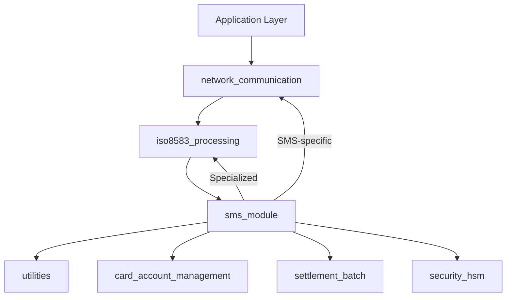
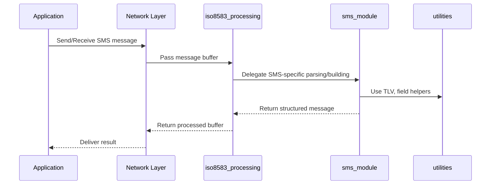

# SMS Module Documentation

## Introduction

The **sms_module** provides the core data structures, constants, and processing logic for handling SMS-specific ISO 8583 messages within the payment processing system. It defines the structures, field types, and functions necessary for parsing, constructing, and manipulating SMS message fields and chip (EMV) data, ensuring compliance with SMS network requirements. This module is a specialization of the general ISO 8583 processing framework, focusing on SMS's unique message layouts, field types, and chip/tag data handling.

---

## Core Functionality

The sms_module is responsible for:
- Defining SMS-specific message and chip/tag data structures
- Parsing and constructing SMS ISO 8583 messages
- Managing SMS field types, lengths, and bitmap handling
- Supporting chip/tag data (e.g., EMV) parsing and construction
- Providing utility functions for field and tag manipulation

### Key Data Structures

#### TSSmsInfo (SMS Message Structure)
```c
typedef struct SSmsInfo {
   int           nFieldPos    [ MAX_SMS_FIELDS  +1 ];
   int           nMsgType;
   int           nLength;
   TSSmsHeader   sHeader;
   char          sBitMap      [ SMS_BITMAP_LEN   ];
   char          sData        [ MAX_SMS_DATA_LEN ];
   msg_id_t      msgId;
   struct timeval kCtime;
} TSSmsInfo;
```
- **Purpose:** Represents an SMS ISO 8583 message instance, including field positions, message type, header, bitmap, raw data, and metadata.
- **Usage:** Used throughout the system for parsing, constructing, and manipulating SMS messages.

#### TSTagSms (SMS Chip/Tag Data Structure)
```c
typedef struct STagSms {
   int  nPresent  [ MAX_SMS_CHIP_TAG ];
   int  nPosTag   [ MAX_SMS_CHIP_TAG ];
   int  nLength;
   char sChipData [ MAX_SMS_CHIP_LEN ];
} TSTagSms;
```
- **Purpose:** Represents the chip/tag data (e.g., EMV) within an SMS message, tracking tag presence, positions, and raw chip data.
- **Usage:** Used for parsing and constructing chip/tag data fields in SMS transactions.

### Main Functions

- `InitSmsInfo(TSSmsInfo * msgInfo)`: Initializes an SMS message structure.
- `AnalyseSms(char * buffer_rec, TSSmsInfo * msgInfo)`: Parses a raw SMS message buffer into a structured form.
- `GetSmsField(int field_no, TSSmsInfo * msgInfo, char * data, int *length)`: Retrieves a specific field from an SMS message.
- `InsertSmsField`, `PutSmsField`, `AddSmsField`: Manipulate fields within an SMS message.
- `SmsBuildMsg(char * buffer_snd, TSSmsInfo * msgInfo)`: Constructs an SMS message buffer from the structured form.
- `InitSmsVerifDataTlvInfo`, `InitSmsAddrVerifDataTlvInfo`, `InitSmsTokenDataTlvInfo`: TLV (Tag-Length-Value) initialization helpers for SMS-specific data.

---

## Architecture and Component Relationships

The sms_module is tightly integrated with the ISO 8583 processing core and interacts with several other modules for full SMS transaction support:

- **Depends on:**
  - [iso8583_processing.md](iso8583_processing.md): For generic ISO 8583 message parsing, field mapping, and bitmap handling.
  - [utilities.md](utilities.md): For common data structures and helper functions (e.g., TLV handling).
  - [network_communication.md](network_communication.md): For message transport and network interfacing.
- **Related modules:**
  - [visa_module.md](visa_module.md), [cb2a_module.md](cb2a_module.md), [cbae_module.md](cbae_module.md), [jcb_module.md](jcb_module.md), [sid_module.md](sid_module.md): Other payment network specializations.

### High-Level Architecture Diagram



### Component Interaction Diagram

```mermaid
flowchart TD
    subgraph SMS Message Lifecycle
        S1[Raw SMS Message Buffer]
        S2[AnalyseSms]
        S3[TSSmsInfo Structure]
        S4[Field Manipulation]
        S5[SmsBuildMsg]
        S6[Outgoing SMS Message Buffer]
    end
    S1 --> S2 --> S3
    S3 --> S4 --> S5 --> S6

    subgraph Chip/Tag Data Handling
        C1[Raw Chip/Tag Data]
        C2[InitSmsVerifDataTlvInfo / InitSmsAddrVerifDataTlvInfo / InitSmsTokenDataTlvInfo]
        C3[TSTagSms Structure]
        C4[Tag Manipulation]
        C5[Build Tag Data]
        C6[Outgoing Chip/Tag Data]
    end
    C1 --> C2 --> C3
    C3 --> C4 --> C5 --> C6
```



### Data Flow Overview



---

## How sms_module Fits Into the System

The sms_module acts as the SMS-specific extension of the ISO 8583 processing pipeline. It is invoked whenever an SMS transaction is detected, ensuring that all SMS-specific field layouts, chip/tag data, and message requirements are handled according to SMS network standards. It works in concert with the generic ISO 8583 logic, network communication, and utility modules to provide end-to-end SMS transaction support.

For details on the generic ISO 8583 processing, refer to [iso8583_processing.md](iso8583_processing.md). For chip/EMV data handling, see [utilities.md](utilities.md).

---

## References
- [iso8583_processing.md](iso8583_processing.md)
- [utilities.md](utilities.md)
- [network_communication.md](network_communication.md)
- [card_account_management.md](card_account_management.md)
- [settlement_batch.md](settlement_batch.md)
- [security_hsm.md](security_hsm.md)
- [visa_module.md](visa_module.md)
- [cb2a_module.md](cb2a_module.md)
- [cbae_module.md](cbae_module.md)
- [jcb_module.md](jcb_module.md)
- [sid_module.md](sid_module.md)
