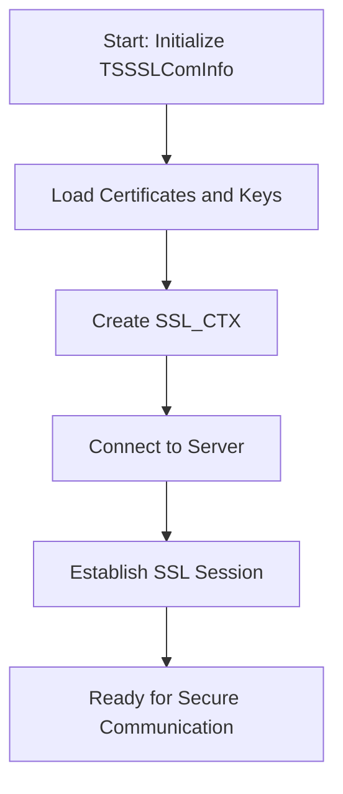
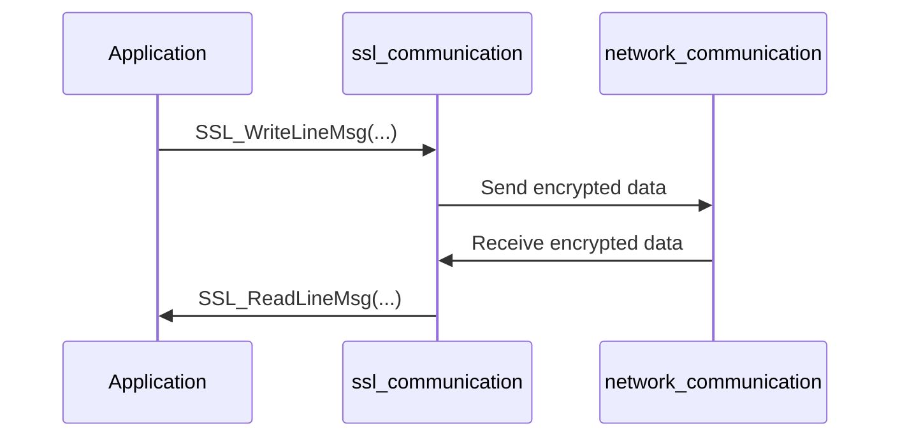

# SSL Communication Module Documentation

## Introduction

The **ssl_communication** module provides secure communication capabilities for the system by implementing SSL/TLS-based client and server communication channels. It is a core part of the `network_communication` subsystem, enabling encrypted data transfer between network endpoints, such as between the host and external banking networks or internal services requiring confidentiality and integrity.

This module abstracts the complexities of SSL/TLS setup, connection management, and secure message transmission, and integrates with the broader communication infrastructure of the system.

---

## Core Functionality

The module is centered around two main structures:

- **TSCtlSSLComInfo**: Represents the state and properties of an individual SSL client connection.
- **TSSSLComInfo**: Manages the overall SSL communication context, including server/client configuration, certificate management, and multiple connections.

Key operations provided by the module include:
- Initialization of SSL client/server contexts
- Accepting and managing multiple SSL client connections (for server mode)
- Secure reading and writing of messages over SSL
- Graceful shutdown of SSL connections

---

## Component Overview

### TSCtlSSLComInfo
```c
typedef struct {
    char                szCltAddress[256];
    E_CONN_STATUS       eStatus;
    int                 bConnected;
    BIO *               conn_bio;
} TSCtlSSLComInfo;
```
- **szCltAddress**: Address of the connected client
- **eStatus**: Connection status (enum defined elsewhere)
- **bConnected**: Boolean indicating if the connection is active
- **conn_bio**: OpenSSL BIO pointer for the connection

### TSSSLComInfo
```c
typedef struct {
    char                        szHostAddr[256];
    int                         nPortNbr;
    int                         nNbConn;
    char                        szCertificateFile[256];
    char                        szPrivateKeyFile[256];
    char                        szCA[256];
    const TSComInfoProperties*  ComInfoProperties;
    TSCtlSSLComInfo*            tab_conn;
    SSL_CTX*                    ctx;
    SSL*                        ssl;
    BIO*                        root_bio; 
    BIO*                        accept_bio;
    BIO*                        buffer_bio;
    int                         nVerifyPeer;
} TSSSLComInfo;
```
- **szHostAddr**: Host address for the SSL endpoint
- **nPortNbr**: Port number
- **nNbConn**: Number of allowed connections
- **szCertificateFile**: Path to the SSL certificate
- **szPrivateKeyFile**: Path to the private key
- **szCA**: Path to the CA certificate
- **ComInfoProperties**: Pointer to communication properties ([communication_properties.md])
- **tab_conn**: Array of client connection structures
- **ctx/ssl/BIOs**: OpenSSL context and I/O objects
- **nVerifyPeer**: Whether to verify peer certificates

---

## Architecture and Relationships

The ssl_communication module is a specialized implementation of a communication channel within the broader [network_communication.md] system. It is designed to be used alongside other channel types, such as TCP and CBCom, and shares a common configuration interface via `TSComInfoProperties`.

### Module Relationships
- **Depends on:**
    - [communication_properties.md] (`TSComInfoProperties`)
    - OpenSSL library (for SSL_CTX, SSL, BIO)
- **Used by:**
    - [network_communication.md] as a secure channel option
    - May be referenced by higher-level modules requiring secure transport

### Comparison with TCP Communication
The structure and logic of `TSSSLComInfo` closely mirror those of the TCP communication module (see [tcp_communication.md]), but with additional fields and logic for SSL context, certificates, and peer verification.

---

## Data Flow and Process Overview

### SSL Server Initialization and Connection Handling
```mermaid
flowchart TD
    A[Start: Initialize TSSSLComInfo] --> B[Load Certificates and Keys]
    B --> C[Create SSL_CTX]
    C --> D[Bind to Host/Port]
    D --> E[Listen for Incoming Connections]
    E --> F{Client Connects?}
    F --|Yes|--> G[Accept SSL Connection]
    G --> H[Verify Peer (if enabled)]
    H --> I[Add to tab_conn]
    I --> E
    F --|No|--> E
```

### SSL Client Initialization


### Secure Message Exchange


---

## Integration in the Overall System

The ssl_communication module is one of several channel types available in the [network_communication.md] subsystem. It is selected when secure (encrypted) communication is required, such as for sensitive financial transactions or connections to external banking networks.

- **Configuration**: Uses `TSComInfoProperties` for channel setup, allowing consistent configuration across channel types.
- **Interoperability**: Can be used interchangeably with TCP or CBCom channels, depending on security requirements.
- **Extensibility**: Designed to support multiple concurrent connections and flexible certificate management.

---

## References
- [network_communication.md]
- [communication_properties.md]
- [tcp_communication.md]
