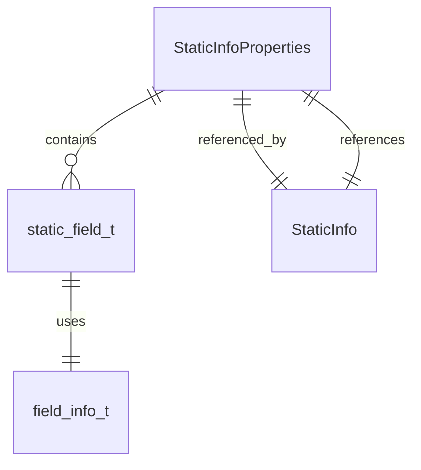
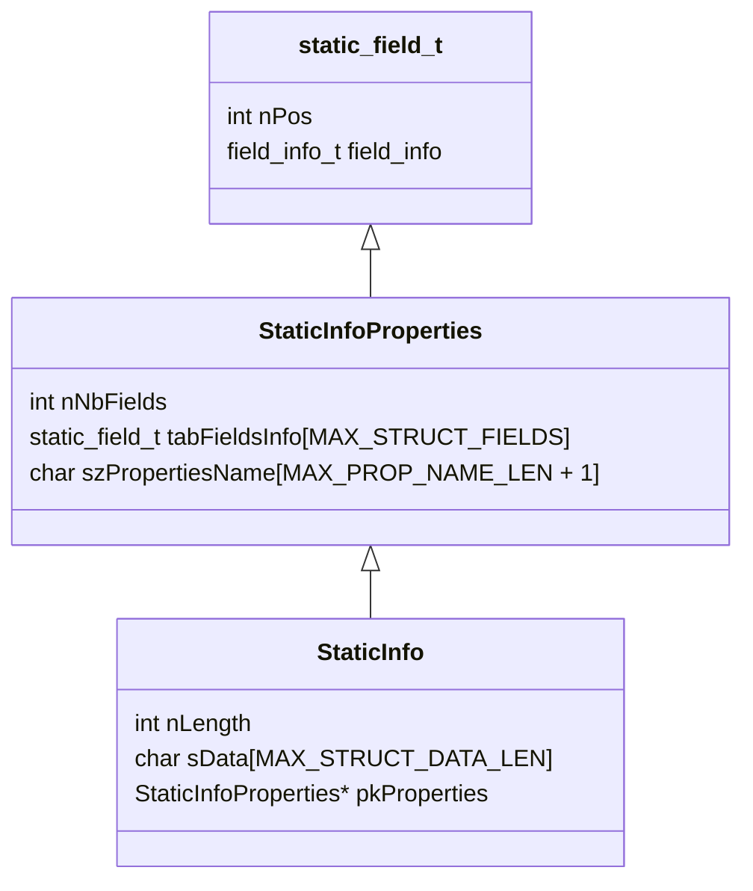
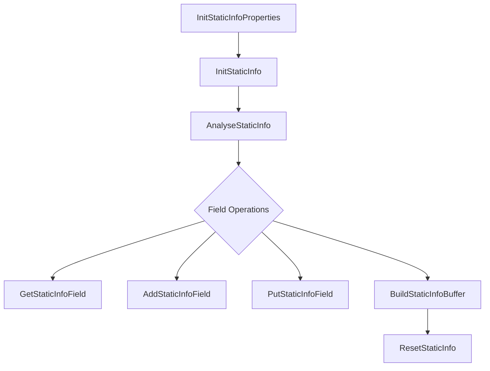

# static_structure Module Documentation

## Introduction

The `static_structure` module provides the data structures and core logic for handling static field-based data layouts within the ISO 8583 message processing framework. It defines how static fields are described, stored, and manipulated, enabling efficient parsing, construction, and management of fixed-format message segments. This module is essential for representing message parts that do not change structure dynamically and are defined by a fixed set of fields.

## Core Functionality

The module centers around three main components:

- **`static_field_t`**: Represents a single static field, including its position and metadata.
- **`StaticInfoProperties`**: Describes the properties of a static structure, including the list of fields and a name identifier.
- **`StaticInfo`**: Holds the actual data for a static structure, referencing its properties and containing the data buffer.

The module also provides a set of functions for initializing, resetting, analyzing, and manipulating static structures and their fields.

## Architecture and Component Relationships

The `static_structure` module is part of the broader `iso8583_processing` subsystem. It interacts closely with the following modules:

- [field_definitions.md](field_definitions.md): Provides the `field_info_t` type used in static field definitions.
- [message_layout.md](message_layout.md): Integrates static structures into overall message layouts.
- [message_info.md](message_info.md): Utilizes static structures as part of message metadata.

### Component Diagram

### Data Structure Overview

### Data Flow and Process Flow

The typical usage flow for static structures is as follows:

1. **Initialization**: `InitStaticInfoProperties` and `InitStaticInfo` set up the properties and data containers.
2. **Parsing/Analysis**: `AnalyseStaticInfo` parses incoming buffers into structured static data.
3. **Field Access/Modification**: `GetStaticInfoField`, `AddStaticInfoField`, and `PutStaticInfoField` allow reading and writing individual fields.
4. **Serialization**: `BuildStaticInfoBuffer` constructs a buffer from the static structure for transmission or storage.
5. **Reset/Cleanup**: `ResetStaticInfo` clears the structure for reuse.

## Integration in the Overall System

The `static_structure` module is a foundational building block for representing and manipulating fixed-format data segments in ISO 8583 messages. It is used by higher-level modules such as [message_layout.md](message_layout.md) and [message_info.md](message_info.md) to compose complete message definitions and to parse or construct messages for network communication.

For field metadata and definitions, see [field_definitions.md](field_definitions.md). For dynamic or variable-length structures, refer to [ber_structure.md](ber_structure.md), [bitmap_structure.md](bitmap_structure.md), and [tlv_structure.md](tlv_structure.md).

## References
- [field_definitions.md](field_definitions.md)
- [message_layout.md](message_layout.md)
- [message_info.md](message_info.md)
- [ber_structure.md](ber_structure.md)
- [bitmap_structure.md](bitmap_structure.md)
- [tlv_structure.md](tlv_structure.md)
