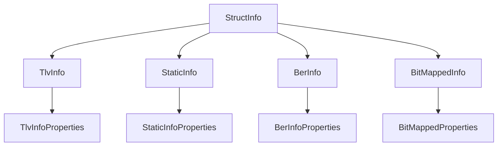
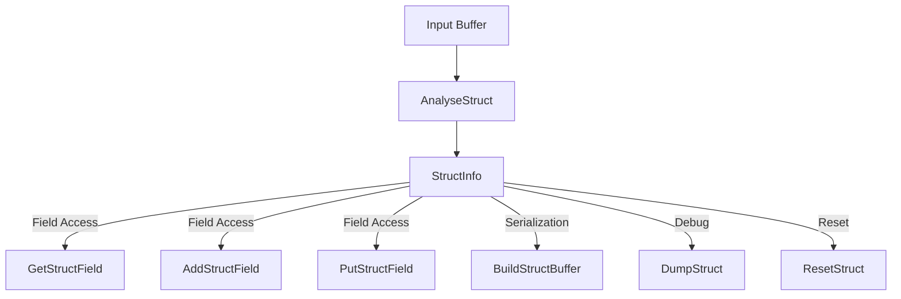
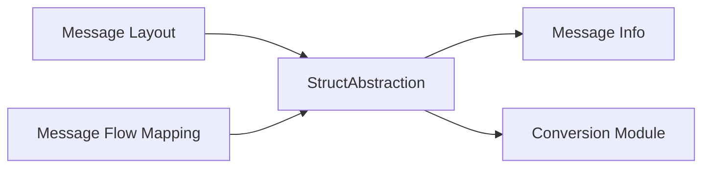

# struct_abstraction Module Documentation

## Introduction

The `struct_abstraction` module provides a unified abstraction for handling various structured data formats used in ISO 8583 message processing. It encapsulates the logic for managing, parsing, and manipulating different field structures—such as TLV (Tag-Length-Value), BER (Basic Encoding Rules), static, and bitmap-based formats—under a single interface. This abstraction is essential for building flexible and extensible financial message processing systems, as it allows higher-level modules to interact with structured data without needing to know the specifics of each format.

## Core Functionality

At the heart of the module is the `StructInfo` structure, which acts as a polymorphic container for the supported structure types:

- **TLV Structures** (`TlvInfo`)
- **Static Structures** (`StaticInfo`)
- **BER Structures** (`BerInfo`)
- **Bitmap Structures** (`BitMappedInfo`)

The module provides functions to initialize, reset, analyze, access, and modify these structures, as well as to build buffers and dump their contents for debugging or logging purposes.

### Key Data Structure: `StructInfo`
```c
typedef struct {
    union {
        TlvInfo         kTlvInfo;
        StaticInfo      kStaticInfo;
        BerInfo         kBerInfo;
        BitMappedInfo   kBitMappedInfo;
    };
    E_FIELD_TYPE    eType;
} StructInfo;
```

- The `union` allows `StructInfo` to represent any of the supported structure types.
- The `eType` field indicates which structure type is currently active.

### Main Operations
- **Initialization**: Set up a `StructInfo` instance for a specific structure type and properties.
- **Reset**: Clear the structure to its initial state.
- **Analysis**: Parse a buffer into the structure.
- **Field Access**: Get, add, or update fields by name.
- **Buffer Building**: Serialize the structure into a buffer for transmission or storage.
- **Dumping**: Output the structure's contents for inspection.

## Architecture and Component Relationships

The `struct_abstraction` module is a central part of the ISO 8583 processing subsystem. It depends on and interacts with several other modules that define the specifics of each structure type:

- [tlv_structure.md](tlv_structure.md): Defines `TlvInfo` and related TLV parsing logic.
- [static_structure.md](static_structure.md): Defines `StaticInfo` for fixed-field layouts.
- [ber_structure.md](ber_structure.md): Defines `BerInfo` for BER-encoded fields.
- [bitmap_structure.md](bitmap_structure.md): Defines `BitMappedInfo` for bitmap-based field presence.

### Component Dependency Diagram



### Data Flow Diagram



## How struct_abstraction Fits Into the Overall System

The `struct_abstraction` module is used by higher-level ISO 8583 message processing components to handle message fields in a format-agnostic way. It is typically invoked by message layout and mapping modules, which determine the structure type and properties required for each message or field group.

- **Upstream**: Receives buffers and structure type information from message layout ([message_layout.md](message_layout.md)) and mapping modules ([message_flow_mapping.md](message_flow_mapping.md)).
- **Downstream**: Provides parsed and accessible field data to message info ([message_info.md](message_info.md)), conversion ([conversion_module.md](conversion_module.md)), and other processing modules.

### System Integration Diagram



## References
- [tlv_structure.md](tlv_structure.md)
- [static_structure.md](static_structure.md)
- [ber_structure.md](ber_structure.md)
- [bitmap_structure.md](bitmap_structure.md)
- [message_layout.md](message_layout.md)
- [message_info.md](message_info.md)
- [conversion_module.md](conversion_module.md)
- [message_flow_mapping.md](message_flow_mapping.md)
