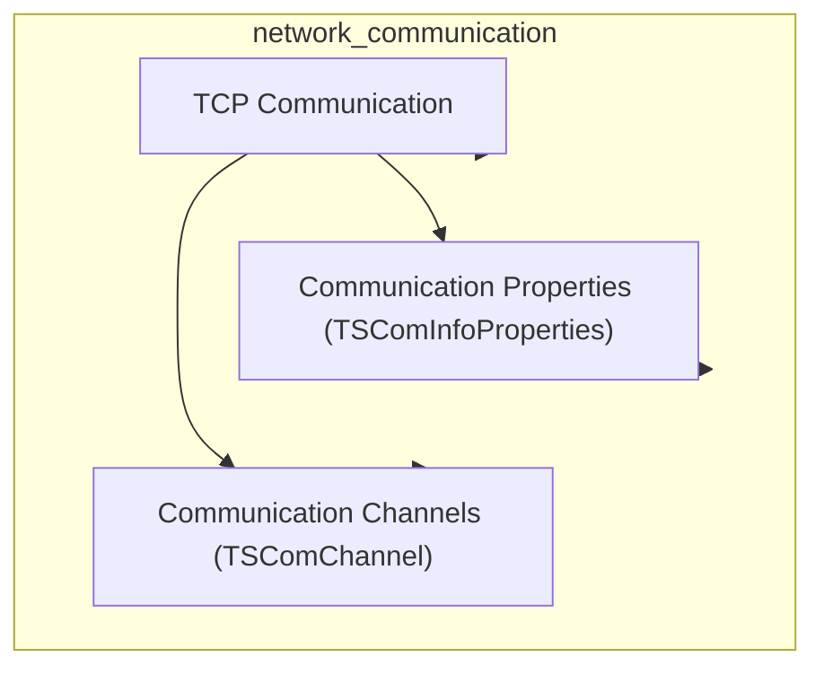
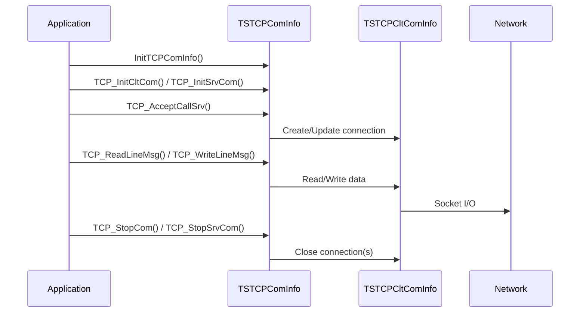

# TCP Communication Module Documentation

## Introduction
The **tcp_communication** module provides the core structures and functions for managing TCP-based communication channels within the system. It is a key part of the broader [network_communication](network_communication.md) module, enabling both client and server TCP connections, message transmission, and connection management. This module abstracts the complexities of TCP socket handling, connection state, and message I/O, providing a unified interface for higher-level network operations.

## Core Functionality
The module defines two primary structures:

- **TSTCPCltComInfo**: Represents a single TCP client connection, encapsulating connection status, socket/file descriptor, and address information.
- **TSTCPComInfo**: Manages a collection of TCP client connections, server address/port, and associated communication properties.

It also provides a set of functions for:
- Initializing client/server TCP communication structures
- Establishing and accepting TCP connections
- Reading and writing line-based messages over TCP
- Stopping individual or all connections

## Architecture and Component Relationships




- **TSComInfoProperties**: Defines protocol-level properties (mode, type, packet length, etc.) referenced by `TSTCPComInfo`.
- **TSComChannel**: Represents a generic communication channel; TCP-specific channels are managed by `TSTCPComInfo`.

For details on these dependencies, see [communication_properties.md](communication_properties.md) and [communication_channels.md](communication_channels.md).

## Data Structures

### TSTCPCltComInfo
```c
typedef struct {
    char szCltAddress[256];
    E_CONN_STATUS eStatus;
    int bConnected;
#ifdef _WIN32
    SOCKET kSocket;
    WSADATA kWsaData;
#endif
    int nFd;
} TSTCPCltComInfo;
```
- **szCltAddress**: Client address (string)
- **eStatus**: Connection status (enum, see [communication_properties.md](communication_properties.md))
- **bConnected**: Connection flag
- **nFd**: File descriptor (or socket on Windows)

### TSTCPComInfo
```c
typedef struct {
    int nNbConn;
    char szHostAddr[256];
    int nPortNbr;
    TSTCPCltComInfo* tab_conn;
    const TSComInfoProperties* ComInfoProperties;
} TSTCPComInfo;
```
- **nNbConn**: Number of connections
- **szHostAddr**: Host address (string)
- **nPortNbr**: Port number
- **tab_conn**: Array of client connection structures
- **ComInfoProperties**: Pointer to communication properties (see [communication_properties.md](communication_properties.md))

## Key Functions

- `InitCltTCPComInfo(TSTCPCltComInfo*)`: Initialize a client connection structure
- `InitTCPComInfo(TSTCPComInfo*)`: Initialize a TCP communication structure
- `TCP_InitCltCom(TSTCPComInfo*)`: Initialize TCP client communication
- `TCP_InitSrvCom(TSTCPComInfo*)`: Initialize TCP server communication
- `TCP_AcceptCallSrv(TSTCPComInfo*, int*)`: Accept a new client connection on the server
- `TCP_StopCom(TSTCPComInfo*, int)`: Stop a specific client connection
- `TCP_StopSrvCom(TSTCPComInfo*)`: Stop the server and all connections
- `TCP_ReadLineMsg(TSTCPComInfo*, int, char*, int*)`: Read a line-based message from a connection
- `TCP_WriteLineMsg(TSTCPComInfo*, int, const char*, int)`: Write a line-based message to a connection

## Data Flow and Process Overview



## Integration in the Overall System
The TCP communication module is a foundational part of the [network_communication](network_communication.md) stack. It is used by higher-level modules (such as ISO 8583 processing, transaction context, and others) to provide reliable, stream-based message transport. It interacts with generic communication properties and channels, and may be extended or wrapped by modules for SSL ([ssl_communication.md](ssl_communication.md)), CBCom ([cbcom_channels.md](cbcom_channels.md)), or other protocols.

## References
- [network_communication.md](network_communication.md)
- [communication_properties.md](communication_properties.md)
- [communication_channels.md](communication_channels.md)
- [ssl_communication.md](ssl_communication.md)
- [cbcom_channels.md](cbcom_channels.md)
