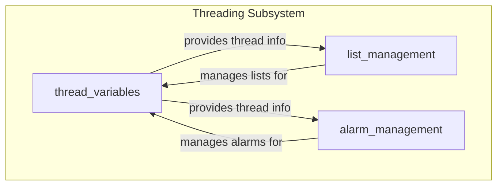
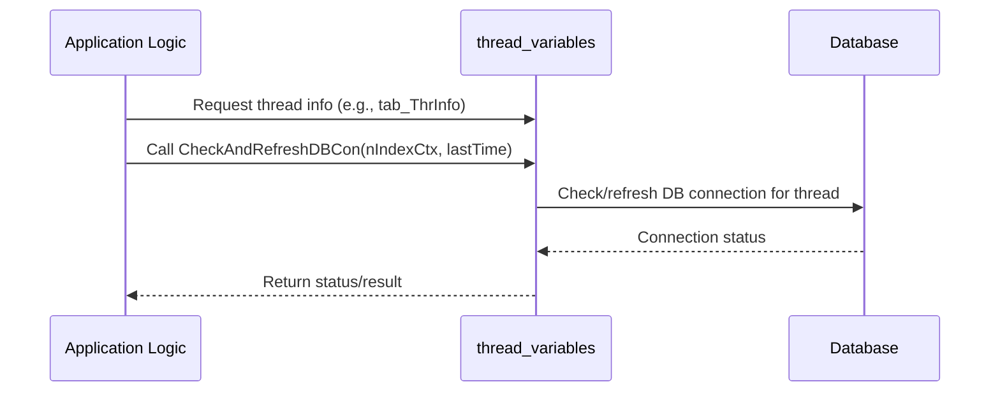

# thread_variables Module Documentation

## Introduction

The `thread_variables` module is responsible for managing thread-specific information and resources within the system. It provides structures and mechanisms to track and interact with threads, supporting concurrent processing and resource management in a multi-threaded environment. This module is a foundational part of the broader `threading` subsystem, which also includes list and alarm management for threads.

## Core Functionality

The primary purpose of the `thread_variables` module is to:
- Maintain information about active threads.
- Provide access to thread identifiers for management and coordination.
- Support thread-related operations such as checking and refreshing database connections associated with threads.

### Key Data Structures

#### `TSThrInfo` (typedef for `struct SThrInfo`)
```c
typedef struct SThrInfo {
    pthread_t tid;
} TSThrInfo;
```
- **tid**: The POSIX thread identifier (`pthread_t`) for the thread.

#### Thread Information Table
- `extern TSThrInfo tab_ThrInfo[];`
  - An external array holding information for all managed threads. Each entry corresponds to a thread's identifier and can be used for thread management tasks.

#### Thread Limits and Counters
- `max_request`, `max_thread`, `nUserThread`: Global variables controlling the maximum number of requests, threads, and user threads, respectively.

#### Thread Utility Function
- `int CheckAndRefreshDBCon(int nIndexCtx, struct timeval lastTime);`
  - Checks and refreshes the database connection for a given thread context index, based on the last activity time.

## Architecture and Component Relationships

The `thread_variables` module is a core part of the `threading` subsystem, which also includes:
- [list_management](list_management.md): For managing thread-safe lists and node structures.
- [alarm_management](alarm_management.md): For handling thread-based alarms and timeouts.

It interacts with the POSIX threading library (`pthread.h`) and is designed to be used by higher-level modules that require thread management capabilities.

### Module Architecture Diagram



### Data Flow and Component Interaction



## Integration in the Overall System

The `thread_variables` module is used by various parts of the system that require thread management, such as network communication, ISO8583 message processing, and transaction context management. It provides the foundational thread tracking and utility functions needed for safe and efficient multi-threaded operation.

For more details on related modules, see:
- [list_management](list_management.md)
- [alarm_management](alarm_management.md)
- [threading](threading.md)

## References
- POSIX Threads (`pthread.h`)
- [threading](threading.md)
- [list_management](list_management.md)
- [alarm_management](alarm_management.md)
