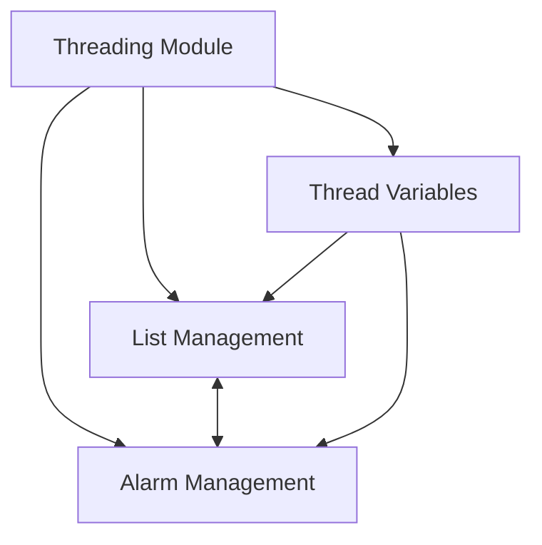
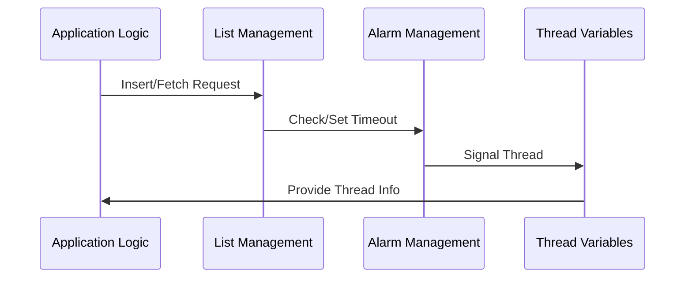

# Threading Module Documentation

## Introduction and Purpose

The `threading` module provides core infrastructure for managing concurrent operations, timeouts, and thread-specific data within the system. It is responsible for:
- Managing thread-safe lists of requests and their lifecycle
- Handling alarms and timeouts for asynchronous operations
- Maintaining thread-specific variables and information

This module is foundational for enabling robust, scalable, and responsive multi-threaded processing, which is essential for high-throughput transaction systems such as those found in payment processing and network communication.

## Architecture Overview

The threading module is composed of three main sub-modules:
- **List Management**: Handles thread-safe linked lists for request tracking and timeout management.
- **Alarm Management**: Provides alarm and timeout signaling for threads.
- **Thread Variables**: Maintains per-thread information and utilities.

These sub-modules interact to ensure safe and efficient concurrent processing.

### High-Level Architecture Diagram

## Sub-Module Overviews

### 1. List Management
Responsible for managing thread-safe linked lists of requests, including insertion, fetching, and timeout-based purging. See [list_management.md](list_management.md) for detailed documentation of this sub-module.

### 2. Alarm Management
Handles alarm signaling and timeout tracking for threads, enabling asynchronous event handling. See [alarm_management.md](alarm_management.md) for details.

### 3. Thread Variables
Maintains thread-specific information and utilities for managing thread pools and thread IDs. See [thread_variables.md](thread_variables.md) for details.

## Integration with Other Modules

The threading module is a core utility used by higher-level modules such as [network_communication.md], [iso8583_processing.md], and [transaction_context.md] to provide concurrency, timeout, and thread management. It does not directly depend on business logic modules but is essential for their operation.

## Component Interaction Diagram

## See Also
- [network_communication.md]
- [iso8583_processing.md]
- [transaction_context.md]
