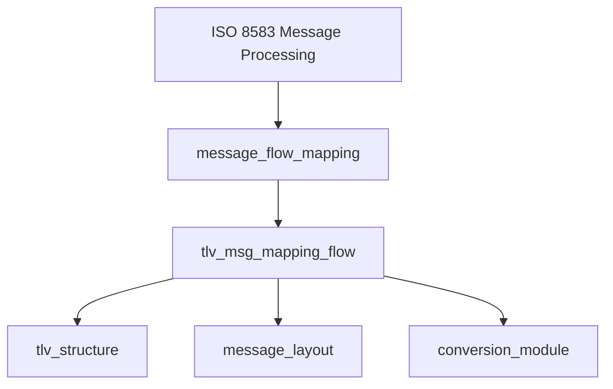
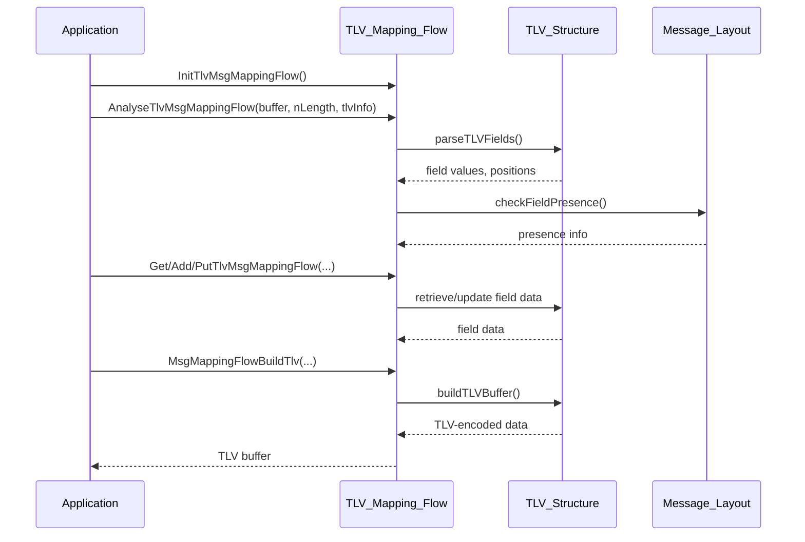

# TLV Message Mapping Flow Module Documentation

## Introduction

The `tlv_msg_mapping_flow` module provides a structured mechanism for managing, parsing, and constructing TLV (Tag-Length-Value) message flows within the ISO 8583 processing system. It is designed to facilitate the mapping between TLV-encoded data and internal message representations, supporting both the extraction and assembly of TLV fields for transaction processing.

This module is auto-generated and should not be modified manually.

---

## Core Functionality

At the heart of the module is the `TSTlvMsgMappingFlow` structure, which encapsulates the state and data required for TLV message mapping operations. The module exposes a set of functions for initializing, analyzing, retrieving, adding, and building TLV message flows.

### Key Data Structure

```c
typedef struct {
    int nPresent[32];      // Presence flags for up to 32 TLV fields
    int nPosTlv[32];       // Position indices for TLV fields in the data buffer
    int nLength;           // Total length of the TLV data
    char sTlvData[1024];   // Buffer holding the TLV-encoded data
} TSTlvMsgMappingFlow;
```

### Main Functions
- `InitTlvMsgMappingFlow(TSTlvMsgMappingFlow *tlvInfo)`: Initializes the TLV mapping structure.
- `AnalyseTlvMsgMappingFlow(char *buffer, int nLength, TSTlvMsgMappingFlow *tlvInfo)`: Parses a TLV buffer and populates the mapping structure.
- `GetTlvMsgMappingFlow(char *tlv_name, TSTlvMsgMappingFlow *tlvInfo, char *data, int *length)`: Retrieves a TLV field by name.
- `AddTlvMsgMappingFlow(char *tlv_name, TSTlvMsgMappingFlow *tlvInfo, char *data, int length)`: Adds a new TLV field.
- `PutTlvMsgMappingFlow(char *tlv_name, TSTlvMsgMappingFlow *tlvInfo, char *data, int length)`: Updates or inserts a TLV field.
- `MsgMappingFlowBuildTlv(char *buffer_snd, TSTlvMsgMappingFlow *tlvInfo)`: Builds a TLV buffer from the mapping structure.
- Additional utility functions for type, length, and name resolution, and for debugging (`DumpMsgMappingFlow`).

---

## Architecture and Component Relationships

The `tlv_msg_mapping_flow` module is a specialized component within the broader ISO 8583 message processing architecture. It interacts closely with the following modules:

- [tlv_structure.md](tlv_structure.md): Defines the TLV field properties and parsing logic.
- [message_flow_mapping.md](message_flow_mapping.md): Manages the mapping of message flows, of which TLV mapping is a subset.
- [message_layout.md](message_layout.md): Provides the layout and presence information for message fields.
- [conversion_module.md](conversion_module.md): Handles field mapping and conversion between different message formats.

### High-Level Architecture Diagram



---

## Data Flow and Process Overview

### TLV Message Parsing and Construction Flow



---

## Component Interaction

- **Initialization**: The application initializes a `TSTlvMsgMappingFlow` structure before use.
- **Parsing**: Incoming TLV data is parsed and mapped to internal fields using the `AnalyseTlvMsgMappingFlow` function, leveraging definitions from the [tlv_structure.md](tlv_structure.md) module.
- **Field Access**: Fields can be retrieved, added, or updated using the provided API, with field definitions and presence validated against [message_layout.md](message_layout.md).
- **Construction**: Outgoing TLV messages are constructed from the internal mapping using `MsgMappingFlowBuildTlv`.

---

## Integration in the Overall System

The `tlv_msg_mapping_flow` module is typically invoked by higher-level message processing routines that require TLV encoding/decoding as part of ISO 8583 transaction flows. It acts as a bridge between raw TLV data and the structured message representations used throughout the system.

For more details on related modules, see:
- [tlv_structure.md](tlv_structure.md)
- [message_flow_mapping.md](message_flow_mapping.md)
- [message_layout.md](message_layout.md)
- [conversion_module.md](conversion_module.md)

---

## References
- [tlv_structure.md](tlv_structure.md)
- [message_flow_mapping.md](message_flow_mapping.md)
- [message_layout.md](message_layout.md)
- [conversion_module.md](conversion_module.md)
