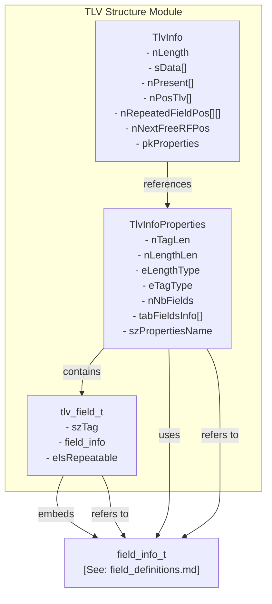
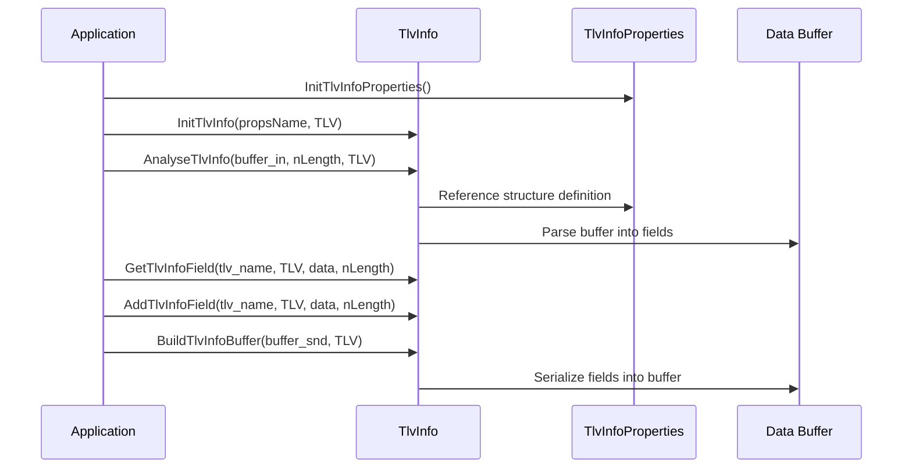

# TLV Structure Module Documentation

## Introduction
The **tlv_structure** module provides the core data structures and functions for handling TLV (Tag-Length-Value) formatted data within the ISO 8583 processing system. TLV encoding is widely used in financial messaging, smart cards, and EMV protocols to represent complex, nested data in a flexible and extensible way. This module enables parsing, building, and manipulating TLV data structures, supporting both ASCII and binary encodings, and handling repeatable fields.

## Core Functionality
The module defines the following key components:

- **`tlv_field_t`**: Represents a single TLV field, including its tag, field information, and repeatability.
- **`TlvInfoProperties`**: Describes the properties of a TLV structure, such as tag/length encoding types, number of fields, and field definitions.
- **`TlvInfo`**: Represents an instance of a TLV structure, including its data buffer, field presence, positions, and repeatable field tracking.
- **API Functions**: Functions for initializing, resetting, parsing (analyzing), extracting, adding, updating, and serializing TLV structures.

## Architecture and Component Relationships

### Component Descriptions
- **`tlv_field_t`**: Each TLV field is defined by a tag (`szTag`), a field definition (`field_info`), and a repeatability flag (`eIsRepeatable`). The `field_info` structure is defined in the [field_definitions.md](field_definitions.md) module.
- **`TlvInfoProperties`**: Describes the structure of a TLV object, including the encoding types for tag and length, the number of fields, and an array of field definitions (`tabFieldsInfo`).
- **`TlvInfo`**: Holds the actual TLV data, tracks which fields are present, their positions, and manages repeatable fields. It references a `TlvInfoProperties` definition for its structure.

### API Functions
- `InitTlvInfo`, `ResetTlvInfo`: Initialize or reset a TLV structure instance.
- `AnalyseTlvInfo`: Parse a buffer into a TLV structure.
- `GetTlvInfoField`, `GetTlvInfoNextField`: Retrieve field data from a TLV structure, supporting repeatable fields.
- `AddTlvInfoField`, `PutTlvInfoField`: Add or update field data in a TLV structure.
- `BuildTlvInfoBuffer`: Serialize a TLV structure into a buffer.
- `DumpTlvInfo`: Debug/inspect the contents of a TLV structure.
- `InitTlvInfoProperties`: Initialize TLV structure properties.

## Data Flow and Process Overview

## Integration with the ISO 8583 Processing System
The TLV structure module is a foundational component for handling TLV-encoded data in ISO 8583 messages. It is used by higher-level modules such as message layout, message info, and conversion modules to parse and construct complex message fields. The `field_info_t` dependency links it to the [field_definitions.md](field_definitions.md) module, ensuring consistent field definitions across the system.

Other related modules:
- [field_definitions.md](field_definitions.md): Field type and format definitions
- [message_layout.md](message_layout.md): Message structure and field presence
- [conversion_module.md](conversion_module.md): Field mapping and conversion logic
- [message_info.md](message_info.md): Message metadata and properties

## Summary
The **tlv_structure** module abstracts the complexity of TLV encoding/decoding, providing a robust API and data model for use throughout the ISO 8583 processing stack. Its design supports extensibility, repeatable fields, and integration with other message structure modules.
