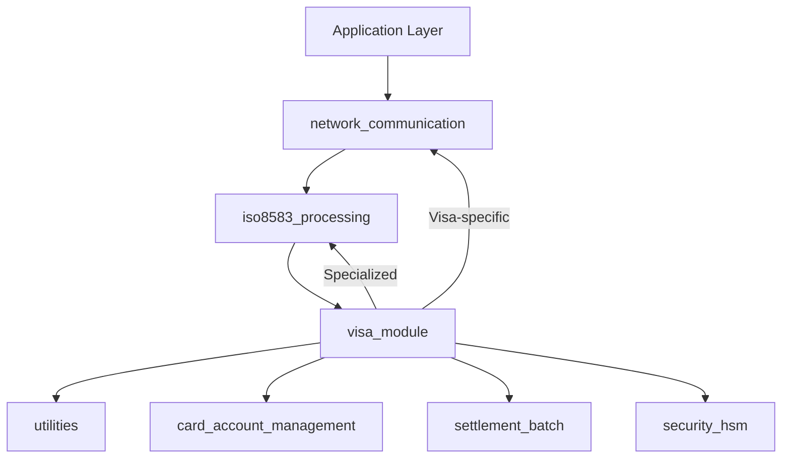
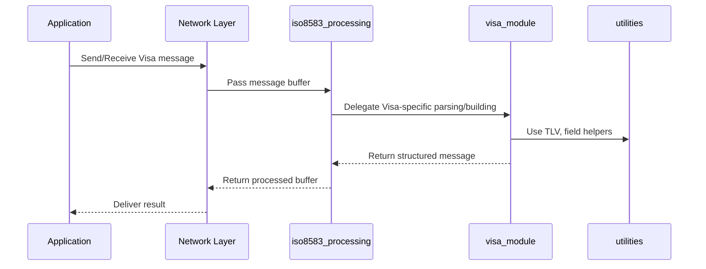

# Visa Module Documentation

## Introduction

The **visa_module** provides the core data structures and processing logic for handling Visa-specific ISO 8583 messages within the payment processing system. It defines the structures, constants, and functions necessary for parsing, constructing, and manipulating Visa message fields and chip data, ensuring compliance with Visa network requirements. This module is a specialization of the general ISO 8583 processing framework, focusing on Visa's unique message layouts, field types, and chip (EMV) data handling.

## Core Functionality

The visa_module is responsible for:
- Defining Visa-specific message and chip data structures
- Parsing and constructing Visa ISO 8583 messages
- Managing Visa field types, lengths, and bitmap handling
- Supporting EMV chip data (tag) parsing and construction
- Providing utility functions for field and tag manipulation

## Key Data Structures

### TSVisaInfo (Visa Message Structure)
```c
typedef struct SVisaInfo {
   int            nFieldPos    [ MAX_VISA_FIELDS  +1 ];
   int            nMsgType;
   int            nLength;
   TSVisaHeader   sHeader;
   char           sBitMap      [ VISA_BITMAP_LEN   ];
   unsigned char  sData        [ MAX_VISA_DATA_LEN ];
   msg_id_t       msgId;
   struct timeval kCtime;
} TSVisaInfo;
```
- **Purpose:** Represents a Visa ISO 8583 message instance, including field positions, message type, header, bitmap, raw data, and metadata.
- **Usage:** Used throughout the system for parsing, constructing, and manipulating Visa messages.

### TSTagVisa (Visa Chip Tag Structure)
```c
typedef struct STagVisa {
   int  nPresent  [ MAX_VISA_CHIP_TAG ];
   int  nPosTag   [ MAX_VISA_CHIP_TAG ];
   int  nLength;
   char sChipData [ MAX_VISA_CHIP_LEN ];
} TSTagVisa;
```
- **Purpose:** Represents the EMV chip data (tags) within a Visa message, tracking tag presence, positions, and raw chip data.
- **Usage:** Used for parsing and constructing chip (EMV) data fields in Visa transactions.

## Main Functions

- `InitVisaInfo(TSVisaInfo * msgInfo)`: Initializes a Visa message structure.
- `AnalyseVisa(unsigned char * buffer_rec, TSVisaInfo * msgInfo)`: Parses a raw Visa message buffer into a structured form.
- `GetVisaField(int field_no, TSVisaInfo * msgInfo, unsigned char * data, int *length)`: Retrieves a specific field from a Visa message.
- `InsertVisaField`, `PutVisaField`, `AddVisaField`: Manipulate fields within a Visa message.
- `VisaBuildMsg(char * buffer_snd, TSVisaInfo * msgInfo)`: Constructs a Visa message buffer from the structured form.
- `InitVisaIcTag`, `AnalyseVisaIc`, `GetVisaIcTag`, `AddVisaIcTag`, `PutVisaIcTag`, `VisaBuildIcFld`: Functions for handling Visa chip (EMV) tags.
- TLV (Tag-Length-Value) initialization helpers for Visa-specific data.

## Architecture and Component Relationships

The visa_module is tightly integrated with the ISO 8583 processing core and interacts with several other modules for full Visa transaction support:

- **Depends on:**
  - [iso8583_processing.md](iso8583_processing.md): For generic ISO 8583 message parsing, field mapping, and bitmap handling.
  - [utilities.md](utilities.md): For common data structures and helper functions (e.g., TLV handling).
  - [network_communication.md](network_communication.md): For message transport and network interfacing.
- **Related modules:**
  - [sms_module.md](sms_module.md), [cb2a_module.md](cb2a_module.md), [cbae_module.md](cbae_module.md), [jcb_module.md](jcb_module.md), [sid_module.md](sid_module.md): Other payment network specializations.

### High-Level Architecture Diagram



### Component Interaction Diagram

```mermaid
flowchart TD
    subgraph Visa Message Lifecycle
        V1[Raw Visa Message Buffer]
        V2[AnalyseVisa]
        V3[TSVisaInfo Structure]
        V4[Field Manipulation]
        V5[VisaBuildMsg]
        V6[Outgoing Visa Message Buffer]
    end
    V1 --> V2 --> V3
    V3 --> V4 --> V5 --> V6

    subgraph Chip Data Handling
        C1[Raw Chip Data]
        C2[AnalyseVisaIc]
        C3[TSTagVisa Structure]
        C4[Tag Manipulation]
        C5[VisaBuildIcFld]
        C6[Outgoing Chip Data]
    end
    C1 --> C2 --> C3
    C3 --> C4 --> C5 --> C6
```



### Data Flow Overview



## How visa_module Fits Into the System

The visa_module acts as the Visa-specific extension of the ISO 8583 processing pipeline. It is invoked whenever a Visa transaction is detected, ensuring that all Visa-specific field layouts, chip data, and message requirements are handled according to Visa network standards. It works in concert with the generic ISO 8583 logic, network communication, and utility modules to provide end-to-end Visa transaction support.

For details on the generic ISO 8583 processing, refer to [iso8583_processing.md](iso8583_processing.md). For chip/EMV data handling, see [utilities.md](utilities.md).

## References
- [iso8583_processing.md](iso8583_processing.md)
- [utilities.md](utilities.md)
- [network_communication.md](network_communication.md)
- [card_account_management.md](card_account_management.md)
- [settlement_batch.md](settlement_batch.md)
- [security_hsm.md](security_hsm.md)
- [sms_module.md](sms_module.md)
- [cb2a_module.md](cb2a_module.md)
- [cbae_module.md](cbae_module.md)
- [jcb_module.md](jcb_module.md)
- [sid_module.md](sid_module.md)
