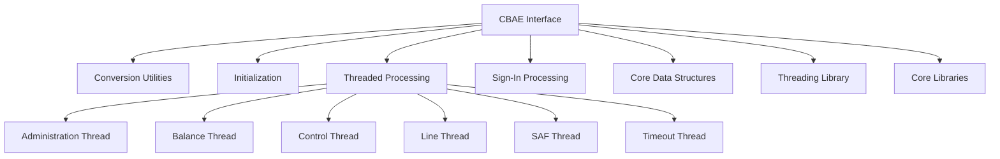
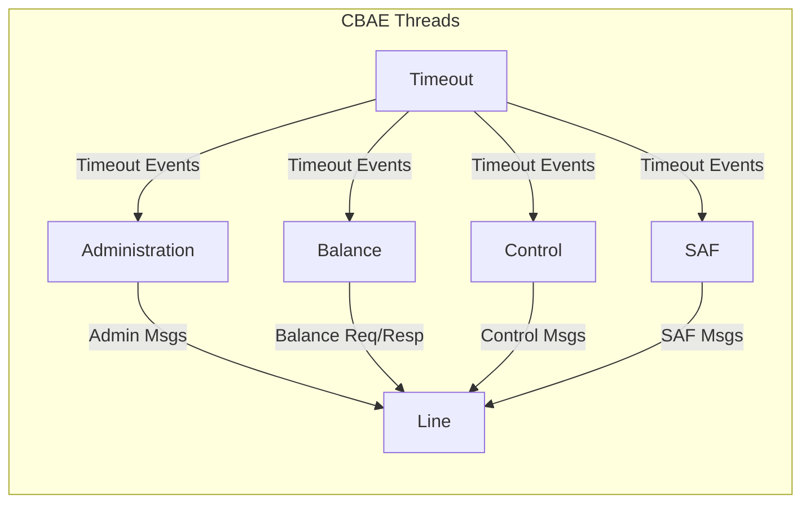
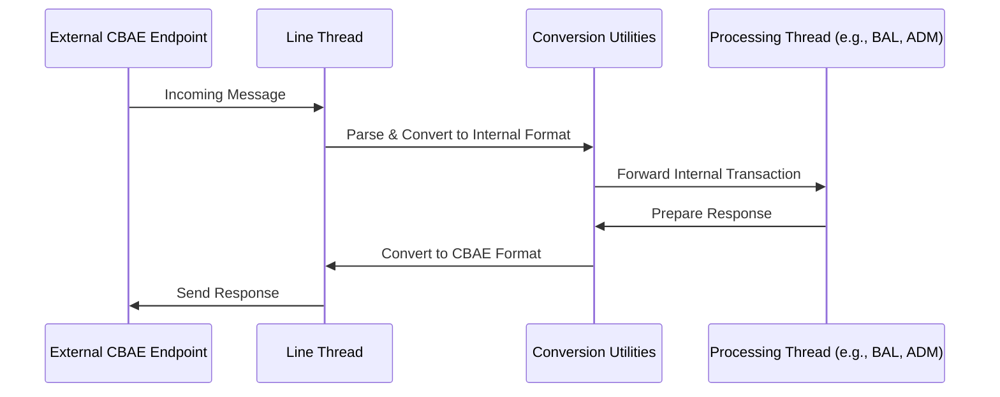
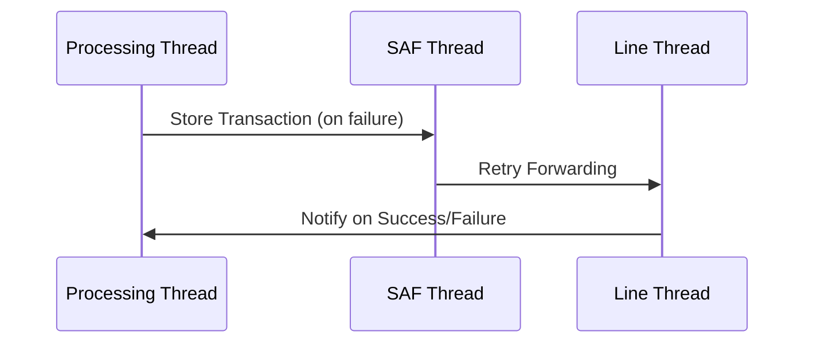

# CBAE Interface Module Documentation

## Introduction

The CBAE Interface module is a core component of the payment switch system, responsible for handling communication, transaction processing, and protocol conversion for the CBAE network. It provides the necessary logic to interface with external CBAE endpoints, manage transaction lifecycles, and ensure reliable, secure, and standards-compliant message exchange.

This module is designed to operate in a multi-threaded environment, supporting various transaction types (authorization, balance inquiry, file updates, etc.) and integrating with the system's core threading, networking, and data structure libraries.

---

## Architecture Overview

The CBAE Interface is structured around several key components:

- **Conversion Utilities** (`cbae_convert_utils.c`): Data structure and protocol mapping between internal and CBAE formats.
- **Initialization** (`cbae_ini.c`): Module and thread initialization, signal handling.
- **Threaded Processing**:
  - **Administration** (`cbae_thread_adm.c`)
  - **Balance Inquiry** (`cbae_thread_bal.c`)
  - **Control** (`cbae_thread_ctl.c`)
  - **Line Handling** (`cbae_thread_line.c`)
  - **SAF (Store and Forward)** (`cbae_thread_saf.c`)
  - **Timeout Handling** (`cbae_thread_timeout.c`)
- **Sign-In Processing** (`cbae_process_signin.c`): Handles sign-in/sign-out flows with the CBAE network.

### High-Level Architecture Diagram

---

## Component Details

### 1. Conversion Utilities (`cbae_convert_utils.c`)

Defines data structures and mapping logic for translating between internal representations and CBAE protocol formats. Key types include:
- `SCategVisa`, `TSCategVisa`: Category mapping structures
- `TSIsoCbaePair`, `SIsoCbaePair`: ISO-to-CBAE field mapping
- `TSAccntType`, `SAccntType`: Account type definitions
- `TSTransType`, `STransType`: Transaction type definitions

These utilities ensure seamless translation of transaction data, supporting interoperability with other modules (see [Core Data Structures](Core Data Structures.md)).

### 2. Initialization (`cbae_ini.c`)

Handles module startup, configuration loading, and signal management (using `sigset_t`). Ensures all threads and resources are correctly initialized before processing begins.

### 3. Threaded Processing

Each thread is responsible for a specific aspect of CBAE transaction handling:
- **Administration Thread** (`cbae_thread_adm.c`): Manages administrative messages and commands.
- **Balance Thread** (`cbae_thread_bal.c`): Handles balance inquiries and responses.
- **Control Thread** (`cbae_thread_ctl.c`): Oversees control messages and state transitions.
- **Line Thread** (`cbae_thread_line.c`): Manages network line communication and message routing.
- **SAF Thread** (`cbae_thread_saf.c`): Processes store-and-forward transactions for reliability.
- **Timeout Thread** (`cbae_thread_timeout.c`): Monitors and handles transaction timeouts.

All threads utilize `timeval` for timing and scheduling, and interact with the [Threading Library](Threading Library.md) for concurrency control.

#### Thread Interaction Diagram

### 4. Sign-In Processing (`cbae_process_signin.c`)

Implements the sign-in and sign-out protocol with the CBAE network, ensuring the module is authenticated and ready for transaction processing. Uses `timeval` for managing sign-in timeouts and retries.

---

## Data Flow and Process Flows

### Transaction Processing Flow

### SAF (Store and Forward) Flow

---

## Dependencies and Integration

- **Core Data Structures**: Uses shared types for accounts, balances, and transactions ([Core Data Structures](Core Data Structures.md)).
- **Threading Library**: Relies on threading, timing, and signal handling ([Threading Library](Threading Library.md)).
- **Core Libraries**: For networking and communication ([Core Libraries](Core Libraries.md)).
- **Other Interface Modules**: Interacts with other network interfaces (e.g., [Visa Interface](Visa Interface.md), [Base24 Interface](Base24 Interface.md)) for protocol conversion and routing.

---

## How the CBAE Interface Fits Into the System

The CBAE Interface is one of several network interface modules in the payment switch. It provides protocol-specific logic for CBAE, while sharing common infrastructure (threading, networking, data structures) with other modules. This modular approach allows the system to support multiple payment networks concurrently, with each interface module responsible for its own protocol and message handling.

For details on other interfaces, see:
- [Visa Interface](Visa Interface.md)
- [Base24 Interface](Base24 Interface.md)
- [CIS Interface](CIS Interface.md)
- [CUP Interface](CUP Interface.md)
- [HSID Interface](HSID Interface.md)

---

## References

- [Core Data Structures](Core Data Structures.md)
- [Threading Library](Threading Library.md)
- [Core Libraries](Core Libraries.md)
- [Visa Interface](Visa Interface.md)
- [Base24 Interface](Base24 Interface.md)
- [CIS Interface](CIS Interface.md)
- [CUP Interface](CUP Interface.md)
- [HSID Interface](HSID Interface.md)
