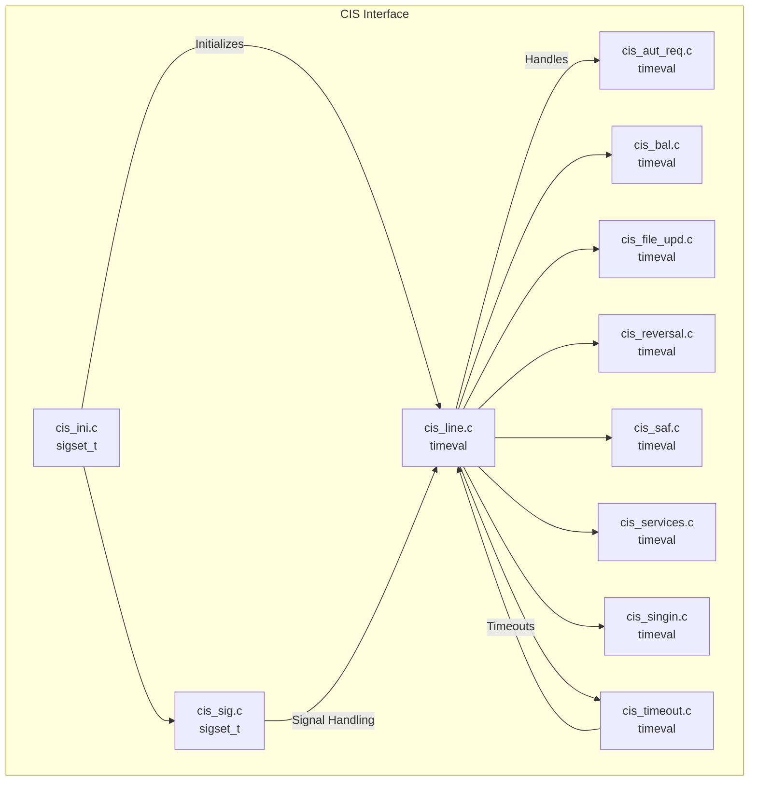
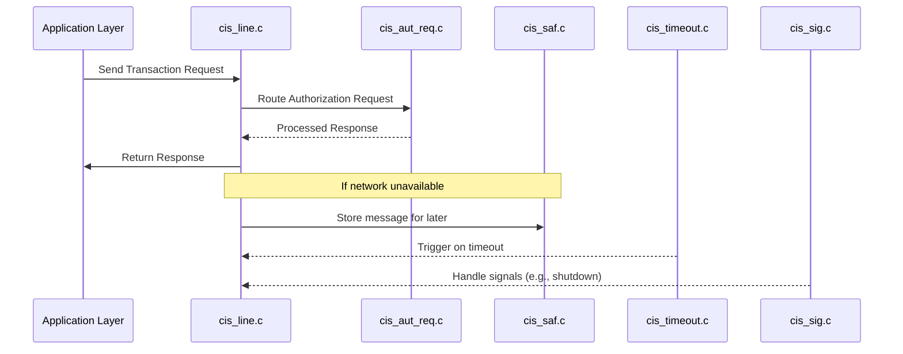

# CIS Interface Module Documentation

## Introduction

The CIS Interface module is responsible for managing the communication and transaction processing between the core system and the CIS (Card Issuer System) network. It handles a variety of transaction types, including authorization requests, balance inquiries, file updates, reversals, and more. The module is designed to operate in a multi-threaded environment, ensuring robust, concurrent processing of financial messages and seamless integration with the broader payment switch architecture.

## Core Functionality

The CIS Interface module provides the following key functionalities:

- **Authorization Requests**: Handles incoming and outgoing authorization messages to and from the CIS network.
- **Balance Inquiries**: Processes requests for account balance information.
- **File Updates**: Manages updates to cardholder and account files as required by the CIS network.
- **Reversals**: Processes transaction reversals in case of errors or cancellations.
- **SAF (Store and Forward)**: Ensures message reliability by storing messages for later forwarding if the network is unavailable.
- **Line Management**: Manages the communication lines and ensures connectivity with the CIS network.
- **Timeout and Signal Handling**: Utilizes system signals and timeouts to manage process lifecycles and error recovery.
- **Sign-in/Sign-out**: Handles the sign-in process required for establishing sessions with the CIS network.
- **Service Management**: Provides additional services as required by the CIS protocol.

## Architecture Overview

The CIS Interface module is composed of several components, each responsible for a specific aspect of the CIS protocol. The main components are:

- `cis_aut_req.c`: Authorization request processing
- `cis_bal.c`: Balance inquiry processing
- `cis_file_upd.c`: File update management
- `cis_ini.c`: Initialization and signal handling
- `cis_line.c`: Communication line management
- `cis_reversal.c`: Reversal transaction processing
- `cis_saf.c`: Store and Forward message handling
- `cis_services.c`: Additional CIS services
- `cis_sig.c`: Signal handling
- `cis_singin.c`: Sign-in process management
- `cis_timeout.c`: Timeout management

### Component Relationships

### Data Flow and Process Flow

## Dependencies and Integration

The CIS Interface module relies on several core libraries and data structures for its operation:

- **Threading and Signal Handling**: Uses `sigset_t` and `timeval` from the system and threading libraries for process control and timing.
- **Core Data Structures**: Utilizes account and transaction data structures defined in [Core Data Structures](Core Data Structures.md).
- **Communication Libraries**: Interfaces with TCP communication libraries (see [Core Libraries](Core Libraries.md)) for network operations.
- **SAF and Timeout Management**: Integrates with SAF and timeout mechanisms as described in [Threading Library](Threading Library.md).

## Interaction with Other Modules

The CIS Interface is one of several network interface modules (see also [Visa Interface](Visa Interface.md), [Base24 Interface](Base24 Interface.md), [CUP Interface](CUP Interface.md), etc.) that provide protocol-specific connectivity. All these modules share a similar architectural pattern, enabling consistent integration with the core switching logic and facilitating maintenance and extensibility.

## Extensibility and Maintenance

- **Adding New Transaction Types**: Implement new handlers following the existing component structure.
- **Protocol Updates**: Update the relevant component (e.g., `cis_aut_req.c` for authorization changes) and ensure proper signal and timeout handling.
- **Integration with Core System**: Follow the established interfaces and data structures as defined in the [Core Data Structures](Core Data Structures.md) and [Core Libraries](Core Libraries.md) documentation.

## References

- [Visa Interface](Visa Interface.md)
- [Base24 Interface](Base24 Interface.md)
- [CUP Interface](CUP Interface.md)
- [Core Data Structures](Core Data Structures.md)
- [Core Libraries](Core Libraries.md)
- [Threading Library](Threading Library.md)
