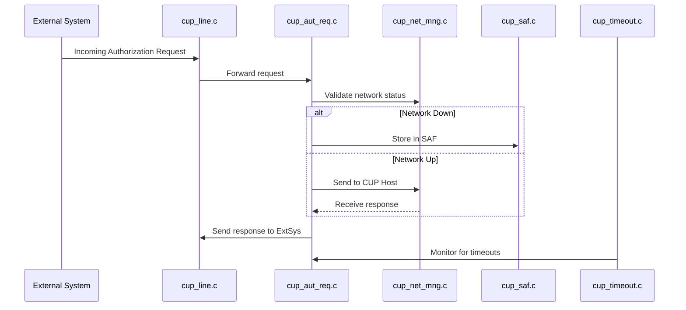
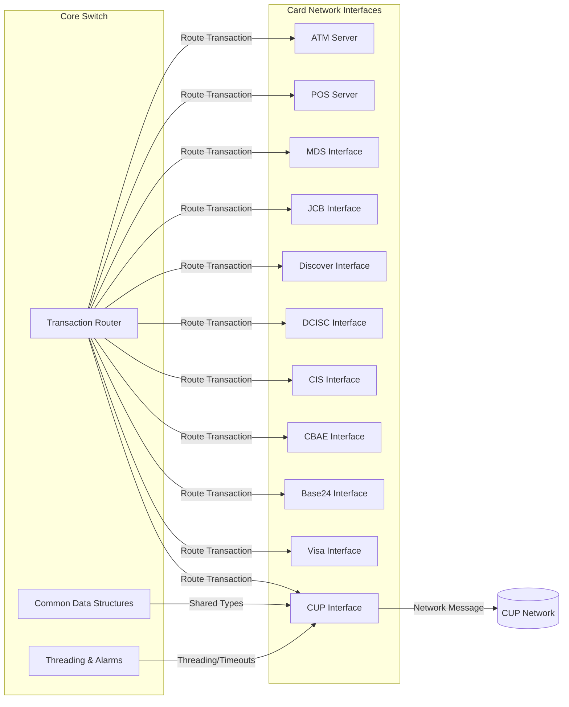

# CUP Interface Module Documentation

## Introduction

The CUP Interface module provides connectivity and transaction processing for China UnionPay (CUP) within the payment switch system. It is responsible for handling CUP-specific message flows, transaction types, network management, and protocol compliance. The module ensures seamless integration of CUP transactions with the core switch, supporting authorization, balance inquiries, reversals, advice, and settlement processes.

## Core Functionality

The CUP Interface module implements the following key functionalities:

- **Authorization Requests**: Processes incoming and outgoing CUP authorization messages.
- **Advice Handling**: Manages advice messages for completed transactions.
- **Balance Inquiries**: Handles requests and responses for account balance checks.
- **Reversals**: Processes transaction reversal requests.
- **SAF (Store and Forward)**: Manages transactions that require deferred processing.
- **Network Management**: Maintains network connectivity and health with CUP endpoints.
- **Line Management**: Handles communication line status and recovery.
- **Timeout and Signal Handling**: Ensures robust operation through timeout management and signal processing.
- **Initialization and Configuration**: Loads and applies CUP-specific configuration at startup.

## Architecture Overview

The CUP Interface is structured as a set of cooperating components, each implemented in a dedicated source file. The architecture is designed for modularity, maintainability, and clear separation of concerns.

### Component Breakdown

| Component         | Responsibility                                      |
|-------------------|----------------------------------------------------|
| cup_advice.c      | Handles advice message processing                   |
| cup_aut_req.c     | Processes authorization requests                    |
| cup_bal.c         | Manages balance inquiry transactions                |
| cup_ini.c         | Module initialization and configuration             |
| cup_line.c        | Communication line management                       |
| cup_net_mng.c     | Network management and monitoring                   |
| cup_reversal.c    | Handles transaction reversals                       |
| cup_saf.c         | Store and Forward transaction management            |
| cup_services.c    | Provides auxiliary CUP services                     |
| cup_sig.c         | Signal handling for process control                 |
| cup_timeout.c     | Timeout management for operations                   |

### High-Level Architecture Diagram

```mermaid
flowchart TD
    subgraph CUP_Interface
        A[Initialization (cup_ini.c)]
        B[Authorization (cup_aut_req.c)]
        C[Advice (cup_advice.c)]
        D[Balance Inquiry (cup_bal.c)]
        E[Reversal (cup_reversal.c)]
        F[SAF (cup_saf.c)]
        G[Network Management (cup_net_mng.c)]
        H[Line Management (cup_line.c)]
        I[Services (cup_services.c)]
        J[Signal Handling (cup_sig.c)]
        K[Timeout Management (cup_timeout.c)]
    end
    A --> B
    A --> C
    A --> D
    A --> E
    A --> F
    A --> G
    A --> H
    A --> I
    A --> J
    A --> K
    G --> H
    B --> F
    E --> F
    J --> K
```

## Component Interactions and Data Flow

### Process Flow Example: Authorization Request



### Dependencies

- **Core Data Structures**: Utilizes shared types such as `timeval` and `sigset_t` for timing and signal management ([Core Data Structures](Core Data Structures.md)).
- **Core Libraries**: Relies on TCP communication and SSL/TLS wrappers for network operations ([Core Libraries](Core Libraries.md)).
- **Threading Library**: Employs threading and alarm mechanisms for concurrency and reliability ([Threading Library](Threading Library.md)).
- **TLV Library**: May use TLV utilities for message parsing and formatting ([TLV Library](TLV Library.md)).

### Inter-Module Relationships

The CUP Interface is one of several card network interface modules (see: [Visa Interface](Visa Interface.md), [Base24 Interface](Base24 Interface.md), [CBAE Interface](CBAE Interface.md), etc.), each implementing similar patterns for their respective networks. These modules interact with the core switch logic and share common infrastructure for communication, threading, and data management.

## How the CUP Interface Fits into the Overall System

The CUP Interface acts as a protocol adapter between the core switch and the CUP network. It translates internal transaction representations into CUP-compliant messages and vice versa. The module ensures that CUP transactions are processed according to network rules, and that all network events (such as line drops, timeouts, and reversals) are handled gracefully.

### System Integration Diagram



## References

- [Visa Interface](Visa Interface.md)
- [Base24 Interface](Base24 Interface.md)
- [CBAE Interface](CBAE Interface.md)
- [CIS Interface](CIS Interface.md)
- [Core Data Structures](Core Data Structures.md)
- [Core Libraries](Core Libraries.md)
- [Threading Library](Threading Library.md)
- [TLV Library](TLV Library.md)

---

*For details on shared data structures, threading, and communication primitives, see the referenced module documentation above.*
