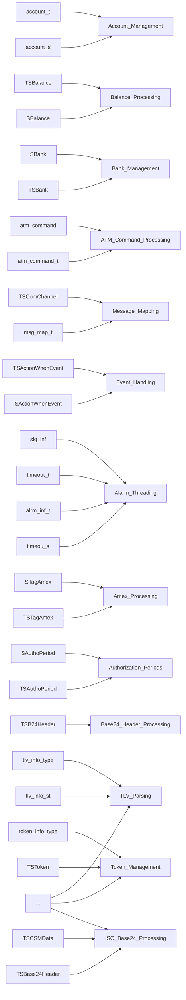
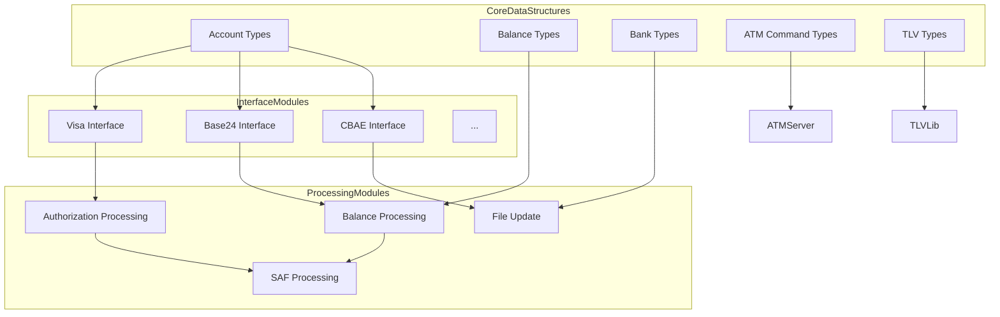

# Core Data Structures Module Documentation

## Introduction

The **Core Data Structures** module provides the foundational data types and structures used throughout the payment switching and transaction processing system. These structures define the schema for accounts, balances, banks, TLV (Tag-Length-Value) parsing, ATM commands, authorization periods, and more. As the backbone of the system, this module ensures consistent data representation and interoperability across all interfaces and subsystems, including Visa, Base24, CBAE, CIS, CUP, DCISC, Discover, HSID, IST, JCB, MDS, Postilion, Pulse, SID, SMS, SMT, UAESwitch, and various core libraries.

## Core Functionality

- **Defines canonical data types** for accounts, banks, balances, TLV parsing, ATM commands, and more.
- **Enables interoperability** between protocol interfaces (e.g., Visa, Base24, CBAE) by providing shared data definitions.
- **Supports extensibility** for new transaction types, message formats, and network protocols.
- **Centralizes schema management** to ensure consistency and reduce duplication across modules.

## Architecture and Component Relationships

The Core Data Structures module is referenced by nearly every interface and subsystem in the platform. It acts as a central hub for data definitions, with other modules importing and utilizing its types for message parsing, transaction processing, and network communication.

### High-Level Architecture

```mermaid
graph TD
    subgraph Core Data Structures
        A[account_t, account_s]
        B[TSBalance, SBalance]
        C[SBank, TSBank]
        D[atm_command, atm_command_t]
        E[TSComChannel, msg_map_t, ...]
        F[TSActionWhenEvent, SActionWhenEvent]
        G[sig_inf, timeout_t, alrm_inf_t, timeou_s]
        H[STagAmex, TSTagAmex]
        I[SAuthoPeriod, TSAuthoPeriod]
        J[TSB24Header]
        K[tlv_info_type, tlv_info_st, ...]
        L[token_info_type, TSToken, ...]
        M[TSCSMData, TSBase24Header, ...]
    end
    subgraph Interfaces
        Visa
        Base24
        CBAE
        CIS
        CUP
        DCISC
        Discover
        HSID
        IST
        JCB
        MDS
        Postilion
        Pulse
        SID
        SMS
        SMT
        UAESwitch
    end
    subgraph Core Libraries
        LibCom
        ThreadingLib
        TLVLib
    end
    subgraph Servers
        ATMServer
        POSServer
        MQServer
        FraudDaemon
        SysMonDaemon
    end
    A-->|used by|Visa
    B-->|used by|Base24
    C-->|used by|CBAE
    D-->|used by|ATMServer
    E-->|used by|Base24
    F-->|used by|ThreadingLib
    G-->|used by|ThreadingLib
    H-->|used by|AmexInterfaces
    I-->|used by|AuthModules
    J-->|used by|Base24
    K-->|used by|TLVLib
    L-->|used by|Base24
    M-->|used by|Base24
    Visa-->|calls|Core Data Structures
    Base24-->|calls|Core Data Structures
    CBAE-->|calls|Core Data Structures
    CIS-->|calls|Core Data Structures
    CUP-->|calls|Core Data Structures
    DCISC-->|calls|Core Data Structures
    Discover-->|calls|Core Data Structures
    HSID-->|calls|Core Data Structures
    IST-->|calls|Core Data Structures
    JCB-->|calls|Core Data Structures
    MDS-->|calls|Core Data Structures
    Postilion-->|calls|Core Data Structures
    Pulse-->|calls|Core Data Structures
    SID-->|calls|Core Data Structures
    SMS-->|calls|Core Data Structures
    SMT-->|calls|Core Data Structures
    UAESwitch-->|calls|Core Data Structures
    LibCom-->|calls|Core Data Structures
    ThreadingLib-->|calls|Core Data Structures
    TLVLib-->|calls|Core Data Structures
    ATMServer-->|calls|Core Data Structures
    POSServer-->|calls|Core Data Structures
    MQServer-->|calls|Core Data Structures
    FraudDaemon-->|calls|Core Data Structures
    SysMonDaemon-->|calls|Core Data Structures
```

### Component Dependency Diagram



## Data Flow and Process Flows

The following diagram illustrates how data structures from this module flow through the system:



## How the Module Fits into the Overall System

The Core Data Structures module is the single source of truth for all major data types in the system. All interface modules (e.g., [Visa Interface](Visa%20Interface.md), [Base24 Interface](Base24%20Interface.md), [CBAE Interface](CBAE%20Interface.md)), core libraries (e.g., [Core Libraries](Core%20Libraries.md)), and servers (e.g., [ATM Server](ATM%20Server.md), [POS Server](POS%20Server.md)) depend on these definitions for their operation. This ensures:

- **Consistency**: All modules interpret and manipulate data in a uniform way.
- **Maintainability**: Changes to data structures propagate automatically to all dependent modules.
- **Extensibility**: New interfaces or features can be added by extending or reusing existing structures.

For details on how specific interfaces or servers use these structures, refer to their respective documentation files:
- [Visa Interface](Visa%20Interface.md)
- [Base24 Interface](Base24%20Interface.md)
- [CBAE Interface](CBAE%20Interface.md)
- [CIS Interface](CIS%20Interface.md)
- [CUP Interface](CUP%20Interface.md)
- [DCISC Interface](DCISC%20Interface.md)
- [Discover Interface](Discover%20Interface.md)
- [HSID Interface](HSID%20Interface.md)
- [IST Interface](IST%20Interface.md)
- [JCB Interface](JCB%20Interface.md)
- [MDS Interface](MDS%20Interface.md)
- [Postilion Interface](Postilion%20Interface.md)
- [Pulse Interface](Pulse%20Interface.md)
- [SID Interface](SID%20Interface.md)
- [SMS Interface](SMS%20Interface.md)
- [SMT Interface](SMT%20Interface.md)
- [UAESwitch Interface](UAESwitch%20Interface.md)
- [Core Libraries](Core%20Libraries.md)
- [ATM Server](ATM%20Server.md)
- [POS Server](POS%20Server.md)
- [MQ Server](MQ%20Server.md)
- [Fraud Daemon](Fraud%20Daemon.md)
- [System Monitoring Daemon](System%20Monitoring%20Daemon.md)

## Summary

The Core Data Structures module is the foundation of the system's data model, enabling robust, consistent, and maintainable transaction processing across all modules. For implementation details and usage examples, consult the documentation of the dependent modules listed above.
