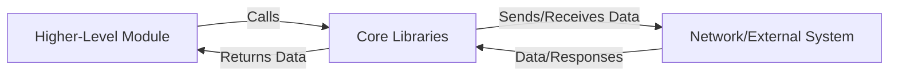
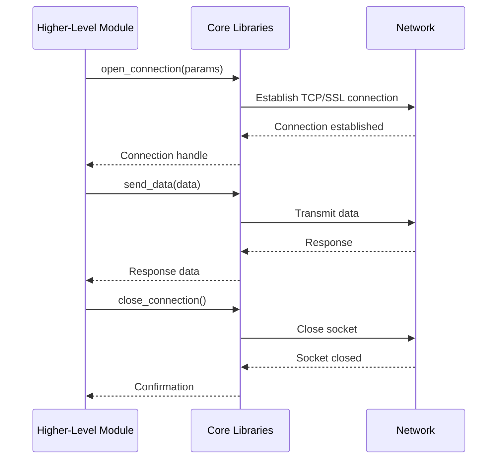
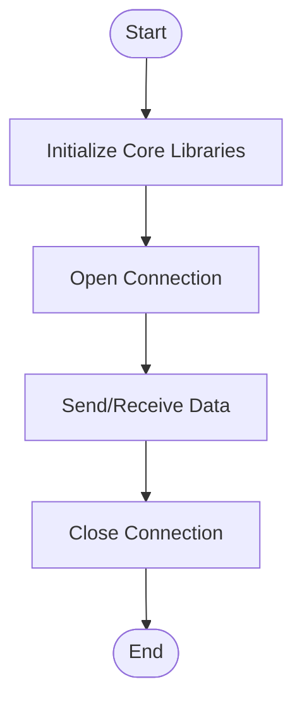

# Core Libraries Module Documentation

## Introduction

The **Core Libraries** module provides foundational networking and communication primitives for the entire system. It implements low-level TCP/IP, SSL/TLS, and socket abstractions, enabling secure and efficient inter-process and inter-module communication. These libraries are critical for the operation of all higher-level modules, such as payment interfaces, threading, TLV parsing, and server components.

## Purpose and Core Functionality

The Core Libraries module is responsible for:
- Establishing and managing TCP/IP and SSL/TLS connections
- Providing socket abstractions for both client and server communication
- Supporting secure communication with HSMs (Hardware Security Modules)
- Offering wrappers and compatibility layers for different platforms (e.g., Win32)
- Supplying reusable network data structures (e.g., `sockaddr`, `hostent`, `servent`, `sockaddr_in`, `linger`, `client_bio_t`)
- Handling timeouts and connection management

These capabilities are exposed through a set of C source files, primarily under `libcom/` and `libcom3/`, and are used by virtually every other module in the system.

## Architecture Overview

The Core Libraries are organized into several key components:

- **TCP Communication Libraries**: Provide basic TCP socket operations (`tcp_com.c`, `tcp_com_wrap.c`, `tcp_com_ssl.c`, `tcp_com_tls.c`, `tcp_com_ssl.c`, `tcp_com_wrap.c`)
- **SSL/TLS Support**: Enable secure communication over sockets (`tcp_com_ssl.c`, `tcp_com_tls.c`, `p7_com_ssl.c`)
- **HSM Communication**: Specialized libraries for secure communication with HSMs (`tcp_hsm.c`, `tcp_hsm_atalla.c`)
- **Platform-Specific Implementations**: Windows-specific TCP communication (`p7_com_tcp_win32.c`)
- **P7 Communication Libraries**: Enhanced communication primitives for advanced protocols (`p7_com_ssl.c`, `p7_com_tcp.c`)

### Component Relationships

All higher-level modules (e.g., Visa Interface, Base24 Interface, Threading Library, ATM Server, POS Server, etc.) depend on the Core Libraries for their networking needs. The Core Libraries are the lowest layer in the system's dependency hierarchy.

## System Integration

The Core Libraries module is foundational and is used by nearly every other module in the system. For example:
- **Payment Interfaces** (Visa, Base24, CBAE, etc.) use Core Libraries for network communication with external systems.
- **Threading Library** relies on Core Libraries for inter-thread and inter-process communication.
- **ATM, POS, MQ, and Fraud Daemons** use Core Libraries for client-server communication and secure data transfer.

For details on how these modules use the Core Libraries, refer to their respective documentation files:
- [Visa Interface](Visa Interface.md)
- [Base24 Interface](Base24 Interface.md)
- [Threading Library](Threading Library.md)
- [ATM Server](ATM Server.md)
- [POS Server](POS Server.md)
- [MQ Server](MQ Server.md)
- [Fraud Daemon](Fraud Daemon.md)

## Architecture Diagram

```mermaid
graph TD
    subgraph Core Libraries
        TCPCom[tcp_com.c]
        TCPComSSL[tcp_com_ssl.c]
        TCPComTLS[tcp_com_tls.c]
        TCPComWrap[tcp_com_wrap.c]
        TCPHSM[tcp_hsm.c]
        TCPHSMAtalla[tcp_hsm_atalla.c]
        TCPIST[tcp_ist.c]
        TCPUAESwitch[tcp_uaeswitch.c]
        P7ComSSL[p7_com_ssl.c]
        P7ComTCP[p7_com_tcp.c]
        P7ComTCPWin32[p7_com_tcp_win32.c]
    end
    subgraph Higher-Level Modules
        Visa[Visa Interface]
        Base24[Base24 Interface]
        CBAE[CBAE Interface]
        CIS[CIS Interface]
        CUP[CUP Interface]
        DCISC[DCISC Interface]
        Discover[Discover Interface]
        HSID[HSID Interface]
        IST[IST Interface]
        JCB[JCB Interface]
        MDS[MDS Interface]
        Postilion[Postilion Interface]
        Pulse[Pulse Interface]
        SID[SID Interface]
        SMS[SMS Interface]
        SMT[SMT Interface]
        UAESwitch[UAESwitch Interface]
        Threading[Threading Library]
        TLV[TLV Library]
        ATM[ATM Server]
        POS[POS Server]
        MQ[MQ Server]
        Fraud[Fraud Daemon]
        SysMon[System Monitoring Daemon]
    end
    TCPCom --> Visa
    TCPCom --> Base24
    TCPCom --> CBAE
    TCPCom --> CIS
    TCPCom --> CUP
    TCPCom --> DCISC
    TCPCom --> Discover
    TCPCom --> HSID
    TCPCom --> IST
    TCPCom --> JCB
    TCPCom --> MDS
    TCPCom --> Postilion
    TCPCom --> Pulse
    TCPCom --> SID
    TCPCom --> SMS
    TCPCom --> SMT
    TCPCom --> UAESwitch
    TCPCom --> Threading
    TCPCom --> TLV
    TCPCom --> ATM
    TCPCom --> POS
    TCPCom --> MQ
    TCPCom --> Fraud
    TCPCom --> SysMon
    TCPComSSL --> Visa
    TCPComSSL --> Base24
    TCPComSSL --> CBAE
    TCPComSSL --> CIS
    TCPComSSL --> CUP
    TCPComSSL --> DCISC
    TCPComSSL --> Discover
    TCPComSSL --> HSID
    TCPComSSL --> IST
    TCPComSSL --> JCB
    TCPComSSL --> MDS
    TCPComSSL --> Postilion
    TCPComSSL --> Pulse
    TCPComSSL --> SID
    TCPComSSL --> SMS
    TCPComSSL --> SMT
    TCPComSSL --> UAESwitch
    TCPComSSL --> Threading
    TCPComSSL --> TLV
    TCPComSSL --> ATM
    TCPComSSL --> POS
    TCPComSSL --> MQ
    TCPComSSL --> Fraud
    TCPComSSL --> SysMon
    TCPComTLS --> TCPComSSL
    TCPComWrap --> TCPCom
    TCPComWrap --> TCPComSSL
    TCPHSM --> TCPCom
    TCPHSMAtalla --> TCPHSM
    TCPIST --> TCPCom
    TCPUAESwitch --> TCPCom
    P7ComSSL --> TCPComSSL
    P7ComTCP --> TCPCom
    P7ComTCPWin32 --> TCPCom
```

## Data Flow Diagram

## Component Interaction Example

## Process Flow

## References

For more details on how the Core Libraries are used in context, see:
- [Visa Interface](Visa Interface.md)
- [Base24 Interface](Base24 Interface.md)
- [Threading Library](Threading Library.md)
- [ATM Server](ATM Server.md)
- [POS Server](POS Server.md)
- [MQ Server](MQ Server.md)
- [Fraud Daemon](Fraud Daemon.md)
- [System Monitoring Daemon](System Monitoring Daemon.md)

For data structure definitions used by the Core Libraries, see [Core Data Structures](Core Data Structures.md).
