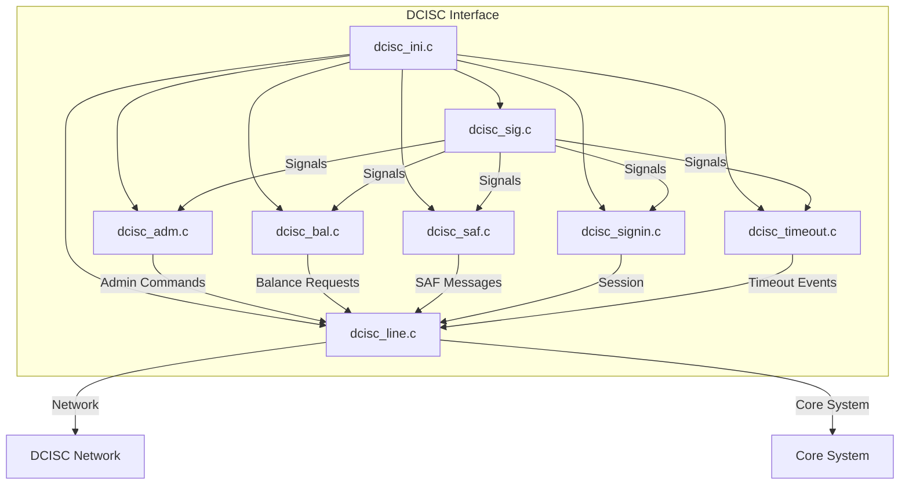
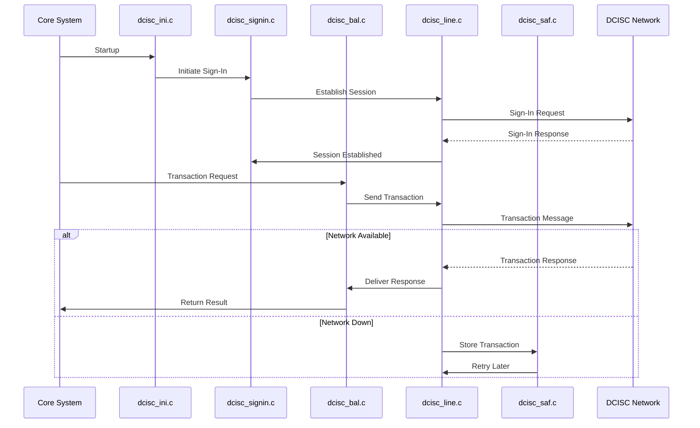

# DCISC Interface Module Documentation

## Introduction

The **DCISC Interface** module is responsible for managing the communication and transaction processing between the core system and the DCISC network. It handles various transaction types, session management, balance inquiries, safe store-and-forward (SAF) operations, and system signaling for the DCISC protocol. This module is a critical part of the payment switch infrastructure, ensuring reliable and secure message exchange with the DCISC network.

## Core Functionality

The DCISC Interface module provides the following core functionalities:

- **Administration**: Handles administrative commands and configuration updates (`dcisc_adm.c`).
- **Balance Inquiry**: Processes balance inquiry requests and responses (`dcisc_bal.c`).
- **Initialization**: Manages startup routines, signal handling, and configuration loading (`dcisc_ini.c`).
- **Line Management**: Maintains and monitors communication lines to the DCISC network (`dcisc_line.c`).
- **Store and Forward (SAF)**: Ensures message reliability by storing transactions for later forwarding in case of network issues (`dcisc_saf.c`).
- **Signaling**: Handles inter-process and network signaling, including signal masking and event notification (`dcisc_sig.c`).
- **Sign-In/Session Management**: Manages sign-in and session establishment with the DCISC network (`dcisc_signin.c`).
- **Timeout Handling**: Monitors and manages timeouts for various operations (`dcisc_timeout.c`).

## Architecture Overview

The DCISC Interface is structured as a set of cooperating components, each responsible for a specific aspect of the protocol handling. The module interacts with the core system libraries (for networking, threading, and data structures) and may communicate with other interface modules (such as Visa, Base24, etc.) for routing or protocol translation.

### Component Relationships

- **dcisc_adm.c**: Interfaces with system administration and configuration management.
- **dcisc_bal.c**: Communicates with transaction processing and balance management subsystems.
- **dcisc_ini.c**: Initializes the module, sets up signal handlers, and loads configuration.
- **dcisc_line.c**: Manages the physical or logical communication lines to the DCISC network.
- **dcisc_saf.c**: Works with the SAF subsystem to ensure message delivery reliability.
- **dcisc_sig.c**: Handles signal processing, often in coordination with the threading library.
- **dcisc_signin.c**: Manages session establishment and authentication with the DCISC network.
- **dcisc_timeout.c**: Monitors operation timeouts, leveraging the threading and alarm libraries.

### High-Level Architecture Diagram

## Data Flow and Process Flows

### Typical Transaction Flow

1. **Initialization**: `dcisc_ini.c` loads configuration and sets up signal handlers.
2. **Sign-In**: `dcisc_signin.c` establishes a session with the DCISC network.
3. **Transaction Request**: A transaction (e.g., balance inquiry) is received by `dcisc_bal.c`.
4. **Line Management**: `dcisc_line.c` sends the request to the DCISC network.
5. **Response Handling**: The response is received and routed back to the appropriate handler.
6. **SAF Handling**: If the network is unavailable, `dcisc_saf.c` stores the transaction for later forwarding.
7. **Timeouts and Signals**: `dcisc_timeout.c` and `dcisc_sig.c` monitor for timeouts and handle signals/events.

#### Transaction Processing Flow Diagram

## Dependencies

The DCISC Interface module depends on several core libraries and data structures:

- **Threading Library**: For signal handling, timeouts, and concurrency (see [alarm_thr.h](alarm_thr.md), [thr_utils.c](thr_utils.md)).
- **Core Data Structures**: For account, balance, and message formatting (see [account.h](account.md), [balance.h](balance.md), [base24.h](base24.md)).
- **Core Libraries**: For networking and communication (see [libcom/tcp_com.c](libcom_tcp_com.md), [libcom/tcp_ssl.c](libcom_tcp_ssl.md)).
- **SAF Subsystem**: For store-and-forward reliability (see [dcisc_saf.c](#)).

## Integration with the Overall System

The DCISC Interface is one of several network interface modules (see also [Visa Interface](Visa Interface.md), [Base24 Interface](Base24 Interface.md), [CUP Interface](CUP Interface.md), etc.). Each interface module is responsible for its respective network protocol, but they share common architectural patterns and core libraries. The DCISC Interface interacts with the core system for transaction routing, logging, and error handling, and may coordinate with other interfaces for multi-network transaction processing.

## References

- [Visa Interface](Visa Interface.md)
- [Base24 Interface](Base24 Interface.md)
- [CUP Interface](CUP Interface.md)
- [Core Data Structures](account.md), [balance.md], [base24.md]
- [Threading Library](alarm_thr.md), [thr_utils.md]
- [Core Libraries](libcom_tcp_com.md), [libcom_tcp_ssl.md)

---

*For detailed component documentation, refer to the respective source files and referenced module documentation.*
