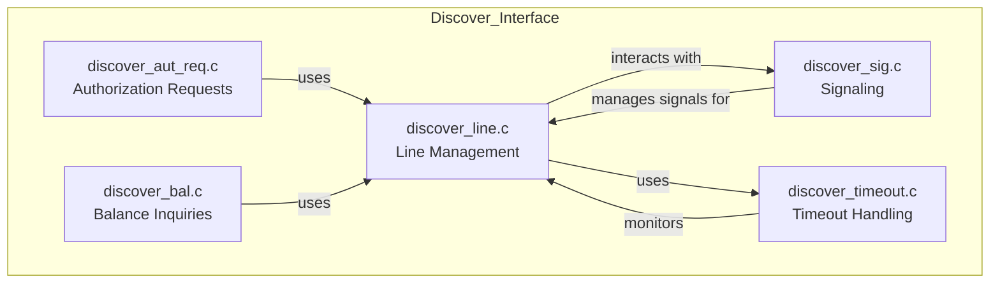
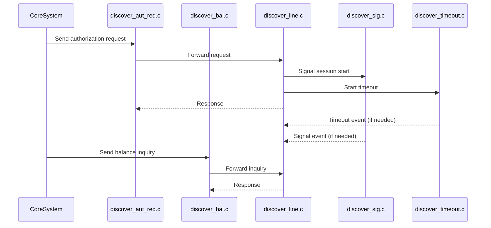
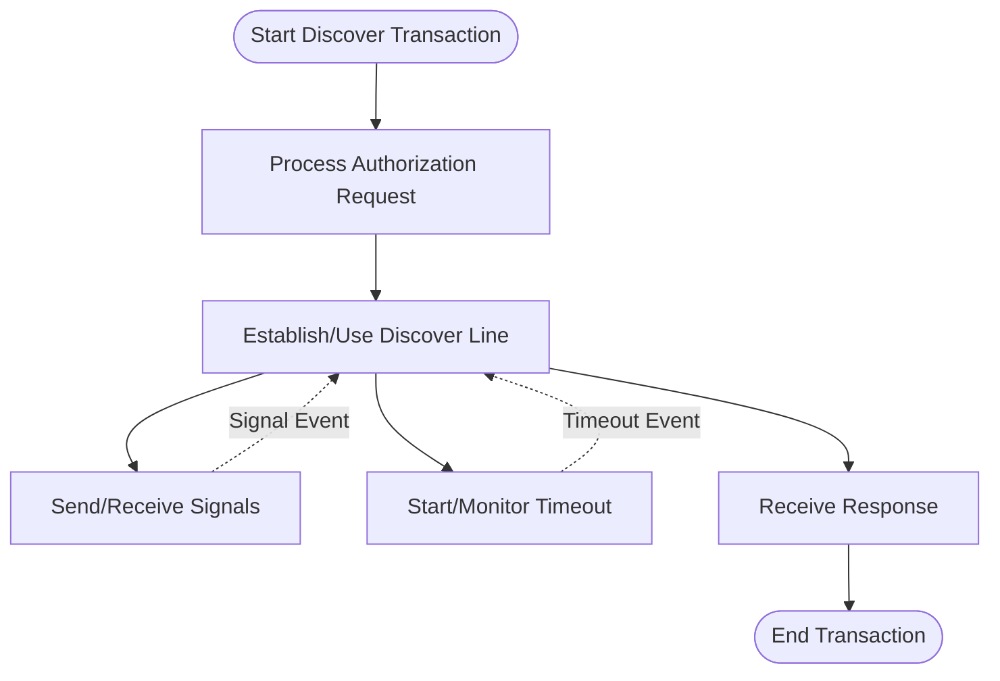

# Discover Interface Module Documentation

## Introduction
The **Discover Interface** module is responsible for handling all interactions between the core system and the Discover card network. It manages the lifecycle of Discover transactions, including authorization requests, balance inquiries, line management, session signaling, and timeout handling. This module ensures that Discover transactions are processed reliably and in accordance with network protocols, integrating seamlessly with the broader payment switching infrastructure.

## Core Functionality
The Discover Interface module provides the following key functionalities:
- **Authorization Requests**: Handles incoming and outgoing authorization requests to the Discover network.
- **Balance Inquiries**: Processes balance inquiry transactions.
- **Line Management**: Manages communication lines and sessions with the Discover network.
- **Signaling**: Handles inter-process and network signaling for Discover sessions.
- **Timeout Handling**: Manages transaction and session timeouts to ensure reliability and responsiveness.

## Architecture Overview
The Discover Interface is composed of several tightly integrated components, each responsible for a specific aspect of Discover transaction processing:

- `discover_aut_req.c`: Handles authorization request logic and communication.
- `discover_bal.c`: Processes balance inquiries.
- `discover_line.c`: Manages the communication line/session with the Discover network.
- `discover_sig.c`: Handles signaling (using `sigset_t` for signal management).
- `discover_timeout.c`: Manages timeouts for Discover transactions and sessions.

### Component Relationships

### Data Flow

## Dependencies and Integration
The Discover Interface module relies on several core libraries and data structures for networking, threading, and transaction management:
- **Core Libraries**: For TCP/IP communication, SSL/TLS, and time management (see [Core Libraries](Core Libraries.md)).
- **Threading Library**: For signal and timeout management (see [Threading Library](Threading Library.md)).
- **Core Data Structures**: For transaction and account representations (see [Core Data Structures](Core Data Structures.md)).

It also follows architectural patterns and interfaces similar to other card network modules, such as [Visa Interface](Visa Interface.md), [CUP Interface](CUP Interface.md), and [Base24 Interface](Base24 Interface.md), ensuring consistency and maintainability across the system.

## Component Interaction with Other Modules
- **Session and Line Management**: Interacts with the core communication and threading libraries for establishing and maintaining network sessions.
- **Signaling and Timeout**: Utilizes the threading library for signal and timeout handling, ensuring robust transaction processing.
- **Transaction Routing**: Works in conjunction with the core switching logic to route Discover transactions appropriately.

## Process Flow Example

## How the Module Fits into the Overall System
The Discover Interface module is one of several card network interface modules within the payment switching system. It provides a standardized way to process Discover transactions, ensuring interoperability with other network modules and the core system. Its design allows for:
- **Scalability**: New card network interfaces can be added with minimal changes to the core system.
- **Maintainability**: Consistent architecture and use of shared libraries/data structures.
- **Reliability**: Robust handling of signals, timeouts, and network events.

For more details on related modules, see:
- [Visa Interface](Visa Interface.md)
- [CUP Interface](CUP Interface.md)
- [Base24 Interface](Base24 Interface.md)
- [Core Libraries](Core Libraries.md)
- [Threading Library](Threading Library.md)
- [Core Data Structures](Core Data Structures.md)

---
*This documentation provides an overview of the Discover Interface module. For implementation details, refer to the source code and referenced module documentation.*
