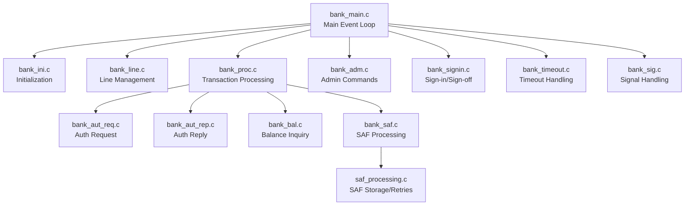
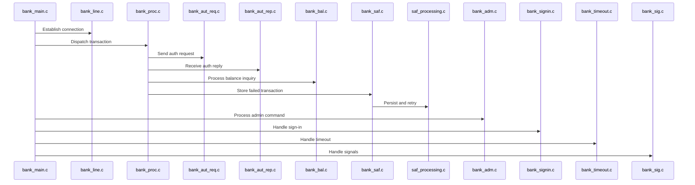

# HSID Interface Module Documentation

## Introduction

The **HSID Interface** module provides the integration layer between the core transaction processing system and external banking hosts using the HSID protocol. It is responsible for managing the communication, transaction processing, and session management with host banks, ensuring reliable and secure message exchange for financial operations such as authorizations, balance inquiries, settlements, and safe store-and-forward (SAF) processing.

This module is a critical part of the overall switching and transaction processing infrastructure, enabling interoperability with banking networks and supporting high-availability transaction flows.

---

## Core Functionality

The HSID Interface module handles:
- **Session Initialization and Management**: Establishes and maintains communication sessions with host banks.
- **Authorization Requests and Replies**: Processes incoming and outgoing authorization messages.
- **Balance Inquiries**: Handles requests and responses for account balance checks.
- **Safe Store-and-Forward (SAF) Processing**: Ensures transaction reliability by storing and forwarding messages in case of communication failures.
- **Administrative and Sign-in Operations**: Manages administrative commands and sign-in/sign-off procedures.
- **Timeout and Signal Handling**: Manages timeouts and system signals for robust operation.

---

## Component Overview

| Component           | Purpose                                                        |
|---------------------|----------------------------------------------------------------|
| `bank_adm.c`        | Handles administrative commands and controls                   |
| `bank_aut_rep.c`    | Processes authorization replies from the host                  |
| `bank_aut_req.c`    | Sends authorization requests to the host                       |
| `bank_bal.c`        | Manages balance inquiry requests and responses                 |
| `bank_ini.c`        | Initializes the HSID interface and manages signal handling     |
| `bank_line.c`       | Manages communication lines and connections                    |
| `bank_main.c`       | Main entry point and event loop for the HSID interface         |
| `bank_proc.c`       | Core transaction processing logic                              |
| `bank_saf.c`        | Handles SAF (store-and-forward) transaction processing         |
| `bank_sig.c`        | Handles system signals                                         |
| `bank_signin.c`     | Manages sign-in and sign-off procedures                        |
| `bank_timeout.c`    | Handles timeout events                                         |
| `saf_processing.c`  | Implements SAF message storage and retry logic                 |

---

## Architecture and Component Relationships

The HSID Interface is structured as a set of cooperating processes and threads, each responsible for a specific aspect of host communication and transaction management. The following diagram illustrates the high-level architecture and interactions between the main components:

### Data Flow and Process Flow

1. **Initialization**: `bank_ini.c` sets up the environment, signal handlers, and configuration.
2. **Session Establishment**: `bank_line.c` manages the connection to the host bank.
3. **Transaction Processing**: `bank_proc.c` routes incoming and outgoing messages to the appropriate handlers (`bank_aut_req.c`, `bank_aut_rep.c`, `bank_bal.c`).
4. **SAF Handling**: If a transaction cannot be delivered, `bank_saf.c` and `saf_processing.c` ensure it is stored and retried.
5. **Administrative and Sign-in**: `bank_adm.c` and `bank_signin.c` handle operator commands and session authentication.
6. **Timeouts and Signals**: `bank_timeout.c` and `bank_sig.c` provide robust error and event handling.

---

## Integration with the Overall System

The HSID Interface is one of several host interface modules (see [Visa Interface](Visa Interface.md), [Base24 Interface](Base24 Interface.md), [CBAE Interface](CBAE Interface.md), etc.) that connect the core transaction switch to external networks. Each interface module follows a similar architectural pattern, enabling modularity and ease of maintenance.

The HSID Interface interacts with:
- **Core Data Structures**: Uses shared types such as `account_t`, `SBank`, and `TSBank` (see [Core Data Structures](Core Data Structures.md)).
- **Core Libraries**: Relies on networking and threading utilities (see [Core Libraries](Core Libraries.md), [Threading Library](Threading Library.md)).
- **SAF and Timeout Mechanisms**: Shares SAF and timeout logic patterns with other interfaces.

---

## Component Interaction Diagram

---

## References

- [Visa Interface](Visa Interface.md)
- [Base24 Interface](Base24 Interface.md)
- [CBAE Interface](CBAE Interface.md)
- [Core Data Structures](Core Data Structures.md)
- [Core Libraries](Core Libraries.md)
- [Threading Library](Threading Library.md)

---

## Summary

The HSID Interface module is a robust, modular component that enables seamless integration with host banking systems. Its architecture ensures reliability, maintainability, and interoperability within the broader transaction processing ecosystem. For details on shared data structures and libraries, refer to the linked documentation above.
