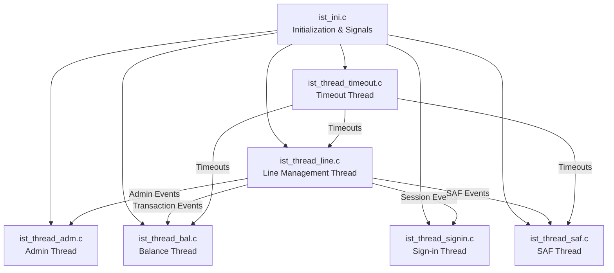
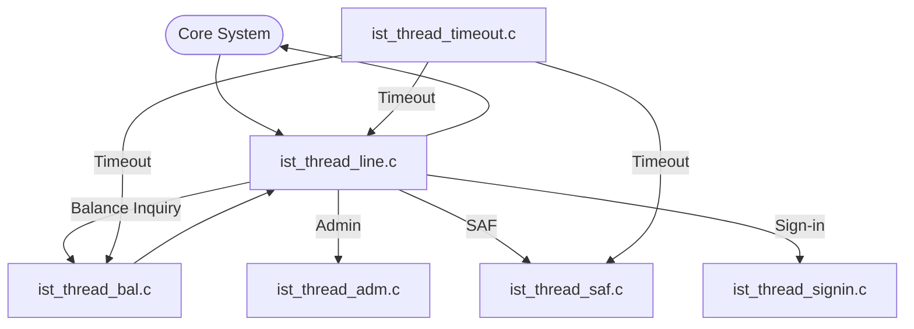
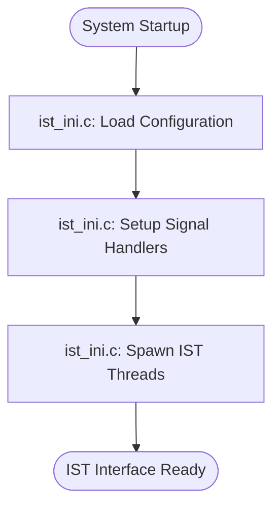
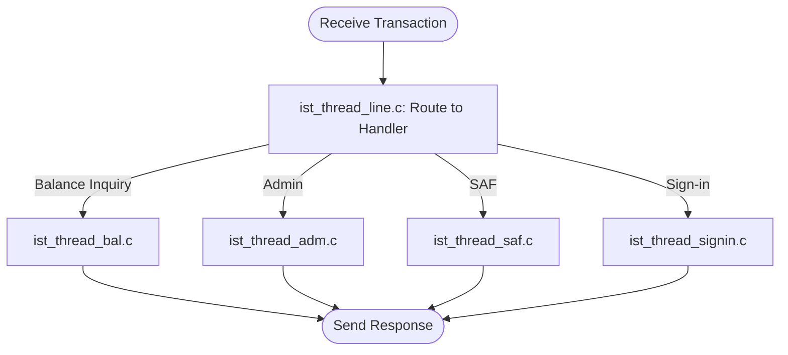

# IST Interface Module Documentation

## Introduction

The IST Interface module provides connectivity and transaction processing capabilities for the IST network within the payment switching system. It is responsible for managing communication, transaction flows, and session management between the core system and the IST network, ensuring reliable and secure message exchange for financial operations such as balance inquiries, transaction authorizations, settlements, and safe store-and-forward (SAF) processing.

The IST Interface is designed to operate as a set of cooperating threads and initialization routines, each handling a specific aspect of the IST protocol and transaction lifecycle. It interacts with the core system libraries, threading utilities, and data structures, and follows architectural patterns common to other network interface modules (e.g., Visa, Base24, JCB, etc.) in the system.

## Core Functionality

The IST Interface module consists of the following core components:

- **ist_ini.c**: Handles initialization, configuration loading, and signal management for the IST interface.
- **ist_thread_adm.c**: Manages administrative tasks and control messages for the IST network.
- **ist_thread_bal.c**: Processes balance inquiry requests and responses.
- **ist_thread_line.c**: Manages the communication line/session with the IST network, including connection establishment and monitoring.
- **ist_thread_saf.c**: Handles store-and-forward (SAF) operations for offline or deferred transactions.
- **ist_thread_signin.c**: Manages sign-in/sign-out procedures and session authentication with the IST network.
- **ist_thread_timeout.c**: Handles timeout management for transactions and network operations.

Each component is implemented as a separate thread or process, enabling concurrent handling of different transaction types and network events.

## Architecture Overview

The IST Interface module follows a modular, thread-based architecture. Each thread is responsible for a specific function, and all threads coordinate via shared data structures and inter-thread communication mechanisms provided by the core threading library.

### High-Level Architecture

### Component Relationships

- **ist_ini.c** initializes all IST threads, loads configuration, and sets up signal handling (using `sigset_t`).
- **ist_thread_line.c** acts as the main communication handler, routing messages to the appropriate processing threads.
- **ist_thread_timeout.c** monitors for operation timeouts and triggers recovery or retry logic as needed.
- **ist_thread_saf.c** ensures that transactions which cannot be immediately processed are safely stored and forwarded when possible.
- **ist_thread_signin.c** manages session authentication and periodic sign-in requirements.

## Data Flow

## Dependencies

The IST Interface module depends on several core libraries and data structures:

- **Threading Library**: For thread management, signal handling (`sigset_t`), and timeouts (`timeval`, `timespec`). See [Threading Library](Threading Library.md).
- **Core Data Structures**: For transaction, account, and message representations. See [Core Data Structures](Core Data Structures.md).
- **Core Libraries**: For TCP/IP communication and network abstraction. See [Core Libraries](Core Libraries.md).

It also follows architectural conventions established by other network interface modules, such as [Visa Interface](Visa Interface.md), [Base24 Interface](Base24 Interface.md), and [JCB Interface](JCB Interface.md).

## Process Flows

### Initialization and Startup

### Transaction Processing

## Integration in the Overall System

The IST Interface is one of several network interface modules in the payment switching system. It is designed to be functionally parallel to other interfaces (e.g., Visa, Base24, JCB, etc.), each handling a specific network protocol but sharing common architectural patterns and core libraries. This modular approach allows for scalability, maintainability, and consistent transaction processing across multiple payment networks.

For more details on the overall system architecture and other interfaces, refer to:
- [Visa Interface](Visa Interface.md)
- [Base24 Interface](Base24 Interface.md)
- [JCB Interface](JCB Interface.md)
- [Core Data Structures](Core Data Structures.md)
- [Threading Library](Threading Library.md)
- [Core Libraries](Core Libraries.md)

## Summary

The IST Interface module is a robust, thread-based component that enables seamless integration with the IST network, supporting secure, reliable, and concurrent transaction processing. Its design leverages shared system libraries and follows best practices established across all network interface modules in the payment switching platform.
