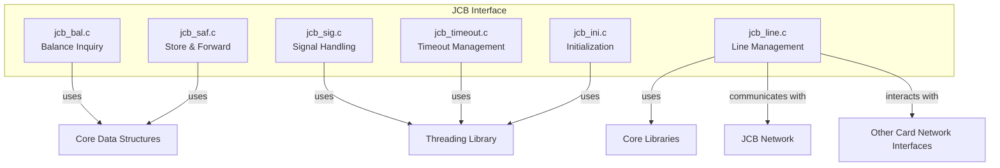
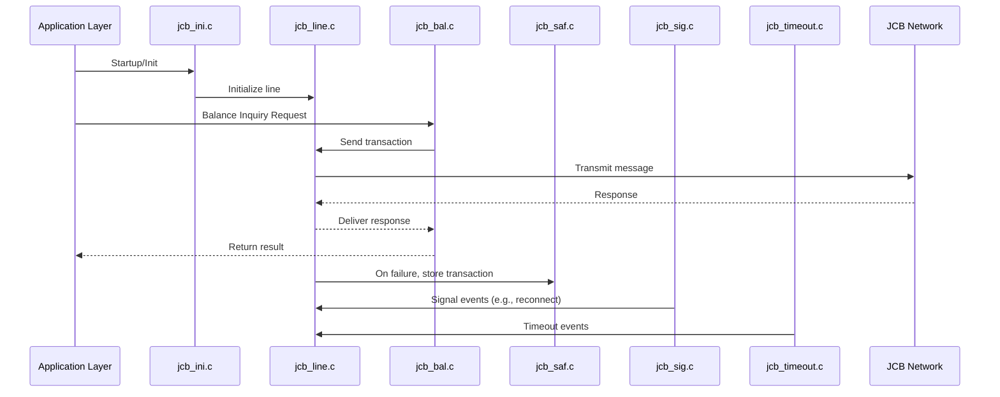
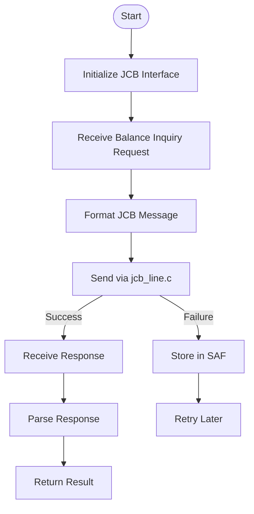

# JCB Interface Module Documentation

## Introduction

The **JCB Interface** module provides connectivity and transaction processing capabilities for the JCB (Japan Credit Bureau) card network within the payment switching system. It is responsible for handling JCB-specific transaction flows, including balance inquiries, transaction authorization, settlement, and safe store-and-forward (SAF) operations. The module ensures reliable communication with the JCB network, manages protocol-specific requirements, and integrates with the system's core transaction and threading infrastructure.

## Core Functionality

The JCB Interface module is composed of several key components:

- **jcb_bal.c**: Handles balance inquiry transactions with the JCB network.
- **jcb_ini.c**: Manages initialization routines and signal handling for the JCB interface.
- **jcb_line.c**: Manages the communication line to the JCB network, including connection setup and teardown.
- **jcb_saf.c**: Implements store-and-forward logic for transactions that cannot be immediately processed.
- **jcb_sig.c**: Handles signal processing and inter-process communication for the JCB interface.
- **jcb_timeout.c**: Manages transaction and communication timeouts.

These components work together to provide a robust and reliable interface for JCB transaction processing.

## Architecture Overview

The JCB Interface is designed as a modular, multi-threaded subsystem within the overall payment switch. It interacts with:
- **Core Data Structures** (e.g., accounts, balances, transaction types)
- **Threading Library** (for concurrency and signal management)
- **Core Libraries** (for TCP/IP and SSL communication)
- **Other Card Network Interfaces** (for multi-network support)

### High-Level Architecture Diagram

## Component Relationships and Data Flow

### Component Interaction Diagram

### Data Flow

- **Initialization**: `jcb_ini.c` sets up signal handlers and initializes resources.
- **Transaction Processing**: `jcb_bal.c` and other transaction handlers format requests and pass them to `jcb_line.c` for network transmission.
- **Store-and-Forward**: If the network is unavailable, `jcb_saf.c` stores transactions for later retry.
- **Signal and Timeout Handling**: `jcb_sig.c` and `jcb_timeout.c` manage asynchronous events and ensure system robustness.

## Dependencies

The JCB Interface relies on several shared system components:

- **Core Data Structures**: [account.h](account.md), [balance.h](balance.md), [action_when_event.h](action_when_event.md), etc.
- **Threading Library**: [thr_utils.c](thr_utils.md), [alarm_thr.c](alarm_thr.md)
- **Core Libraries**: [libcom/tcp_com.c](tcp_com.md), [libcom/tcp_ssl.c](tcp_ssl.md)
- **Other Card Network Interfaces**: For multi-network transaction routing (see [Visa Interface](Visa Interface.md), [Base24 Interface](Base24 Interface.md), etc.)

## Process Flows

### Example: Balance Inquiry

## Integration in the Overall System

The JCB Interface is one of several card network modules integrated into the payment switch. It follows a common architectural pattern shared with other interfaces (e.g., Visa, CUP, Base24), enabling:
- Consistent transaction processing across networks
- Shared use of threading, communication, and data structure libraries
- Modular addition or removal of network interfaces

For details on other interfaces, see:
- [Visa Interface](Visa Interface.md)
- [Base24 Interface](Base24 Interface.md)
- [CUP Interface](CUP Interface.md)

## References

- [Core Data Structures](account.md), [balance.md], [action_when_event.md]
- [Threading Library](thr_utils.md), [alarm_thr.md]
- [Core Libraries](tcp_com.md), [tcp_ssl.md]
- [Visa Interface](Visa Interface.md)
- [Base24 Interface](Base24 Interface.md)
- [CUP Interface](CUP Interface.md)
